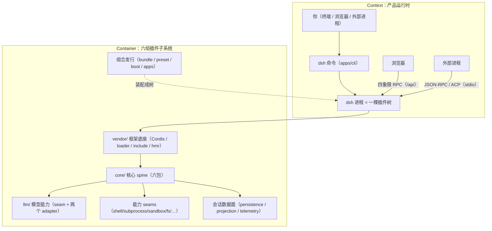

# 《DeepSeek Harness》深度解读 · 00 总览

- 仓库：deepseek-ai/deepseek-harness / 子类型：monorepo（pnpm workspaces，Node ^22.19||>=24，ESM，strict TS）
- 版本锁定：deepseek-ai/deepseek-harness **master 分支 tarball 快照，2026-08-14 下载**；快照不含 git 元数据，**无 commit hash 可记录**（材料降级，特此声明）；替代锚点为根 `package.json` 版本 `0.1.0-rc.5`。补充锚点：快照根 `package.json` 的 SHA-1 为 `16918dcd04afbb809d896844bd04c3cb3bd3d301`，SHA-256 前 40 位为 `3fec1dd1d3faf02a591c8cf792a1eeedf810491c`（`shasum package.json` / `shasum -a 256 package.json` 可复算）。文中全部 `file:line` 锚点以该快照的文件系统状态为准。
- 材料范围：map+采样（约 7667 个文件——find 全量、排除 node_modules 与 .git；TS/TSX/Py 源码合计 568,408 行：TS 497,489 / TSX 66,633 / PY 4,286；远超单次上下文预算，按子系统分组采样）。六分篇合计精读：`vendor/` 框架层全文、`core/` 六包全部 src、`llm/` 五包全部 src、执行类主线链（shell→subprocess→sandbox→interaction）至函数级、session 数据面四族、组合发行面（apps/cli、app-boot、bundle 三层、preset、apiproxy、client runtime）；签名级扫读：schemastery/cosmokit、compaction、平行能力 seams（fs/terminal/lsp/skill/web/code-runtime/mcp/e2b）、client 40+ `ui-*` 包、typert/api/sdk/acp、python/native。e2e（需 `DEEPSEEK_API_KEY`）与平台相关行为（沙箱 runner、Win32 写穿发布）未运行验证，相关论断一律标注「静态推断」。
- 读者画像：具备工程常识（会用命令行、写过模块化代码、见过事件发射器），对 agent harness 领域零了解。本总览自包含——单独读它也能建立完整心智模型；要某个机制的代码级证据，按分篇导览进入对应分篇。
- 本总览的验证口径沿用六分篇：`pnpm vitest run packages/core/agent-loop packages/core/agent packages/core/session packages/core/system-prompt packages/core/scope`（46 个测试文件 815 个测试通过）、`pnpm vitest run packages/core/tools`（12 文件 386 个测试通过）、`npx vitest run packages/llm`（34 文件 675 个测试通过）、`pnpm vitest run packages/boot/app-boot/tests/config-reload.spec.ts`（12/12）与 `user-patches.spec.ts`（16/16）——被这些套件覆盖的论断标「已验证（跑过）」；其余代码行为论断为「静态推断」（带 `file:line` 锚点，锚点存在性由 deep-read lint 脚本机械校验）。

## 0. 阅读地图

**主旨一句话**：DeepSeek Harness（下称 dsh）是一个"一切皆插件"的开源 agent harness——在 vendored Cordis 框架上，把模型适配、工具注册、会话日志乃至 agent loop 本身全部做成可替换插件，用一条事件溯源的 SessionEvent 日志（硬不变量「model-visible ⟺ logged」，即"进模型请求的必可从日志重建"）把 turn 驱动、工具执行、持久化与多端 UI 串成一个可组合、可热插拔的产品运行时。

**主线**：读一个 agent harness，最该先回答的问题是"一句话从进来到出去，系统里到底发生了什么"。全书主线就是这一问：**一次用户请求的完整生命周期**（S1，分篇 02 主战场）——turn 怎么开、消息怎么认领、prompt 怎么装配、模型请求怎么出门、chunk 怎么回家、工具怎么执行、日志怎么落盘；**一次工具调用的执行链**（S2，分篇 04 主战场）——以 bash 为例，从模型 tool_use 到进程诞生的 approval→sandbox→spawn 全链；**一次产品启动**（S3，分篇 06 主战场）——`dsh web` 从命令行到浏览器的组合装配。分篇 01 是这一切的垫层（Cordis 插件底座），分篇 03 放大模型段，分篇 05 放大持久化段。

**关键收获**（读完全书应带走的三件事）：

1. **"一切皆插件"不是口号，是运行时纪律**。插件等于三种普通 JS 值，注册等于 fiber，注册即 effect——连 agent loop 自己都是一个 `class AgentLoop extends Service`（`packages/core/agent-loop/src/index.ts:296-306`）。卸载因此成为一等公民：agent 可以热改自己的运行时，因为每一处变化都被登记成可倒序撤销的 disposer。
2. **事件溯源是唯一真相**。模型可见的一切（消息、请求头、chunk）都在 append-only 日志里；`deriveMessages()` 从日志投影历史而不是维护第二份对话状态；agent-loop 的 invariant 在请求出门前逐字节断言"请求 ⟺ 日志"（`packages/core/agent-loop/src/invariant.ts:19-55`）。fork、resume、replay、审计全部是这个不变量的红利。
3. **可替换性是结构的产物，不是配置的恩赐**。capability seam 三角色（Service Definition / Provider / Consumer）、request/spec split、以及"全仓库只有一个地方 fork 进程"的 subprocess seam，让"本地→沙箱→远程"的迁移降级为组合层一行改动——bash、PTY、LSP 的 consumer 一行不改。

**全书导览**：01 垫层 → 02 核心 spine 与一轮 turn → 03 LLM 能力层 → 04 工具 seams 与执行管道 → 05 会话数据面与持久化 → 06 组合发行与多前端。除 01 必须最先读、06 建议最后读外，02–05 在 01 之后可按兴趣乱序。每篇末尾都有自测 Q&A 与覆盖报告。

## 1. 背景与前置知识

读者画像说了"零领域知识"，本节把后面全书的词汇先垫起来，全部中英对照、给精确定义。读完这节你就能读懂任何一篇的第一段。

**插件架构（plugin architecture）**。dsh 的根规则只有一条："everything is a plugin"（`AGENTS.md:3`）。在 Cordis 里，插件不是规范文件也不是基类，而是三种普通 JavaScript 值之一：一个函数、一个构造器、或一个带 `apply(ctx, config)` 方法的对象（`vendor/cordis/src/registry.ts:92-96`）。插件体通过 `ctx`（context，上下文）与系统交互：`ctx.on()` 监听事件、`ctx.provide()` 提供服务、`ctx.plugin()` 嵌套挂插件。`ctx` 是一个 Proxy（`vendor/cordis/src/context.ts:74`），属性读被路由到"服务解析"，写被路由到"服务注册"；子 context 靠原型链继承父级。插件不靠手写"new"，而由 **Loader（装载器）** 把一叠 YAML 行变成插件树：每行是一个 **entry**——挂哪个插件、带什么 config、插在哪个 id 旁；**Include** 是其中特殊的一类 entry，把一个 YAML 文件声明的整段入口清单作为独立子树挂进来（固定 id），组合层正是靠它把 bundle 的行叠进根树。插件注册的运行时产物是 **fiber**：一次插件挂载的实例，持有该插件自己的子 context、配置与全部可倒序撤销的 disposer——同一插件挂两次就有两个 fiber（`vendor/cordis/src/fiber.ts:147-154`）。

**上下文 / 服务 / 效应（context / service / effect）**。服务就是"claim 了 `ctx` 上一个稳定键的对象"——`ctx.llm`、`ctx.tools`、`ctx.sessions`。插件之间不互相 import 实现：提供者把对象挂到键上，消费者在元数据里声明 `inject: ['llm']`，框架保证"你要的服务齐了才启动你，服务没了就把你卸载"。**注册即 effect**：插件做的每一件有外部性的事都必须通过 `ctx.effect()` 登记，并同时交出"怎么撤销"的清理函数（disposer）；插件卸载时框架倒序执行全部 disposer，每一点变化都被精确回滚（dsh 把它写成纪律：`AGENTS.md:102`）。

**事件系统与 waterfall（事件分发）**。Cordis 事件总线有五种语义：`emit`（同步广播不等）、`parallel`（并发等全部）、`serial`（按序 await）、`bail`（同步按序遇值提前返回）、`waterfall`（中间件式包裹，靠 `next()` 委托）。waterfall 的规则最反直觉也最重要：**监听器不调 `next()` 不是"我不发表意见"，而是"我否决后面所有人包括默认行为"**——实现就一行 `cbs.shift() ?? inner`（`vendor/cordis/src/events.ts:234-243`）。dsh 把它升级为纪律：只观察的监听器必须委托，有决策权的策略监听器可以不委托（`docs/cordis-primer.md:28-34`）。

**agent loop（代理循环）与 turn/step**。agent loop 是"反复向模型要下一动作"的驱动循环。dsh 把它切成两级：**turn（轮）**是零或多个 step 的完整回合，**step（步）**是一次模型请求加它调用的工具（`docs/architecture.md:65`）。turn 边界先于输入认领、关闭时必落 `turn/end`——"每个出口都有结局"。

**事件溯源（event sourcing）**。dsh 不保存"当前对话状态"，只保存一份 append-only 的会话事件日志（`ctx.sessions`，SessionEvent 词汇表）。模型可见的历史是日志的一个投影视图（surface），可随时重算；进程崩溃只丢"未提交的批次"，不损坏已提交事实。这条主张的完整形态是硬不变量 **model-visible ⟺ logged**：进模型请求的每一个字节都能从日志重建——invariant 插件在 `llm/stream` 瀑布上对每个 loop 请求做逐字节断言（`packages/core/agent-loop/src/invariant.ts:21-52`）。

**capability seam 三角色（能力缝）**。dsh 把"一个可替换能力"拆成三个包角色：**Service Definition**（声明抽象服务与词汇，如 `ctx.shell` 的契约）、**Service Provider**（实现并注册，如本地 bash 执行器）、**Consumer**（消费服务、通常是模型-facing 的工具，如 tool-bash）。Definition 包不依赖任何人，Provider 依赖 Definition，Consumer 也依赖 Definition——换 Provider 时 Consumer 一行不改。这就是"本地换沙箱换远程"的结构载体（`docs/architecture.md:98-102`）。

**组合层（profile / bundle / patch / preset）**。产品形态由文件分层组合而成：**profile（档案）**是 `$DSH_HOME/profiles/<name>` 下的一个目录，声明叠哪些 **bundle（捆绑包）**；**patch（补丁）**是对插件树的一次修改（按 id 定位一行、整行替换 config，或 insert 新行），层序即优先级；**preset（预设）**是 per-session 的 agent 组合。分层顺序 bundle→profile→home→`--patch`（`docs/architecture.md:15-37`）。

**收件箱（inbox）与表面（surface）**。agent 的唯一输入口是 inbox——它不是驱动器的私有队列，而是 agent 拥有的一份 durable 投影：待办消息列表的每一次变更**先写进日志再改内存**（`packages/core/agent/src/inbox.ts:129-138`），进程重启后待办不丢。三种输入方式：`followup`（排队一个普通后续 turn）、`steer`（打方向，运行中的驱动在下一个 step 边界消费）、`inject`（注入模型可见上下文，排队等别的消息来唤醒）。模型历史同样不是日志本身，而是 surface（表面）——日志上的一层有序视图，只有 `user/message`、`assistant/message`、`tool/result` 三种消息事件能上去，每个上去的事件必须声明自己是尾部追加（append）还是遮蔽替换（replace）；compaction 用一次 replace 遮蔽旧节点而日志一字不动（`packages/core/session/src/types.ts:343-389`）。

**请求/规格分离（request/spec split）与封闭词汇**。dsh 的包边界纪律是"Explicit > implicit"：默认值填充不许藏在执行函数里写成 `?? default`，必须是边界上一个显式的 `resolve(request): Spec` 步骤（`packages/subprocess/subprocess/src/types.ts:69-74` 自认以 shell seam 为模板）。政策类词汇全部做成封闭枚举：SandboxMode 三值（read-only / workspace-write / danger-full-access）、ApprovalOutcome 四值（allowed-once / rejected / cancelled / unavailable）、turn 结局六值——封闭意味着 switch 收尾带 `assertNever`，加新值在每个消费点编译报错。「请求」在会话日志里落成 **`request/header`** 事件——一次请求完整头部的快照（call config、渲染后的 system prompt、工具 schemas），最新一份快照即可重建任一请求是在什么头部下发出的（`packages/core/session/src/request-header.ts:65-71`）。

**durable 平面（durable plane）**。指所有"进程退出后还活着"的状态，dsh 刻意分成三层：会话事件日志（append-only、事件溯源、每个字节有 replay 语义）、日志的派生视图（projection 缓存、搜索索引——可以丢、可以重建，丢了只是重算慢一点）、非会话数据（workspace 登记簿、设置、凭据——不是日志，不进事件词汇表）。三层的可靠性承诺完全不同，混在一层里是这类系统最常见的腐烂方式。

**宿主平面与 agent 平面（host plane / agent plane）**。进程级一次的服务（注册表、沙箱栈、持久化）属于宿主平面；单个 agent 贡献的东西（工具、prompt 段）属于 agent 平面。Web 形态把 agent 平面整体交给 preset：每个会话选一个 preset，preset 的行只挂一次、被所有选它的会话共享（`packages/preset/agent-presets/src/index.ts:1-21`）。多前端形态还牵一个传输层名词：**Typert**——跨进程类型化 RPC（构建期类型分析器 + 运行时注册表），把宿主服务的类型化方法描述符物化给浏览器端，让"跨进程也有类型"（`packages/typert/README.md:5-11`）。

**runtime invariant（运行时不变量）**。dsh 给每个核心包配一个 `./invariant` companion，由 spine 统一挂载，断言"事件流与数据之间的关系"——turn/step 编号单调闭合配对、请求⟺日志、管道阶段单调、scope 载体与主体同键。这些是运行时行为不是类型体操：关系破了就上报（分篇 02 §4.6）。约 57 万行 monorepo 的纪律有一部分就是这样机械执行的。

**锚点案例登场**。全书反复回到一个真实配置：`examples/headless-agent/cordis.yml:23-32` 里的 `llm-deepseek` 插件行——一段 YAML，配置了 `thinking: enabled`、`reasoningEffort: max` 和两个模型。配套的叙事锚点是命令 `dsh --profile headless "帮我跑下测试"`：一句话进 inbox、走完一轮 turn、模型调一次 bash 工具、日志记录全程。01 篇问"这两行 YAML 怎么变成一个活着的插件"，02 篇问"这句话怎么走完一轮 turn"，04 篇问"`npm test` 怎么变成进程"，06 篇问"`dsh web` 怎么从命令行长成插件树"——同一个锚点，四把尺子。

## 2. 对象全景：C4 式缩放

从三个缩放级别看森林，级别之间逐层放大。

### 2.1 Context（系统上下文）

dsh 是一个本地运行的 agent harness 运行时：人通过三种入口与它对话——CLI（`dsh --profile headless "task"`）、Web 浏览器（`dsh web`）、外部进程（JSON-RPC SDK / ACP，走 stdio）。所有入口最终都汇聚到同一个东西：**一棵挂满了插件的 Cordis 插件树**。没有"主程序"，只有树——这一点与多数"框架 + 应用"的直觉相反：CLI、Web 服务、headless runner 都是树上的插件行，连持久化后端、日志、UI 的传输层都是。树的"地基"是 vendored Cordis（vendor/），树的"生长算法"是 Loader 加 `applyEntryPatches`（分篇 01），树的"形状"由 profile/bundle/patch 决定（分篇 06）。

### 2.2 Container（容器：六组插件子系统）

| 容器 | 一句话职责 | 对应分篇 |
|---|---|---|
| vendor/ 框架底座 | 插件/context/effect/事件/loader 的全部语义来源，vendored 钉进仓库并配 18 条本地修改日志 | 01 |
| core/ 核心 spine | 产品脊柱：session 日志、system-prompt 装配、tools 注册表、agent 接口、agent-loop 驱动、scope 作用域 | 02 |
| llm/ 模型能力 | 一次模型调用被拆成"词汇 → seam 注册表 → adapter wire 翻译"，外加重试与计量 | 03 |
| 能力 seams（执行类） | 十几个"可替换能力"，同一三角色范式重复；bash 链端到端 | 04 |
| 会话数据面 | append-only 日志的落盘、崩溃修复、resume/fork、派生视图、遥测 | 05 |
| 组合发行 | profile/bundle/patch 分层组合、preset、CLI/Web/headless/exe 多形态 | 06 |

依赖形状值得记两笔：**agent-loop 恰好是依赖图顶点**——它依赖全部注册表，因为它每跑一步都要摸一遍它们；而扩展插件（llm-retry、goal、commands……）的依赖边里只有 `agent` 没有 `agent-loop`，所以 loop 可替换（`docs/subsystems/core.md:20`）。**scope 是唯一不是服务的包**——它不挂 ctx key 只导出函数，故意坐在 session 与 system-prompt 之下避免循环依赖（`docs/subsystems/core.md:20`）。

这张表读完后应该带走的判断：**dsh 的产品形态与运行时机制是两套正交的东西**。运行时机制（插件、事件、日志、seam）只有一套，由 01–05 篇负责；组合层不发明任何新运行时机制，它只是把 Loader"配置即插件树"的语义用文件分层重复利用——这是分篇 06 的核心结论。读 02–05 时脑子里始终有两套坐标：机制在哪个包里、这个包在哪种产品形态下被挂载。

### 2.3 Component（组件：以 core spine 为例再放大一层）

核心 spine 六包是全书最常被引用的组件集，逐包一句话（依赖边见 `docs/module-graph.md`）：

| 包 | ctx key | 组件职责 |
|---|---|---|
| `core/scope` | 无（纯库） | per-agent 作用域原语：`createScope`/`scopeOf`/`scopeTarget`，注册可见性与 effect 所有权二合一 |
| `core/session` | `ctx.sessions` | append-only SessionEvent 日志 + 内存 store；surface 投影出模型历史 |
| `core/system-prompt` | `ctx.systemPrompt` | prompt 分段（section）+ 动态上下文 + 工具 schema 装配，每 step 重做 |
| `core/agent` | `ctx.agents` | Agent 接口、活注册表、`agent/*` 事件、inbox（durable 投影） |
| `core/tools` | `ctx.tools` | scoped 工具注册表 + 带守卫的分段执行管道（prepare→dispatch→finalize） |
| `core/agent-loop` | `ctx.agentLoop` | 默认驱动器：实现 Agent 接口、跑 turn/step 循环、挂 invariant |

其余容器的组件级分解在各分篇对象全景节：vendor 九包三层（01 §2）、llm 五包一站图（03 §2）、执行类 seams 三角色对照表（04 §2，本篇承重图）、durable 平面三层归位（05 §2）、组合发行面模块地图（06 §2）。

## 3. 主线叙事浓缩：三个关键场景

给读者画像配的路线图是：把全书三条主线各压缩成一段，够你在分篇里对号入座。

### 3.1 场景一：一轮 turn（S1）——turn 驱动与事件溯源

你执行 `dsh --profile headless "帮我跑下测试"`。你的话包装成 `UserMessage` 交给 agent，旅程分两半：

**控制流**：`agent.followup(message)`（`send(message, 'next-turn', true)` 的别名，`packages/core/agent-loop/src/agent.ts:122-124`）先把消息 splice 进 inbox 的 next-turn 队列、落一条 `agent/inbox/spliced` 事件，再 `wakeDriver()` 把驱动器相位切成 running、启动 `kick()`。`kick()` 是 `while (await this.turn()) {}` 循环（`packages/core/agent-loop/src/agent.ts:210-223`）。`turn()` 的第一步是**先于一切认领**地追加 `turn/start`（`packages/core/agent-loop/src/agent.ts:255`）——对应 `docs/architecture.md:65` 的"a turn opens before its first input is claimed"。然后 `preStep()` 里 **claim**：从 inbox 取走全部 next-step 输入、加上恰好一条 next-turn 消息（`packages/core/agent/src/inbox.ts:71-78`）。之后 prompt 装配（`ctx.systemPrompt.assemble`，每 step 重做无缓存）→ `agent/pre-step` 瀑布（监听器可改写或整体拒绝）→ `step/start` → 你的消息作为 `user/message` 进日志 → `buildRequest()` 从日志折叠的 `request/header` 取种子配置、过 `agent/request` 瀑布、`prepareCall`（解析精确模型、物化 adapter 默认值、钉住 adapter 注册，`packages/llm/llm/src/index.ts:779-814`）、头部有变化就落新 `request/header`、请求 `deepFreeze` 打 loop 标记 → `ctx.llm.stream(request)` 返回 chunk 流。

**数据流（即日志事件序列）**：`agent/inbox/spliced` → `turn/start` → `agent/inbox/spliced`（claim 纯删除）→ `step/start` → `user/message` → `request/header` → `assistant/chunk`×N → `assistant/message`（`sourceEventSeqs` 指回全部 chunk）→ `tool/call` → `tool/result` → `step/end` → `turn/end`。三个不变量在这个序列上落地：

1. **每个原始 chunk 都落盘**——replay 与流式 UI 保真的来源（`docs/architecture.md:94`）。
2. **model-visible ⟺ logged 逐字节断言**——invariant 以 `{ global: true, prepend: true }` 挂在 `llm/stream` 瀑布上，检查 `options.messages` 与 `session.deriveMessages()` 的 JSON 逐字节相等（`packages/core/agent-loop/src/invariant.ts:21-52`）。prepend 的原因注释写得很直白：重放类监听器会短路瀑布，检查必须比它还先。
3. **拒绝和空跑也留下 durable turn**——pre-step 拒绝 → `turnEnds = { kind: 'blocked' }` 收尾；首 step 空 enter → `{ kind: 'completed' }`；`turn/end` 在 `finally` 里必定落盘（`packages/core/agent-loop/src/agent.ts:317-322`）。turn 结局是闭合枚举：completed/blocked/aborted/error/max-tokens/interrupted（`packages/core/session/src/types.ts:155-174`）。

失败路径同样是结构化的：流以 error/aborted 收尾时驱动先发 `agent/request-error` 瀑布，有监听器返回 `{ kind: 'retry' }` 就**同一 step 号**原地重发（`packages/core/agent-loop/src/agent.ts:354-370`）——重试是插件（llm-retry）不是 loop 内建行为。step 结束后驱动判断"还欠不欠东西"：工具可以宣布"这轮够了"（`exec.concludeTurn()`，结果带 `concludesTurn: true`）、next-step 队列可还有排队；都不欠了就发 `agent/turn-stopping`（serial 事件，没有 `next()`），监听器可以当场 `agent.steer(...)` 塞新输入，跑完后驱动**重读 inbox** 再决定（`packages/core/agent-loop/src/agent.ts:295-299`）——结果由数据决定，不由监听器顺序决定。另有一层进程内归因：`ctx.agents.withInitiator(agent, op)` 用 AsyncLocalStorage 把"这条异步链是谁发起的"传到链的每一处（`packages/core/agent/src/index.ts:341-343`），工具调度器靠 `requireInitiator()` 找回这个 agent 作为落盘目标。

模型历史不是一份状态，而是日志的投影：`Session.deriveMessages()` 按 surface 节点逐节点投影、带增量缓存，compaction 用一次 `replace` 遮蔽旧节点而日志一字不动（`packages/core/session/src/index.ts:726-747`）。完整逐行拆解在分篇 02 §3、§5。

### 3.2 场景二：bash 工具链（S2）——approval → sandbox → spawn

模型在 assistant 消息里回了 `bash` 的 tool_use 块，参数 `{command: "npm test"}`。这条链是全书"能力可替换"的实体证明，分七站：

1. **落盘先行**：agent-loop 先 append `tool/call`（含模型原始 arguments 字符串），再交给 `ctx.tools` 的执行调度器（staged 管道：prepare→dispatch→finalize）。
2. **政策瀑布 `tools/pre-execute`**：每个 listener 拿 `exec`、必须 `next()` 委托，汇成 `allow` / `deny` / `ask`（`packages/core/tools/src/index.ts:1475-1481`）。默认组合无 hooks 时落到 allow。
3. **审批是独立 seam 不是 listener**：pre-execute 回了 `ask`，注册表调 `ctx.approval.request(...)`（`packages/core/tools/src/index.ts:1689-1721`）——`approval/asked` 先落盘、走 `approval/request` 瀑布问 answerer、`approval/decided` 落盘，一问一答都是日志审计对（`packages/interaction/user-approval/src/index.ts:257-276`）。审批结果四值：allowed-once / rejected / cancelled / unavailable，后三者都拒绝但文案各异。
4. **单调 guards**：allow 之后、执行之前的最后 veto 点——guard 只能拒不能放（"monotonic"），全局层先查再沿 agent scope 链查（`packages/core/tools/src/index.ts:1101-1124`）。
5. **`tools/execute` 瀑布（around 语义）**：timeout-policy 在此读出工具定义上的 `timeoutMs`（超时是部署策略不是模型参数），把超时与上游取消融合成新 signal 套在 `exec.signal` 上（`packages/guard/timeout-policy/src/index.ts:56-78`）。
6. **工具体 → sandbox 包裹 → 进程**：tool-bash 校验模型参数（command/description 非空、escalation 参数必须成对）、解析沙箱政策、可选的 escalation 审批（严格更宽校验 + 只有 `allowed-once` 放行，`packages/sandbox/sandbox/src/escalation.ts:157-189`）、然后 `ctx.shell.run(ctx.shell.resolve(request))`（`packages/shell/tool-bash/src/index.ts:330-390`）。默认 POSIX 组合里 `ctx.shell` 是 bash-sandbox：模式非 danger-full-access 时调 `ctx.sandbox.confine(['bash','-c',cmd], policy)` 把 argv 包进围栏（`packages/shell/bash-sandbox/src/index.ts:88-114`）——sandbox-local 按平台选 runner（Linux `[bwrap, landlock]`、darwin `[seatbelt]`、win32 `[windows-acl]`），没有链就 fail closed 抛 `SANDBOX_UNAVAILABLE`（`packages/sandbox/sandbox/src/index.ts:124-144`）。最后 `runArgv` 融合 deadline、调 `ctx.subprocess.spawn(spawnSpec)`（`packages/shell/bash-local/src/index.ts:223-240`）——**全仓库只有一个地方 fork 进程**，subprocess 是共享的进程 substrate（`packages/subprocess/README.md:5`），其词汇刻意"无默认、无 shell、无超时分类"：argv 永不 shell 解释，`terminate()` 是唯一终止动词（POSIX 杀 detached 进程组、SIGTERM 后升级 SIGKILL，Windows 用 `taskkill /T` 杀整棵树，`packages/subprocess/subprocess/src/types.ts:75-104`）。换成 `subprocess-e2b` 加 `fs-e2b`（两者共享 `ctx.e2b` 持有的同一个远程运行时），bash/PTY/LSP 整体迁进远程 Linux，consumer 一行不改。
7. **回程 `tools/post-execute`**：spill-policy 把超长纯文本结果外溢进 `ctx.spillStore`、换回有界预览（`packages/spill/spill-policy/src/index.ts:190-209`）；repeat-tool-reminder 做纯劝告的循环调用提醒；之后 `tool/result` 落盘，model-visible ⟺ logged 闭环合拢。整条链的失败词汇全是封闭的：sandbox 缺 runner 抛 `SANDBOX_UNAVAILABLE`、approval 缺 answerer 归一 `unavailable`、escalation 在每个岔口抛逐字固定的文案——"拒绝"被细化成一组可诊断的封闭词汇，而不是一个布尔。

### 3.3 场景三：dsh web（S3）——从 bin 到插件树

`dsh web` 与 `dsh --profile web` 是同一个东西（`apps/cli/src/args.ts:156` 的硬编码别名）。启动分七步：

1. **bin 只做分发**：`bin.ts` 解析 argv 后按模式动态 import（profile/plugin/dump-config），launcher 只认自己的旗标，**第一个不认识的 token 之后的参数原样交给树**（`apps/cli/src/bin.ts:29-48`）。
2. **profile 目录即组合**：`$DSH_HOME/profiles/web` 存 `package.json`（声明 `dsh.profile.bundles` 有序清单）+ `cordis.patch.yml`；首次使用自动初始化模板 `web = [dsh-base, dsh-web-app]`（`packages/boot/app-boot/src/profile.ts:114-117`）。
3. **patch 分层合并**：层序 bundle→profile→home→`--patch`→两个程序化补丁（shipped preset 根注入 + telemetry 硬关），合并算法是 `applyEntryPatches` 一个纯函数：`structuredClone` 输入、先建 id 索引、insert 行立即入索引、非 insert 按 id 整行替换 config（不做深合并）（`vendor/include/src/index.ts:58-128`）。层序即优先级、后写的赢。
4. **boot 从空根长树**：根 `cordis.yml` 每次启动被重写为**永远为空的 entry list**（防 Loader 写回把 bundle 行烤进根文件导致重复插入，`apps/cli/src/profile-boot.ts:60-64`）；`boot()` 挂 Loader → prepare（提供 LaunchEnvironment 与 cmdlineArgs 两个服务）→ 挂根 Include（固定 id）→ 树 settle → **激活审计**：enabled 而 fiber 不 ACTIVE 的行直接抛错（`packages/boot/app-boot/src/index.ts:692-725`）。
5. **树内分叉**：web-app bundle 插入的 `web-startup` 行用 commander 解析 `--host/--port/--trusted-host`，成功才 `provide('webStartup')`（行等服务就是组合层表达启动顺序的方式）；显式拒绝 `--host 0.0.0.0`（`packages/bundle/web-app/src/startup.ts:69-71`）。webserver 提供 `ctx.webServer`，`web-runtime` 打印 URL 行作为就绪信号。
6. **浏览器半**：`dsh-client-modules` 扫描树中声明 `dsh.client` 的包、组装 `window.__DSH_BOOT__` 入口图注入 `<head>`；宿主与浏览器之间是**四象限 RPC**（client-request / server-response / server-request / client-response，`packages/host/apiproxy/src/api/rpc.ts:151-186`），物理载体（HTTP POST / SSE）与逻辑消息解耦；Typert 网关只认两段式端点，未认领回落 apiproxy。
7. **S3 与 S1 交接**：浏览器 `sessions.create` → `ensureSession`（活 agent 复用 / 冷会话 resume / 全新创建）——冷 resume 时 **preset 从日志解析而非 header**（`packages/preset/agent-presets/src/session.ts:48-54`），preset 的解析发生在会话存在之前、失败则整个创建回滚（`packages/host/apiproxy/src/api-proxy.ts:1213-1271`）。之后 `session.prompt` → `followup` → 进入 3.1 的 S1。回程 `session/event` 作为纯推 server-request 广播，浏览器端按 seq 缝合断线期间的事件。

两个补充入口：想知道"我这台机器到底会 boot 什么树"，用 `dsh --profile web --dump-config`——不 boot、不求值 `!!js`（entry YAML 里内嵌 JS 表达式的自定义 tag），按层前缀快照差分标注每行来源（`packages/boot/app-boot/src/index.ts:379-441`）。想知道 Web 形态与 headless 的差异落在哪，看 web-app patch 的 `packages/bundle/web-app/cordis.patch.yml:276` 起整段 disable——24 个工具/协作行被禁，但注册表类行（jobs/goals/skill/subagents/token-meter）刻意留下：Web 把"这个 agent 有哪些本事"从进程问题改成每会话问题，而"本事登记处"仍是全进程一处（分篇 06 §5.2）。

### 3.4 关键制品一览（六个承重制品的速览）

六分篇各拆了几个"设计决策密度最高"的承重制品，全文贴码 + 逐行拆解（回答什么/逐项解释/直觉/反事实/白话翻译五连）。下表是速览，精读去对应分篇：

| 制品 | 回答的问题 | 位置 |
|---|---|---|
| `EventsService.waterfall()`（5 行） | 否决权如何落地：`?? inner` 让"不调 next() 即否决"成为默认路径 | 分篇 01 §5.1（`vendor/cordis/src/events.ts:234-243`） |
| `Fiber.effect()`（140 行，dsh 本地加固版） | 回滚如何恰好执行一次：wrapper 先于执行体登记、barrier 覆盖异步 setup 窗口 | 分篇 01 §5.2（`vendor/cordis/src/fiber.ts:415-561`） |
| `applyEntryPatches()` | 组合层的代数：structuredClone + id 索引 + insert 入索引，一层一算子 | 分篇 01 §5.4（`vendor/include/src/index.ts:58-128`） |
| `ReactLoopAgent.turn()` / `step()` | 一轮 turn 的状态机：每个出口都有结局，max-tokens 粘性 | 分篇 02 §5.1/§5.2（`packages/core/agent-loop/src/agent.ts:246-330`） |
| `Session.deriveMessages()` | 模型历史从哪来：surface 投影 + 代际缓存，compaction 不动日志 | 分篇 02 §5.4（`packages/core/session/src/index.ts:726-747`） |
| agent-loop invariant | model-visible ⟺ logged 的机器执行：出门前逐字节安检，只报警不拦截 | 分篇 02 §5.6（`packages/core/agent-loop/src/invariant.ts:19-55`） |
| `DeepSeekAdapter.stream` / `translate` | 一次 stream 一次 HTTP 请求：配置快照、watchdog、错误归一；SSE 翻译等 `[DONE]` | 分篇 03 §5.1/§5.3（`packages/llm/llm-deepseek/src/adapter.ts:214-269`） |
| ShellExecRequest/Spec + resolve | 默认值只许活在此处：request/spec split 让下游 seam 无默认 | 分篇 04 §5.1（`packages/shell/bash-local/src/index.ts:146-171`） |
| `approveEscalation` / `ApprovalService.request` | 审批编排：严格更宽校验、审计对 turn-enclosed、四条失败路径全归拒绝 | 分篇 04 §5.2/§5.3（`packages/sandbox/sandbox/src/escalation.ts:157-189`） |
| JSONL 格式 + POSIX 发布协议（link+unlink） | 磁盘长什么样、创建如何原子：temp+fsync 管内容，link EEXIST 管排他 | 分篇 05 §4.1/§4.2（`packages/session/session-persistence-jsonl/src/index.ts:529`） |
| 版本拒绝机制（required-on-read） | 无兼容承诺怎么执行：版本整数管结构、`ignorable` 管词汇，只读侧拒绝 | 分篇 05 §4.4（`packages/session/session-persistence/src/coordinator.ts:1061`） |
| base `cordis.patch.yml`（78 行 insert） | 最小完整 agent 的行清单：一个值一个所有者、行序无语义 | 分篇 06 §5.1（`packages/bundle/base/cordis.patch.yml:15`） |

## 4. 分篇导览

每篇三到五句：讲什么、关键结论、何时精读。

### 4.1 分篇 01《Cordis 插件底座》

垫层篇。把"插件"这个词的全部含义——三种插件形态、`ctx` Proxy、fiber 生命周期、注册即 effect、服务注入、五种事件语义、loader 把 YAML 变插件树——用一条迷你端到端轨迹讲完：`examples/headless-agent/cordis.yml` 里那两行配置怎么变成活着的插件、又怎么被干净卸载。关键结论：Cordis 把卸载做成了一等公民（fiber 的 `_unload()`/`_reload()` 一对私有方法同时支撑依赖热插拔、配置热更新、HMR），dsh 为此 vendor 了整套框架并打了 18 条本地修改补丁（`vendor/README.md:31`），其中 `Fiber.effect()` 的重写是最承重的一处。它对读者最大的红利是一张修改分类表（构建适配 / 生命周期加固 / 配置语义增强 / 观测兼容四类），把"上游 Cordis 行为"与"dsh 本地行为"划开——后续每篇的机制拆解都标明自己站在线的哪一边。**何时精读**：读任何后续篇之前——它是全书词汇表的地基。

### 4.2 分篇 02《核心 spine 与一轮 turn》

S1 主战场，全书正文最核心的一篇。用「帮我跑下测试」这句话的旅程讲完 core 六包：inbox 的 durable 投影、turn() 状态机全文、surface 投影历史、model-visible ⟺ logged 的 invariant、Agent 所有权事务、scope 作用域原语。关键结论：一轮 turn 的所有结局都在日志里；loop 可替换不是口号而是依赖方向（接口住 `dsh-agent`、实现住 `dsh-agent-loop`、扩展插件从不 import loop）。数据流方面它给出了一条完整的日志事件序列（从 `agent/inbox/spliced` 到 `turn/end`），并承诺：拿着这份序列对照任何一条真实 session 日志就能逐事件讲清系统在干什么——这是 02 篇的验收标准。本篇还验证了全书首轮架构假设——`docs/architecture.md:65-84` 的 turn flow 与代码一致，同时记下三处文档偏差（D1 request-error 时序、D2 事件变体数、D3 重试 step 号）。**何时精读**：想弄清"一句话发出去之后系统里到底发生了什么"。

### 4.3 分篇 03《LLM 能力层与流式管道》

放大 S1 的模型段。一次模型调用被拆成三段：**词汇**（Message 单一形状 + source 双轴；StreamChunk 七变体，`block-end` 直接带装配好的完整块）、**seam**（LlmRuntime 注册表、路由原子替换、双 waterfall 分工——`agent/request` 可改写、`llm/stream` 只读）、**adapter**（wire 翻译）。两个 twin adapter 证明替换性：llm-deepseek 裸 fetch 直连官方 API、llm-pi-ai 一个包装下所有 provider（catalog 物化、dormant 挂载、replayState）。重试和计量不碰管道本体：llm-retry 挂在 `agent/request-error` 上且 durable-before-wait（先落 `llm/retry` 再等待），token-meter 折叠日志（provider 真实 usage 只在 header 一致时采信）。错误码制度值得单独记住：路由只看 `code` 绝不解析 `message`，`EMPTY_RESPONSE` 算可重试错误而 `INVALID_CREDENTIAL` 刻意不在默认可重试集里。**何时精读**：想加新 adapter、理解流式/重试/计费，或看"错误码是制度不是字符串"。

### 4.4 分篇 04《工具 seams 与执行管道》

S2 主战场。主锚点是 `npm test` 从 tool_use 到进程的七站旅程（approval→sandbox→spawn），主结构是一张"三角色 × 十几个能力"的对照表——shell/subprocess/sandbox/fs/terminal/lsp/skill/web/code-runtime/e2b 全部重复同一个范式，mcp-client 是唯一反例（外部协议适配器不需要 seam）。关键结论：request/spec split 把默认值收敛到边界；subprocess 是唯一进程 substrate，换执行世界=组合层换 Provider 行；fail closed 是一等设计值（缺 runner 抛 `SANDBOX_UNAVAILABLE` 而非裸跑）。它还拆了三个承重制品全文（ShellExecRequest/Spec 与 resolve、approveEscalation、ApprovalService.request/decide），并给出每个 seam 换 provider 的最小操作清单。**何时精读**：想理解"本地换沙箱换远程"的机制、挂新工具，或看 policy 与 mechanism 三层分离。

### 4.5 分篇 05《会话数据面与持久化》

放大 S1 的 durable 侧，接住 02 篇在 `turn/end` 处故意断的那一刀。主锚点是"聊三轮、Ctrl+C、第二天 resume"。关键结论：写盘是"200ms 批窗口 + 三个语义检查点"（llm/stream、tools/execute、agent/pre-step 三个副作用边界必须已落盘才放行）；崩溃不截断工作——物理层容忍 torn tail、语义层给孤儿 turn 补合成关闭；resume = 读前缀→版本/词汇检查→legacy 迁移→移交 core/session replay；fork 血缘只住 header 的 `parentSession`/`seedLength` 两个字段。它也处理了一个容易踩的坑：新插件 merge 新事件类型后，旧 harness 打开日志会 required-on-read 整份拒读，除非事件带 `ignorable: true`——词汇增长靠 per-event 标记而不是 bump 全局版本号。日志之外的一切（projection 缓存、FTS 索引、标题、设置、凭据、附件）都是可弃可重算的派生——**日志是唯一被当作事实对待的字节**。**何时精读**：想验证"model-visible ⟺ logged 怎么落到字节与事务"。

### 4.6 分篇 06《组合发行与多前端》

S3 主战场，收尾篇。回答"这棵插件树从哪来、怎么组装、怎么变成五种发行形态"。关键结论：**组合层是纯函数 + 一摞 YAML**——base 的 78 行 insert、模式层覆盖、用户层与 `--patch`，全部经同一个 `applyEntryPatches` 在永远为空的根上合并；Web 形态用 preset standing mount 把 agent 平面整体下放 per-session，两道守卫（inactiveRows / leakedServices）守住 realm 边界；npm 依赖闭包、单 exe deploy closure、Python wheel 共享同一组合语义。篇末给出 `--dump-config` 作为理解任何组合问题的第一工具，并留了四个坑（根配置别手改、dump 不显示 flag 决定的值、preset 服务行要加 isolate realm、`--patch` 相对调用目录解析）。**何时精读**：最后读——它消费 01/02 的词汇，并给全书收口。

### 4.7 全仓模块地图观察结论

map 阶段的三路排序给了两条对"怎么读这个仓库"的实证结论（详见 `assets/repo-map.txt` 与侦察笔记）：其一，**PageRank 偏离叙事直觉**——top-1 是 `packages/client/ui-message-feedback/src/client/controller.ts`（0.0246），top 10 里 4 个是 client UI 文件，真正的 turn 驱动器 `packages/core/agent-loop/src/*` 全部没进 8000 token 预算的 119 文件名单；PageRank 顶部被类型词汇文件主导（`core/session/src/types.ts` 0.0182、`llm/llm/src/message.ts` 0.0118）——**类型枢纽 ≠ 行为主线**。其二，focus 个性化几乎不撼动头部，monorepo 图上单文件加权不足以翻页。结论：叙事主线必须以语义相关性（README/architecture.md 主张的 turn flow、capability seam 表）为主锚，PageRank 只用于圈定必读类型文件（session/types.ts、llm/message.ts、scope/index.ts、tools/index.ts 确实都是必读）。另因快照无 `.git`，git 热点（Tornhill 频率×复杂度）缺失，语义路权重进一步上升——这条"工具局限"本身就是方法论文本。

## 5. 局限与批判（总览级）

按"意图 vs 现实 / 工具局限 / 方法论局限 / 设计取舍"四层收拢六分篇的批判。

**意图 vs 现实（文档与代码的偏差）**，六分篇共登记十余处，最实质的三处：

| # | 文档/任务卡宣称 | 代码实际 | 判断 |
|---|---|---|---|
| D1 | 时序图把 `step/end` 画在 `agent/request-error` 之前（`docs/agent-lifecycle.md:41-43`） | request-error 在 `step()` 的 while 循环内 dispatch，`step/end` 在 `turn()` 的 `finally`——request-error **先于** step/end | 文档过期，属实质偏差（影响"监听器能否在 step 闭合前修复 durable 状态"的理解） |
| D2 | core.md 称 SessionEventMap 有 twelve event variants 且含 `steering/message`，另有 `TurnTrigger` 类型 | 实际 13 个成员、无 `steering/message`、全库无 `TurnTrigger` | 文档过期（疑似早期设计残留）；session.md 本身是准的 |
| D3 | `docs/capability-seams.md` 生成图把 lsp provider 标为 `lsp-local` | 实际包是 `lsp/lsp-stdio`，无 lsp-local | 生成图漂移未重跑 |

另有多处注释级过时：`packages/bundle/web-app/cordis.patch.yml:287-288` 与 shipped preset 注释引用的 `apps/cli/src/web.ts` 在快照中不存在（`DSH_WEB_URL` 实际由 `packages/bundle/web-app/src/index.ts:150-157` 注册）；部分任务卡转述把层次压平（05 篇"三种标题策略"实为"两种节奏 × 一个共享库"）。03 篇另记了一处"意图与现实的张力"：`packages/llm/llm/src/call-config.ts:15` 留有一条仓库自身待办标记（代号 call-config-shape）——哪些字段真正属于 epoch 级（影响 KV cache 复用）还没想完，`docs/subsystems/llm-streaming.md:597` 的同号注释说 model 和 effort 是明确的、采样标量"出于谨慎"先放在 header 里，即 header 字段集是保守超集：多记不错记，代价是某些不影响缓存的字段变化也会触发一次 `request/header` 快照。值得记录的正面事实：03 篇对照的 adapter contract 八条、05 篇对照的 persistence 文档、04 篇对照的 tool-execution-pipeline 大体一致——doc-sync gate 不是摆设，漂移集中在转述层与生成物。

**工具局限**：PageRank 路线无法定位行为主线（§4.7）；无 git 元数据使热点分析缺失。这两条都导致**语义锚定**成为本解读的方法论主锚。

**方法论局限**：六篇绝大多数代码行为论断为「静态推断」（带锚点），已运行验证的限于四组测试套件（§元信息）与只读命令（哈希复算、文件比对、锚点存在性）；e2e 需 `DEEPSEEK_API_KEY` 未跑；平台相关行为（bwrap probe、Seatbelt、windows-acl、Win32 `MoveFileExW` 写穿）在本机 macOS 上只能静态可读。05 篇尝试 `node --experimental-strip-types` 直接导入源码验证，因 workspace 依赖指向未构建的 `lib/` 且约束禁止产出构建物而止步。

**设计取舍（不是缺陷，读者应知道）**：invariant 失败**只报警不拦截**——对生产是韧性，对开发期可能让真问题静默；遥测是 at-most-once 不是审计通道（要审计回读日志本体）；`!!js`（上文的 entry 内嵌 JS 标签）是完全 `eval`（安全边界=配置文件可信，无沙箱无超时）；Cordis 循环 inject 无检测——互等 fiber 永久 PENDING 且无诊断，靠架构纪律（Service Definition 不 inject 自己的 Consumer，`AGENTS.md:109`）从依赖方向上避免成环。

## 6. 总结与自测

**三句话总结**：

1. dsh 把"一切皆插件"从口号做成了运行时纪律：插件=三种普通值、注册=fiber、注册即 effect，连 agent loop 自己都是 `class AgentLoop extends Service` 的插件，组合层用 `applyEntryPatches` 一个纯函数在永远为空的根上长树——卸载是一等公民，agent 可以热改自己的运行时。
2. 事件溯源是唯一真相：模型可见的一切都在 append-only 日志里，`deriveMessages()` 从日志投影历史、invariant 在请求出门前逐字节断言"请求 ⟺ 日志"——fork、resume、replay、审计全是这个不变量的红利，崩溃只丢未提交批次、不截断已提交工作。
3. 可替换性是结构的产物：capability seam 三角色 + request/spec split + subprocess 唯一进程 substrate 三重设计，让"本地→沙箱→远程"的迁移降级为组合层一行改动，bash/PTY/LSP 的 consumer 一行不改。

**自测 Q&A**（答不出请回对应节，答案带锚点可复核）：

- Q：用户连发三句话，会产生几轮 turn？A：三轮——turn 边界的 claim 只取恰好一条 next-turn 消息（`packages/core/agent/src/inbox.ts:71-78`）。
- Q：模型历史存在哪个字段/表里？A：哪都不在。它由 surface 节点逐节点投影而来、带增量缓存，surface 被 replace（compaction）才整体重建（`packages/core/session/src/index.ts:726-747`）。
- Q：waterfall 监听器不调用 `next()` 是什么语义？代码里哪一行决定的？A：否决后面所有人包括默认行为；`vendor/cordis/src/events.ts:234-243` 的 `cbs.shift() ?? inner`。
- Q：想给某类工具加全局超时，改 loop 吗？A：不改。挂 `tools/execute` 瀑布即可（timeout-policy 就是这么干的，`packages/guard/timeout-policy/src/index.ts:56`）。
- Q：为什么 `llm/stream` 的 listener 不许改请求，改请求去哪？A："model-visible ⟺ logged"——loop 请求是日志的纯函数，listener 只读；改请求去 `agent/request`（改完重新落 `request/header`）。
- Q：把执行世界从本地迁到远程沙箱的最小改动？A：组合层换行——`subprocess-local` 换成 `subprocess-e2b`、加挂 `e2b` 与 `fs-e2b`；bash/terminal/lsp 的 consumer 无感知（分篇 04 §3.9）。
- Q：进程死在 turn 中间，resume 会发生什么？A：不截断工作。物理层忽略撕裂尾字节，语义层用 `interruptedTurnClosers` 给孤儿 turn 补合成关闭事件（缺失工具结果补错误结果、`turn/end` 以 `{ kind: 'interrupted' }` 收尾）（`packages/core/session/src/repair.ts:27`）。
- Q：为什么根 `cordis.yml` 每次启动被重写为空表？A：防 vendored Loader 在插件自卸载时把 bundle 插进来的行写回根文件、下次 boot 再插一遍导致行数翻倍（`apps/cli/src/profile-boot.ts:60-64`）。

## 附录：覆盖报告

**图表与资产索引**：

| 资产 | 说明 |
|---|---|
| `assets/tree.txt` | 仓库目录树快照（两层） |
| `assets/repo-map.txt` | repo_map.py 产物（119/2595 文件入图，budget 8000），PageRank 排名的原始依据 |
| `assets/p06-composition-map.md` | dsh-base 78 行组合全表（物化自 `apps/cli/composition.md`，正文逐字节一致，分篇 06 §5.1） |
| `assets/dsh-base-composition.md` | 同一文件的既有副本（未被分篇引用，保留备查） |

分篇内嵌图表（Mermaid，未落 assets）：01 篇 1 幅（EntryTree 结构）、03 篇 3 幅（五包一站图 / step 数据流 / step 控制流）、05 篇 1 幅（durable 双通道总览）、06 篇 2 幅（产品形态全景 / boot 时序 sequenceDiagram）；04 篇 1 幅文本时序图（npm test 全链）。本总览另新增 1 幅 Mermaid（C4 全景，§2.2）；§3.1 的 S1 事件序列是行内文本链（非图）。

**6 分篇清单**：

| 分篇 | 主题 | 关键场景 | CJK 字数（剥代码块） |
|---|---|---|---|
| 01-cordis-插件底座.md | Cordis/loader 框架垫层 | 一行 cordis.yml 的一生 | ≈8.2k |
| 02-核心spine与一轮turn.md | core 六包 + turn 状态机 | S1 一轮 turn | ≈8.6k |
| 03-llm能力层与流式管道.md | llm seam + 流式管道 | S1 模型段 | ≈7.0k |
| 04-工具seams与执行管道.md | 三角色 seam + bash 链 | S2 npm test | ≈9.4k |
| 05-会话数据面与持久化.md | durable 平面 | S1 durable 侧 | ≈9.6k |
| 06-组合发行与多前端.md | 组合层 + 多形态发行 | S3 dsh web | ≈7.0k |

**覆盖矩阵（主题 × 分篇）**：S1 一轮 turn——02（主战场）、03（模型段）、05（durable 侧）；S2 工具链——04（主战场）、02 §3.5（调度器）；S3 组合启动——06（主战场）、01（Loader 语义）。垫层——01。未覆盖清单（六分篇各自声明，非遗漏）：`tools/src/code-mode.ts` 与 schema DSL（04 范围外）、`session/src/chunk-rows.ts` 编解码细节（05 只到结论级）、llm 包内 api-key/attribution/brand 等辅助文件、`packages/compaction/` 只到签名级、client 40+ `ui-*` 包 roster 级、`scripts/build-exe-for-python-sdk.ts` 未读、e2e 测试（需 API key）未跑。

**repo map 观察结论**（详见 `assets/repo-map.txt` 与侦察笔记）：①PageRank 顶部偏离叙事直觉，top-1 为 client UI 文件，agent-loop 未进 119 文件名单；②类型词汇文件主导排名，类型枢纽≠行为主线；③focus 个性化几乎不撼动头部；④git 热点缺失。→ 方法结论：语义锚定为主、PageRank 只用于圈定必读类型文件。

**开放问题（[ASK USER]，六分篇汇总 17 条，代码读不出不编造）**：

- 分篇 01：①为什么选 vendored copy 而非 git submodule / fork 发布包？②为什么 port 上游 PR #41 而不等其合并？
- 分篇 02：①request-error 时序是文档没跟上代码还是有意改序？②`steering/message` 与 `TurnTrigger` 是已删除的早期设计还是规划中的设计？③turn 号从 1 起始而非 0 的理由无记录。
- 分篇 03：①DeepSeek 官方 API 字段（thinking/reasoning_effort 拼写、passback 规则、cache 记账）若已变更，映射层是否需同步？②`retryPolicy.mode: 'always'` 实际部署中谁在用？③pi-ai 上游 Error cause 链拍平是否有计划提修复？
- 分篇 04：①bash 围栏走 executor 子类而 fs 走 provider 内围栏，结构不对称的原因？②escalation"拒绝即终局"仅靠提示词约束、无机制闸，是否有意为之？
- 分篇 05：①「rank 0.0069」的出处？②`packChunks`「~60% smaller」测量口径可复算？③Win32 发布路径是否有 Windows CI 计划？
- 分篇 06：①`@deepseek-ai/dsh` 实际 tarball 内容与 publish 流程？②单 exe 构建管线内部机制？③为什么选 pnpm 作为 profile 插件管理器？
