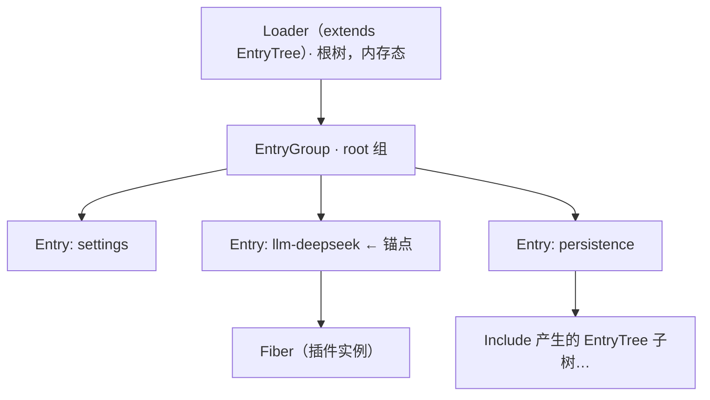

# 《DeepSeek Harness》深度解读 · 分篇 01：Cordis 插件底座

- 仓库：deepseek-ai/deepseek-harness / 子类型：monorepo（pnpm workspaces，ESM，strict TS）
- 版本锁定：deepseek-ai/deepseek-harness **master 分支 tarball 快照，2026-08-14 下载**；快照不含 git 元数据，**无 commit hash 可记录**（材料降级，特此声明）；替代锚点为根 `package.json` 版本 `0.1.0-rc.5`。文中全部 `file:line` 锚点以该快照的文件系统状态为准。vendored Cordis 本体另有自己的上游锚点：cordiverse/cordis commit `56b3d4f725681cf4556c1a8695a709cc3b6eed74`（版本 4.0.0-rc.7，见 `vendor/README.md:17`）。
- 材料范围：本篇精读 `vendor/` 框架层（cordis、loader、include、hmr 全文；schemastery、cosmokit 签名级扫读）与意图文档 `docs/cordis-primer.md`；dsh 业务包只取对照锚（每个机制一处真实用法），业务本体是后续分篇的对象。
- 读者画像：准备读本系列后续任何一篇的工程师。假定你会 TypeScript、用过事件发射器，没读过 Cordis。
- 本篇子锚点：`examples/headless-agent/cordis.yml` 里挂载 DeepSeek 适配器的那五行配置——全篇反复回到它。

## 0. 阅读地图

DeepSeek Harness（下称 dsh）的根规则只有一条："everything is a plugin"（`AGENTS.md:3`）。模型适配、工具、会话日志乃至 agent loop 本身都是插件，而"插件"这个词的全部含义——怎么注册、怎么等依赖、怎么发事件、怎么卸载——都不在 dsh 的业务代码里，在 `vendor/` 下那套 vendored Cordis 框架里。本篇就是这个框架层的垫层：读完你应该能拿着"ctx、fiber、effect、service、inject、waterfall、entry"这套词汇去读任何一篇后续分篇。叙事主线是一条迷你端到端轨迹：锚点那行 cordis.yml 配置，如何变成一个活着的插件，又如何被干净地卸载。

## 1. 背景与前置知识

上一节给了全篇地图，但地图上有七个生词。本节把它们逐个落地，并把锚点立起来。术语用词与本系列共享术语表一致，这里给的是它们在代码里的精确定义。

**插件（plugin）**。在 Cordis 里，插件不是规范文件或装饰器类，而是三种普通 JavaScript 值之一：一个函数、一个构造器、或一个带 `apply(ctx, config)` 方法的对象（`vendor/cordis/src/registry.ts:92-96`）。没有基类要求、没有注册表声明——`ctx.plugin(x)` 接受任何满足这三种形态之一的值。

**上下文（context，`ctx`）**。插件体的唯一入参（另一个是它的 config）。它表面上是"一个什么属性都有的对象"：插件读 `ctx.llm`、`ctx.tools`，调 `ctx.on()`、`ctx.plugin()`。实际上它是一个 `Proxy`（`vendor/cordis/src/context.ts:74`）：属性读取被路由到"服务解析"逻辑，写属性被路由到"服务注册"逻辑。context 之间靠原型链继承：`ctx.extend(meta)` 造一个子 context，子级能看到父级的一切，own property 只多 `meta` 里那几个键（`vendor/cordis/src/context.ts:99-107`）。

**fiber**。一次"插件被挂载"的运行时实例。同一个插件被 `ctx.plugin()` 挂两次，就有两个 fiber。fiber 持有这个插件实例的一切：它的子 context、它的依赖状态、它的配置、以及——最关键的——它注册过的所有清理函数。fiber 有六种生命周期状态（`PENDING/LOADING/ACTIVE/FAILED/DISPOSED/UNLOADING`，`vendor/cordis/src/fiber.ts:147-154`）。名字借自"纤程"：它是框架调度的最小所有权单元。

**effect（效应）**。Cordis 的核心思想："注册即 effect"。插件做的每一件有外部性的事——监听事件、提供服务、开文件 watcher——都必须通过 `ctx.effect()` 登记，并同时交出"怎么撤销这件事"的清理函数（disposer）。插件卸载时框架倒序执行全部 disposer，插件存在期间造成的每一点变化都被精确回滚。dsh 把这条写成了产品纪律："every contribution goes through `ctx.effect()` / `ctx.on()`"（`AGENTS.md:102`）。

**服务（service）与 inject**。服务就是"claim 了 `ctx` 上一个稳定键的对象"——`ctx.llm`、`ctx.tools`、`ctx.sessions`。插件之间不互相 import 实现，而是：提供者把对象挂到键上（`ctx.provide(name, value)`），消费者在插件元数据里声明 `inject: ['llm']`，框架保证"你要的服务齐了才启动你，服务没了就把你卸载"。加载顺序因此不靠编排脚本，靠依赖声明自发涌现。

**事件分发（dispatch）**。Cordis 事件总线有五种语义：`emit`（同步广播，不等）、`parallel`（并发，等全部）、`serial`（按序 await，遇 bail 值提前返回）、`bail`（同步按序，遇 bail 值提前返回）、`waterfall`（中间件式包裹，靠 `next()` 委托）。类型定义在 `vendor/cordis/src/events.ts:32`。

**entry 与 loader**。以上都是进程内 API。`vendor/loader/` 负责另一半：把 YAML 配置文件（cordis.yml）里的每一行变成一个 `ctx.plugin()` 调用。配置里的一行叫一条 entry，整棵树叫 entry tree。

**锚点登场**。这是 `examples/headless-agent/cordis.yml:23-32`，一个无头（headless）编程 agent 的完整组成文件里的一行：

```yaml
- id: llm-deepseek
  name: '@deepseek-ai/dsh-llm-deepseek'
  config:
    thinking: enabled
    reasoningEffort: max
    models:
      - id: deepseek-v4-pro
        contextWindow: 128000
      - id: deepseek-v4-flash
        contextWindow: 128000
```

同一文件第 63-67 行还有一行带表达式的（`examples/headless-agent/cordis.yml:63-67`）：

```yaml
- id: persistence
  name: '@deepseek-ai/dsh-session-persistence-jsonl'
  config:
    root: './.sessions'
    compression: !!js "process.env.DSH_SNAPSHOT === undefined ? 'zstd' : 'none'"
```

全篇的问题是：这两行字，怎么变成进程里两个活着的、互相能等到对方的、改文件能热更新、卸载时不留痕迹的插件实例？

## 2. 对象全景

上一节立了词汇和锚点，本节看森林：`vendor/` 这层里到底有哪些包、它们怎么分工、以及 dsh 用什么纪律管住这层"别人的代码"。

`vendor/` 共九个包，分三层（清单与上游 SHA 见 `vendor/README.md:13-23`）：

| 层 | 包 | 职责 |
|---|---|---|
| 内核 | `cordis/`（`@deepseek-ai/cordis`） | context/fiber/effect/事件/service/registry，全部语义来源 |
| 配置与运行时 | `loader/`、`include/`、`group/` | cordis.yml → 插件树；文件背书子树；嵌套组 |
| 运行时周边 | `hmr/`、`timer/`、`logger-console/` | 热替换、定时器、控制台日志 |
| 基础库 | `schemastery/`、`cosmokit/` | Config schema 校验；纯工具函数 |

内核 `cordis/` 本身只有九个源文件：`index.ts`（全量 re-export，`vendor/cordis/src/index.ts:1-14`）、`context.ts`（Proxy 与子 context）、`events.ts`（事件总线）、`fiber.ts`（生命周期与 effect，754 行，全框架最重）、`registry.ts`（插件注册表）、`service.ts`（Service 基类）、`reflect.ts`（服务解析层，Proxy 背后的真身）、`logger.ts`、`utils.ts`。

为什么 vendor 而不是 npm 依赖？`vendor/README.md:3` 给了官方答案：这样 harness 完全拥有自己的框架层——"auditable, patchable, pinned"。配套纪律有两条硬约束：所有本地修改必须穷尽式记录在 `vendor/README.md` 的 Local modifications 清单里（`vendor/README.md:31`，当前共 18 条），且 `vendor/AGENTS.md:5` 明说"Do NOT edit `vendor/*/src/` files casually"。这 18 条修改是本篇的重要材料：它们把"上游 Cordis 行为"和"dsh 本地行为"划开，后文每个机制都会标明自己站在线的哪一边。修改按性质分四类：

- **构建适配**（清单 2/3/4/5/10/16/17）：改名进 `@deepseek-ai` scope、tsconfig 并入 monorepo、ESM/NodeNext 兼容。不改变运行时语义。
- **生命周期加固**（清单 6）：`fiber.ts` 关闭三个重入 dispose 缺口。这是对本篇主线影响最大的一条，第 3、5 节细拆。
- **配置语义增强**（清单 8/11/12/14/15/18）：loader/include 的事务性更新、`!!js` 惰性求值、patch 修复、写回重试。第 3.2、5.4 节细拆。
- **观测与兼容**（清单 1/7/9/13）：hmr 去 i18n、JSDoc 补全、配置文件精确 watch。

至于"dsh 在哪用它"：每个 dsh 包都把 `@deepseek-ai/cordis` 声明为 peerDependency（`AGENTS.md:100`），即整个产品运行时共享同一个框架实例——这是"一切皆插件"不发生语义分裂的前提。

## 3. 主线叙事：一行 cordis.yml 的一生

词汇和全景都就位了。本节把锚点那行配置从静态文本追到活体插件再追到卸载，分六站。每一站先给一句意图（chunk 标题），再进代码。除特别标注外，行为论断均为 `静态推断`，锚点即证据。

### 3.1 文件先变成 entry：Include 的读取与解析

**意图：把 YAML 字节流变成一份带 `!!js` 表达节点的 entry 列表，一次都不碰插件代码。**

应用启动时，入口会把一个 Include 插件挂到根 context，`path` 指向锚点那个文件（启动链的完整组合叙事属于分篇 06；本篇从 Include 拿到 path 这一刻讲起）。Include 是"文件背书的 entry 树"（`vendor/include/src/index.ts:174`），它的 `Service.init` 钩子做三件事：读文件、解析、挂载（`vendor/include/src/index.ts:273-289`）。

解析用的是一把专用 YAML schema：`entryListSchema`，它在 JSON_SCHEMA 之上只加了一个自定义 tag——`!!js` 标量解析成 `{ __jsExpr: <源码字符串> }` 节点（`vendor/include/src/index.ts:9-23`）。注意此时表达式**不求值**，只是被包成有标记的数据。锚点里 `compression: !!js "process.env.DSH_SNAPSHOT === ..."` 过完这一步是 `{ __jsExpr: "process.env.DSH_SNAPSHOT === undefined ? 'zstd' : 'none'" }`。求值发生在很后面的第 3.4 站——这个"解析早、求值晚"的错位是 dsh 本地修改 #15 的核心，记住它。

文件不存在时落 `config.initial`；存在但解析结果不是顶层数组直接报错（`vendor/include/src/index.ts:261-263`）。解析通过后，列表被交给 patch 层（`applyEntryPatches`，第 5.4 节有全量拆解），再交给 EntryGroup 挂载。

### 3.2 entry 列表变成插件树：EntryTree / EntryGroup / Entry

**意图：列表里每一行变成一个 Entry 对象；Entry 是"配置行"与"fiber"之间的桥梁，并且所有变更都是事务。**

三个类的分工（`vendor/loader/src/config/tree.ts:7-20`、`vendor/loader/src/config/group.ts:6-14`、`vendor/loader/src/config/entry.ts:52-61`）：



Entry 的持久化形态是 `EntryOptions`，只有六个字段（`vendor/loader/src/config/entry.ts:9-22`）：`id`（树内稳定标识）、`name`（模块说明符）、`config`、`group`（是否嵌套组）、`disabled`、`inject`。对照锚点那一行：`id: llm-deepseek`、`name: '@deepseek-ai/dsh-llm-deepseek'`、`config` 是那段 thinking/models 字典。

挂载入口是 `Entry.init()` → 私有 `_init()`：先 `import` 出模块（`vendor/loader/src/config/entry.ts:277-289`），再 `_start()`。import 优先走 Node 内部 ModuleLoader（`vendor/loader/src/config/tree.ts:145-162`）——这是 loader 用 `--expose-internals` 或 `node-addon-require-builtin` 拿到的进程内部 API（`vendor/loader/src/internal.ts:105-131`），拿它是因为 HMR 需要读写模块缓存；拿不到就退回普通动态 import。

变更入口是 `Entry.update()`，它是 dsh 本地修改 #8 的事务性重写（`vendor/loader/src/config/entry.ts:142-246`）。规则：只改 `config` 不重建 fiber，走 `_patchContext` 让活着的 fiber 热更新（`vendor/loader/src/config/entry.ts:114-122`）；改 `name`/`inject`/`group` 才 dispose 旧 fiber 重建。任何一步失败就回滚到旧 options、旧插件，回滚再失败则把两个错误包成 `AggregateError` 抛出——错误信息里带 stage 标记（`import`/`dispose`/`apply`/`rollback`，`vendor/loader/src/config/entry.ts:24-27`）。EntryGroup 层面同理：候选并发启动、全部 settle 后统一算账、失败则撤销新增并复活旧配置（`vendor/loader/src/config/group.ts:59-106`）。这套事务行为有测试覆盖，本文作者实际跑过：`pnpm vitest run packages/boot/app-boot/tests/config-reload.spec.ts`，12/12 通过（vitest 4.1.8）——本条标注 `已验证（跑过）`，该套件正是本地修改 #8 与 #11 声明的覆盖测试（`vendor/README.md:40`、`:43`）。

### 3.3 `ctx.plugin()`：Fiber 诞生

**意图：一个插件值 + 一份 raw config → 一个登记在册、有父级所有权、等待依赖的 fiber。**

Entry 拿到模块后调 `this.ctx.registry.plugin(plugin, this.options.config, this.getOuterStack)`（`vendor/loader/src/config/entry.ts:296`）。`RegistryService.plugin()` 干的事很短（`vendor/cordis/src/registry.ts:316-336`）：把插件值归一成可执行 callback（函数直接用，对象取 `.apply`，`vendor/cordis/src/registry.ts:222-228`）；以 callback 为键在 `_internal: Map` 里取或建一个 runtime 记录（同插件多 fiber 共享）；然后 `new Fiber(...)`，把返回值包一层 thenable 交出去。

Fiber 构造器（`vendor/cordis/src/fiber.ts:222-333`）是控制权交接最密集的地方，顺序有讲究：

1. **造子 context**：`this.ctx = parent.extend({ fiber: this })`（`vendor/cordis/src/fiber.ts:236`）。子 context 继承父级一切服务与配置，own property 只多一个 `fiber`——这就是"插件嵌套"的全部隔离与共享：服务共享、身份独立。若插件声明了带配置的 inject（如 `{ llm: { route: ... } }`），这些配置写进子 context 的 intercept map（`vendor/cordis/src/fiber.ts:238-245`），作用见第 4.2 节。
2. **先把 disposer 交给父 fiber，再发布自己**：`this.dispose = parent.fiber.effect(() => {...})`（`vendor/cordis/src/fiber.ts:265-297`），然后才 `emit('internal/plugin', this)`（`vendor/cordis/src/fiber.ts:302`）。代码注释写明动机："Publish only after the parent owns a fully assigned disposer"——观察者在这个通知里同步 dispose 子 fiber 或父 fiber 都安全。loader 正是靠监听这个通知给 fiber 绑定 entry、并把 entry 声明的 `inject` 合并进 fiber 的依赖表（`vendor/loader/src/index.ts:117-123`）。
3. **发布之后才解析依赖**：对每个 inject 名跑 `_checkImpl`，再 `_refresh()` 决定要不要激活（`vendor/cordis/src/fiber.ts:314-319`）。注释说明这个顺序是故意的：loader 可能在 `internal/plugin` 通知里追加 inject，所以依赖解析必须在发布之后。

回答导读问题"子 context 继承什么、隔离什么"：继承——父级可见的全部服务（原型链）与 intercept 配置；隔离——fiber 身份（每个插件自己的 `ctx.fiber`）、通过 `ctx.isolate(name, label?)` 显式切走的服务命名空间（`vendor/cordis/src/context.ts:121-125`，子树内该服务名解析到新 label，父级不受影响）、以及 effect 所有权（子 fiber 的 effect 随子 fiber 卸载，不污染父级）。dsh 里 agent 级作用域原语（core/scope）就建立在这套 extend/isolate 之上，那是分篇 02 的材料。

### 3.4 激活：等依赖 → 求值 `!!js` → 校验 schema → 跑插件体

**意图：fiber 只在"依赖齐备"的那一刻启动；启动前 config 先过表达式求值与 schema 校验两道门。**

依赖检查的核心是 epoch 机制（`vendor/cordis/src/fiber.ts:611-639`）：`_refresh()` 把 inject 表编成一串 epoch 文本——某个服务没有 ACTIVE 的实现，epoch 就是 `INACTIVE`；齐备则拼成 `':uid1:uid2'`。epoch 从 `INACTIVE` 变非 `INACTIVE` 触发 `_reload()`；反向变化触发 `_unload()`。而"有实现"的判定是严格的：`_checkImpl` 调 `reflect._getImpl(name, true)`，strict 模式要求**提供方的 fiber 处于 ACTIVE 状态**（`vendor/cordis/src/fiber.ts:598`、`vendor/cordis/src/reflect.ts:237-243`）。服务后来上线时，提供方的 `ctx.provide()` 会 `notify()` 全部依赖它的 fiber 重跑 `_checkImpl`（`vendor/cordis/src/reflect.ts:277-305`、`:314-336`）——加载顺序就是这样"长"出来的，没有任何全局编排。

`_reload()` 的三道门（`vendor/cordis/src/fiber.ts:646-673`）：

1. **表达式求值**：config 先过 `internal/config` waterfall（`vendor/cordis/src/fiber.ts:641-644`）。loader 在这个 waterfall 上挂了全局 listener（`vendor/loader/src/index.ts:92-101`）：对有 entry 的 fiber，把 config 里的 `{ __jsExpr }` 节点递归替换为求值结果。求值发生在**此时**——fiber 的 inject 已就位，表达式里写 `ctx` 上的服务名是合法的。而 Include/Group 这类"树载体"用 `EntryGroup.key` 标记豁免（`vendor/include/src/index.ts:177-182`）：它们的 config 装的是别的行的配置，各行表达式留到各行自己的 fiber 里求值。锚点第二行的 `compression` 就是在 persistence 插件激活这一刻、对着它自己的 ctx 算出 `'zstd'` 或 `'none'`。
2. **schema 校验**：`resolveConfig()` 拿插件声明的 `Config`（一个 standard-schema 校验器）跑同步校验，有 issue 就抛 `ValidationError`（`vendor/cordis/src/fiber.ts:50-62`）。锚点第一行的 `reasoningEffort: max` 合不合法、缺省字段补什么默认值，都在这一步定死。
3. **跑插件体**：callback 以 `(ctx, config)` 调用（`vendor/cordis/src/fiber.ts:247-263`）。返回值不是随便什么——它被当作 effect 处理，见下一站。

任一门抛错：记 `_error`，epoch 打回 `INACTIVE`，fiber 进 FAILED（`vendor/cordis/src/fiber.ts:659-664`）；`await fiber` 的调用方（比如 Entry._start）拿到异常并触发 dispose。

### 3.5 注册即 effect：插件活着的时候积累什么

**意图：插件体里的每一次 `ctx.on()` / `ctx.provide()` / `ctx.effect()` 都变成 fiber 名下一条可倒序撤销的记录。**

看 `ctx.on()` 的内部路径（`vendor/cordis/src/events.ts:288-302`）：断言 fiber 活着 → 走 `internal/listener` bail 钩子（框架内部用来把 `internal/update` 这类特殊事件路由到 fiber 私有钩子表，`vendor/cordis/src/events.ts:140-146`）→ 调 `register()`。而 `register()` 的本体是（`vendor/cordis/src/events.ts:254-260`）：

```ts
register(label: string, hooks: Hook[], callback: any, options: EventOptions): () => void {
  const method = options.prepend ? 'unshift' : 'push'
  return this.ctx.fiber.effect(() => {
    hooks[method]({ ctx: this.ctx, callback, ...options })
    return () => this.unregister(hooks, callback)
  }, label)
}
```

注册监听器 = 一个 effect：setup 把 listener 推进 hooks 数组，返回的 disposer 负责把它摘掉。`ctx.provide()` 是同构的（`vendor/cordis/src/reflect.ts:277-305`）：effect 的 setup 把实现写进 `reflect.store` 并 notify 依赖方，disposer 摘除并再次 notify。所以"插件存在期间积累的状态"在框架眼里是一张扁平的 disposer 清单（`Fiber._disposables`），每条还带着诊断标签（`ctx.on("...")`、`ctx.provide("...")`，可用 `getEffects()` 读出整棵树，`vendor/cordis/src/fiber.ts:568-572`）。

effect 本身接受四种形态：返回一个 disposer、返回 disposer 的 Promise、同步/异步 iterable 逐个产出 disposer（`vendor/cordis/src/fiber.ts:83-93`、`:356-400`）。插件体的返回值也走同一条 `_execute` 通道——插件 return 一个函数，就是声明"卸载时请调我"。

### 3.6 卸载与回滚：倒序、容错、可重入

**意图：`dispose()` 之后，这个插件在进程里造成的每一点变化都被逆序抹掉；清理失败不传染邻居。**

触发卸载有三条路：`registry.delete(plugin)`（外部连锅端，`vendor/cordis/src/registry.ts:258-267`）、fiber 自己 `dispose()`、以及依赖塌了（epoch 变回 `INACTIVE` 触发 `_unload()`，之后依赖恢复还会自动 `_reload()`——热插拔的全部魔法就是这一对私有方法）。`_unload()` 本体（`vendor/cordis/src/fiber.ts:675-696`）：`_disposables.clear()` 取出全部清理函数，逐个 await，单个失败只 `logger.error` 不中断其余；清完看 epoch，依赖还在就重新 `_reload()`。

真正难的是重入：插件体执行途中有人 dispose 怎么办？setup 同步抛错时已经收集了一半的 disposer 怎么办？UNLOADING 途中有代码又注册 effect 怎么办？上游 Cordis 在这三个缺口上都会漏，dsh 本地修改 #6（`vendor/README.md:38`）把 `Fiber.effect()` 重写成了现在这 140 行：wrapper 先于插件体注册进 `_disposables`（`vendor/cordis/src/fiber.ts:520` 在 `:522` 执行体之前），setup 失败则回滚已收集的清理并摘除 wrapper（`:523-537`），UNLOADING 状态下新建 effect 直接抛 `CordisError('INACTIVE_EFFECT')`（`:420-422`）。这个函数是第 5.2 节的全量拆解对象。

HMR 为什么能"免费"获得正确的热替换？因为它不自己懂任何业务清理：文件变更 → `registry.delete(旧插件)` → 上面的回滚机制跑完 → `registry.plugin(新模块, oldFiber._config)` 重建 fiber 并保留 entry 绑定（`vendor/hmr/src/index.ts:502-509`、`:511-545`）。raw config（注意是 `_config`，未求值的原件）被原样移交，表达式在新 fiber 激活时重新求值。配置文件本身的变更走另一条路：HMR watcher 认出变更文件是某个 Include 的 filename，就串行调 `include.refresh()`（`vendor/hmr/src/index.ts:244-254`、`:297-324`），失败广播 `hmr/config-update-failed`。两条路的交汇处有个真实的并发陷阱：Include 的事务 update 不可重入，dsh 本地修改 #12 用单队列串行化所有子树变更、并让 HMR 主 watcher `ignoreInitial: true`——否则初始扫描会在首次挂载中途触发 refresh，回滚反过来 dispose 掉 HMR，形成退不出、无诊断的死锁（注释全文在 `vendor/include/src/index.ts:216-229` 与 `vendor/hmr/src/index.ts:232-239`；这是少数带着事故痕迹的代码，值得读原文）。

## 4. 模块详解

主线走完了"一行配置的一生"，但有三块机制在主线里只露了一面：Service 注入的完整规则、事件系统的五种语义、基础库的分工。本节逐个补全，每个机制末尾给一行"dsh 在哪用它"。

### 4.1 Service：声明、注入、解析顺序、循环依赖

**声明侧**有两条路。轻量路：`ctx.provide(name, value, check?)`，任何插件都能调（`vendor/cordis/src/reflect.ts:277-305`）。重量路：继承 `Service` 基类，构造函数里 `super(ctx, name)` 会自动完成 `ctx.reflect.provide(name, this, this[Service.check])`（`vendor/cordis/src/service.ts:42-59`），并附送两个能力：`[Service.invoke]` 让实例本身可被调用（`ctx.logger('name')` 就是这样来的），`[Service.check]` 是一个可用性谓词——依赖方除了要求"提供方 fiber ACTIVE"，还要求 check 通过（`vendor/cordis/src/fiber.ts:600-608`）。loader 用后者实现了"等条目加载完再启动依赖插件"（`vendor/loader/src/index.ts:166-170`）。

**注入侧**只有一种写法：插件元数据的 `inject` 字段，数组形 `['llm']` 或对象形 `{ llm: <intercept config> }`（`vendor/cordis/src/registry.ts:19`）。对象形的配置值会写进子 context 的 intercept map（第 3.3 站），最终在 Service 消费配置时按"越靠根的 intercept 越先应用，`base` 垫底、`head` 封顶"的顺序合并（`vendor/cordis/src/service.ts:86-102`）——这是"父级给子树里的插件调参"的官方通道，`ctx.intercept(name, config)`（`vendor/cordis/src/context.ts:139-145`）和 `ctx.isolate(name, label?)`（`:121-125`）是它的两个手工入口。

**解析顺序**就是没有顺序：fiber 的激活完全由"依赖是否齐备"驱动（第 3.4 站的 epoch 机制），锚点文件里 `llm-deepseek` 写在 `settings` 和 `credentials` 之后纯属给人看的——bundle 的 patch 文件把这点写进了注释："Row order carries no load semantics (activation is service-availability driven)"（`packages/bundle/base/cordis.patch.yml:12-13`）。

**循环依赖**：代码里没有任何环检测分支（依据：`vendor/cordis/src/fiber.ts:597-639` 与 `vendor/cordis/src/reflect.ts:314-336` 全文无此逻辑，`静态推断`）。两个互相 inject 对方所提供服务的 fiber，会因为对方永远到不了 ACTIVE 而一起停在 PENDING——不报错、不超时，只是永远不来。这是框架留给使用者的坑，dsh 的解法是架构层的：capability seam 规定 Service Definition 包不 inject 自己的 Consumer（`AGENTS.md:109`），从依赖方向设计上避免成环。

**dsh 在哪用它**：`packages/core/agent-loop/src/index.ts:296-306`——agent loop 自己也只是一个 `class AgentLoop extends Service`，`static inject = ['agents', 'sessions', 'llm', 'tools', 'systemPrompt']`，`static Config = z.object({...})`。"连 loop 都是插件"这句话的字面证据。

### 4.2 事件系统：五种语义、waterfall 契约、declaration merging

五种语义的实现都不到十行，全在 `vendor/cordis/src/events.ts:183-243`：

| 模式 | 等不等 | 顺序 | 提前终止 | 返回值 |
|---|---|---|---|---|
| `emit` | 不等 | 注册序 | 否 | 无 |
| `parallel` | 等全部（`Promise.allSettled`，有 reject 聚合抛出） | 并发 | 否 | 无 |
| `serial` | 逐个 await | 注册序 | 遇 bail 值返回 | 第一个 bail 值 |
| `bail` | 同步 | 注册序 | 遇 bail 值返回 | 第一个 bail 值 |
| `waterfall` | 组合本身同步（监听器可返回 Promise） | 注册序由外向内 | 不调 `next()` 即否决 | 最外层监听器的返回值 |

bail 值的判定是 `value !== null && value !== false && value !== undefined`（`vendor/cordis/src/events.ts:13-15`）——注意 `0` 和空字符串都算 bail。

**waterfall 的 `next()` 委托契约**。dispatch 时最后一个实参被当作最内层的 `next`（通常是内置行为）；每次 `next()` 从回调数组 shift 出下一个监听器执行，数组耗尽落到内置行为（`vendor/cordis/src/events.ts:234-243`，全文见第 5.1 节）。所以"不调用 `next()`"不是"我不发表意见"，而是"我否决后面所有人包括默认行为"。dsh 把这条升级为纪律："Waterfall listeners MUST call `next()` to delegate; returning without it short-circuits the chain"（`AGENTS.md:106`），意图文档进一步区分了两类监听器：拥有决策权的策略监听器可以不委托，只观察/注解的必须委托（`docs/cordis-primer.md:28-34`）。真实样例一对：dispatch 侧 `packages/core/tools/src/index.ts:1298-1301`（`ctx.waterfall(scopeTarget(...), 'tools/code-dispatch-log', dispatch, () => Promise.resolve(dispatch.content))`），listener 侧 `packages/jobs/tool-jobs/src/index.ts:233-237`（记完输出上限后 `return next()`，`{ prepend: true }` 排到队首）。

**类型化事件的扩展机制**是 TypeScript declaration merging，三层递进。第一层在 cordis 内部：`events.ts`、`registry.ts`、`fiber.ts` 各自 `declare module './context.ts' { interface Context { ... } }`，把 `ctx.on`、`ctx.plugin`、`ctx.effect` 的类型合并进 Context 接口（如 `vendor/cordis/src/events.ts:34-109`）。第二层在 dsh 插件：`declare module '@deepseek-ai/cordis' { interface Events { 'hmr/reload'(reloads: ...): void } }`（`vendor/hmr/src/index.ts:15-31`；loader 也用同一招声明 `exit`、`loader/config-update` 等事件和 `ctx.loader`，`vendor/loader/src/index.ts:23-43`）。第三层是 dsh 自己的 SessionEventMap：词汇本体在 `packages/core/session/src/types.ts:236`，任何包都能用 `declare module '@deepseek-ai/dsh-session/types' { interface SessionEventMap { 'agent/inbox/spliced': {...} } }` 添词（实例：`packages/core/agent/src/types.ts:12-27`）。效果：事件名与 payload 类型在编译期闭合，新增事件不需要改框架任何一个文件——"挂在扩展点上，不改核心"这个纪律在类型层面也是成立的。

### 4.3 基础库：schemastery 与 cosmokit

**schemastery**（签名级扫读）：一个 standard-schema 兼容的校验库，`z.object(...)` 风格的声明式 schema，原型上挂了 `~standard` 接口（`vendor/schemastery/src/index.ts:275`）。cordis 内核不 import 它——`resolveConfig` 只依赖 `@standard-schema/spec` 接口（`vendor/cordis/src/fiber.ts:50-62`），schemastery 是 dsh 选定的该接口实现，插件用它声明 `static Config`。它的 `.simplify()`（`vendor/schemastery/src/index.ts:407-431`）还有个不显眼但关键的用途：loader 把校验后的 config 写回 YAML 时靠它去掉默认值膨胀（`vendor/loader/src/index.ts:106-107`）。**dsh 在哪用它**：第 4.1 节 agent-loop 的 `static Config = z.object({...})` 里那个 `z` 就是它（`packages/core/agent-loop/src/index.ts:10`）。

**cosmokit**（签名级扫读）：五个纯工具模块（array/types/misc/string/time，`vendor/cosmokit/src/index.ts:1-10`），cordis 从它那里拿 `defineProperty`、`isNullable`、`deepEqual`、`valueMap` 等，无领域语义。

## 5. 关键制品详解

机制讲完，落到四个承重制品的全文。每个走拆解链五连：回答什么 → 逐项解释 → 直觉 → 反事实 → 白话翻译。来源分级：waterfall 与 evaluate 是上游 Cordis 原样；`Fiber.effect()` 与 `applyEntryPatches` 是 dsh 本地修改版（非官方，上游对应物见 cordiverse/cordis 对应 commit）。

### 5.1 `EventsService.waterfall()`——否决权如何落地

> 来源：官方（上游原样）。`vendor/cordis/src/events.ts:234-243`

```ts
waterfall(...args: any[]) {
  const cbs = this.dispatch('waterfall', args)
  const inner = args.pop()
  const next = () => {
    const cb = cbs.shift() ?? inner
    return cb(...args)
  }
  args.push(next)
  return next()
}
```

1. **回答什么问题**：一条事件管线里，每个监听器如何获得"放行/否决/包裹"后续链的能力。
2. **逐项解释**：`dispatch()` 先按过滤规则收齐监听器回调数组；`args.pop()` 把调用方传来的最后一个实参（内置行为）存为 `inner`；`next` 是共享闭包——每次调用 shift 出下一个监听器，数组空了就用 `inner`；`args.push(next)` 把这个闭包补回参数列尾部，于是每个监听器收到的签名都是 `(...业务参数, next)`；最外层的 `return next()` 启动链条并把最外层监听器的返回值交还调用方。
3. **直觉**：全部权力藏在 `?? inner` 里——监听器不调 `next()`，`inner` 就永远到不了，否决是默认路径的自然结果，不需要任何显式的"否决 API"。而 `cbs.shift()` 的共享游标让"包裹"（`next()` 前后各干一段活）天然成立。
4. **反事实**：若把 `?? inner` 换成"空数组时返回 undefined"，内置行为就进不了管线，框架核心逻辑（如 loader 的 config 求值兜底 `() => config`）会被静默跳过；若每次 `next()` 不 shift 而是按索引重新派发，监听器就会重复执行。
5. **白话翻译**：一摞人围着一件事，从外到内轮流经手；你不往下传，这事就死在你手里。

### 5.2 `Fiber.effect()`——回滚机制的心脏（dsh 本地加固版）

> 来源：非官方（dsh 本地修改 #6，`vendor/README.md:38`；上游同名函数较简）。`vendor/cordis/src/fiber.ts:415-561`

```ts
  effect(execute: () => SyncEffect, label?: string): Disposable<Promise<void>>
  /** Same as above for async effects; the disposer is also awaitable. */
  effect(execute: () => Effect, label?: string): AsyncDisposable<Promise<void>>
  effect(execute: () => Effect, label = 'anonymous'): any {
    this.assertActive()
    if (this.state === FiberState.UNLOADING) {
      throw new CordisError('INACTIVE_EFFECT')
    }

    const disposables: Disposable[] = []
    let disposing = false
    let disposalTask: void | Promise<void>
    const dispose = () => {
      if (disposing) return disposalTask
      disposing = true
      let task!: void | Promise<void>
      for (const disposable of disposables.splice(0).reverse()) {
        if (task) {
          task = task.then(() => runDisposable(disposable))
        } else {
          const result = runDisposable(disposable)
          if (isObject(result) && 'then' in result) {
            task = result as any
          }
        }
      }
      return disposalTask = task
    }

    const meta: EffectMeta = { label, children: [] }
    const runner: EffectRunner<boolean> = {
      execute,
      epoch: true,
      collect: (dispose) => {
        disposables.push(dispose)
        this._disposables.delete(dispose)
        if (dispose[symbols.effect]) {
          meta.children.push(dispose[symbols.effect])
        }
      },
      getOuterStack: buildOuterStack(),
    }

    let task: void | Promise<void>
    let executing = true
    let resolveSetup: (() => void) | undefined
    let rejectSetup: ((reason: unknown) => void) | undefined
    let setupBarrier: Promise<void> | undefined
    let setupFailed = false
    let inFlight: void | Promise<void>
    let removeWrapper = () => false

    const waitForSetup = () => {
      setupBarrier ??= new Promise<void>((resolve, reject) => {
        resolveSetup = resolve
        rejectSetup = reject
      })
      return setupBarrier
    }

    const disposeAfter = (setup: PromiseLike<void>) => {
      return Promise.resolve(setup).then(
        () => dispose(),
        async (reason) => {
          await dispose()
          throw reason
        },
      )
    }

    const finalizeDisposal = (callback: () => void | Promise<void>) => {
      let result: void | Promise<void>
      try {
        result = callback()
      } catch (error) {
        removeWrapper()
        throw error
      }
      if (isObject(result) && 'then' in result) {
        const pending = Promise.resolve(result).finally(() => {
          removeWrapper()
          if (inFlight === pending) inFlight = undefined
        })
        return inFlight = pending
      }
      removeWrapper()
      return result
    }

    const wrapper = defineProperty(() => {
      // A synchronous setup failure can race an owner unload that already
      // captured this wrapper but has not invoked it yet. The failed effect is
      // never returned publicly, so let that internal caller await rollback.
      if (!runner.epoch) return setupFailed ? inFlight : undefined
      runner.epoch = false
      return finalizeDisposal(() => {
        if (executing) return disposeAfter(waitForSetup())
        return task ? disposeAfter(task) : dispose()
      })
    }, symbols.effect, meta) as AsyncDisposable
    effectInertia.set(wrapper, () => inFlight)

    // Make the effect visible to a reentrant owner unload before execute()
    // runs any plugin code. Async teardown stays owner-visible until it
    // settles, allowing an outer effect to join cleanup another caller began.
    removeWrapper = this._disposables.push(wrapper)
    try {
      task = this._execute(runner)
    } catch (reason) {
      executing = false
      setupFailed = true
      runner.epoch = false
      let cleanup: void | Promise<void>
      try {
        cleanup = finalizeDisposal(dispose)
      } finally {
        rejectSetup?.(reason)
      }
      if (isObject(cleanup) && 'then' in cleanup) {
        cleanup.catch(error => this.ctx.logger.error(error))
      }
      throw reason
    }
    executing = false
    if (setupBarrier) {
      Promise.resolve(task).then(resolveSetup, rejectSetup)
    }

    // prevent unhandled rejection — both from `task` itself and from the
    // disposer chain if it fails to settle cleanly.
    task?.catch(() => {
      if (!runner.epoch) return dispose()
      return finalizeDisposal(dispose)
    }).catch((error) => this.ctx.logger.error(error))

    const disposeAsync = () => {
      if (!runner.epoch) return
      runner.epoch = false
      return finalizeDisposal(dispose)
    }
    wrapper.then = async (onFulfilled, onRejected) => {
      return Promise.resolve(task)
        .then(() => disposeAsync)
        .then(onFulfilled, onRejected)
    }
    return wrapper
  }
```

1. **回答什么问题**：`ctx.effect(fn)` 如何做到——`fn` 立即执行；它产出的每个 disposer 被收集；无论"调用方主动 dispose""所属 fiber 卸载""setup 中途失败"还是"setup 异步进行时遭遇卸载"哪条路触发，清理都恰好执行一次、倒序、可等待，且不被重入打乱。
2. **逐项解释**（按执行时序）：入口两道闸——`assertActive()`（fiber 已死直接抛）与 UNLOADING 拒绝（`静态推断`：这是本地修改 #6 的关键一行，清理途中新注册的 effect 会逃出卸载快照，必须拒绝）。`disposables` 是这个 effect 的私有清单；`dispose()` 用 `disposing` 标志保证单次语义，`.splice(0).reverse()` 倒序并把异步 disposer 串成 promise 链。`runner.collect` 做两件隐蔽的事：把子 disposer 从 fiber 总清单挪进本 effect 名下（`this._disposables.delete(dispose)`——所以卸载时不会出现"父 effect 和子 effect 重复清理"），同时把嵌套 effect 的诊断标签挂成树。中段的状态机组（`setupBarrier`/`inFlight`/`wrapper`）是加固本体：`wrapper` 是注册进 fiber 总清单的那个函数，它在 `_execute` 跑任何插件代码**之前**就入列（`removeWrapper = this._disposables.push(wrapper)` 先于 `task = this._execute(runner)`），于是"setup 执行中 fiber 开始卸载"时卸载方能看见并等它；wrapper 内部按三种时态分派——还在 executing 就等 setup barrier 再 dispose，有异步 task 就接在 task 后，否则直接 dispose。`effectInertia` 这个 WeakMap 让"结构所有者"（fiber 卸载路径）能加入一个已由别人开始的清理，而公开 disposer 仍保持单次语义。catch 块处理 setup 同步失败：回滚已收集的 disposer、摘除 wrapper、再把原错误抛给调用方。尾部 `task?.catch(...)` 兜住异步 setup 的拒绝，避免 unhandled rejection。
3. **直觉**：设计枢轴是"先登记、后执行"。普通实现会先跑 `execute()` 拿到 disposer 再登记，这在单线程无重入的世界没问题；但 Cordis 的 `internal/plugin` 通知、`ctx.on` 回调都可能同步触发卸载，登记晚一行的窗口就是泄漏窗口。全部复杂度（barrier、inFlight、inertia）都是在为"登记与执行之间存在异步窗口"买单。
4. **反事实**：删掉 UNLOADING 闸，HMR 重载过程中某个异步回调里迟到的 `ctx.on()` 会把监听器挂进一个已经清空的 hooks 数组，旧插件"复活"一半；把 wrapper 的登记挪到 `_execute` 之后，插件体里同步触发 `ctx.fiber.dispose()` 就会跳过这个 effect 已产生的全部清理；去掉 `collect` 里的 `_disposables.delete`，卸载会对外层 effect 和内层子 disposer 各跑一次清理，重复 close 同一资源。
5. **白话翻译**：先领一张"待清理"的号牌再开工；不管活干没干完、谁喊停、什么时候喊停，凭号牌把摊子倒着收干净，且只收一次。

### 5.3 `evaluate` / `interpolate`——`!!js` 在哪求值、边界在哪

> 来源：官方（上游原样）。`vendor/loader/src/config/utils.ts:1-32`

```ts
import { valueMap } from '@deepseek-ai/cosmokit'

// eslint-disable-next-line no-new-func
/** Evaluate a JavaScript expression against a loader context scope. */
export const evaluate = new Function('ctx', 'expr', `
  with (ctx) {
    return eval(expr)
  }
`) as ((ctx: object, expr: string) => any)

/** Recursively replace YAML `!js` expression nodes with evaluated values. */
export function interpolate(ctx: object, value: any) {
  if (isJsExpr(value)) {
    return evaluate(ctx, value.__jsExpr)
  } else if (!value || typeof value !== 'object') {
    return value
  } else if (Array.isArray(value)) {
    return value.map(item => interpolate(ctx, item))
  } else {
    return valueMap(value, item => interpolate(ctx, item))
  }
}

/** Return true when a value is a serialized loader JavaScript expression. */
export function isJsExpr(value: any): value is JsExpr {
  return value instanceof Object && '__jsExpr' in value
}

/** Serialized JavaScript expression produced by the include YAML tag. */
export interface JsExpr {
  __jsExpr: string
}
```

1. **回答什么问题**：cordis.yml 里的 `!!js` 表达式在什么时候、以什么权限、对着什么作用域执行。
2. **逐项解释**：`evaluate` 是一个 `new Function` 出来的双参函数，函数体用 `with (ctx)` 把 context 的属性直接变成词法变量再 `eval` 表达式——所以 `!!js dshHomePath('sessions')` 里能裸写 ctx 上的名字（实例：`packages/bundle/base/cordis.patch.yml:101`）。`interpolate` 深度优先遍历 config，遇 `{ __jsExpr }` 节点就替换为求值结果，数组和纯对象递归，其余原样。`isJsExpr` 就是认 `__jsExpr` 键。
3. **直觉**：调用位置比实现重要。它在 loader 的 `internal/config` waterfall listener 里被触发（`vendor/loader/src/index.ts:100`），而 `internal/config` 由 fiber 在 `_reload()` 里、inject 齐备之后、schema 校验之前发起（`vendor/cordis/src/fiber.ts:641-655`）——所以表达式可以引用这个插件自己声明的依赖服务。这是 dsh 本地修改 #15（port 上游 PR cordiverse/cordis#41）的全部意义：把求值从"挂载时"推迟到"激活时"，配置才能在 service 替换后重新求值（`vendor/README.md:47`）。`disabled` 字段走另一条更勤快的路：每次挂载决策都对 loader context 求一次值，且原始节点留在 options 里、写回文件时保持 `!!js` 形态（`vendor/loader/src/config/entry.ts:100-108`，本地修改 #18）。这两条行为链均有作者实跑测试背书：`pnpm vitest run packages/boot/app-boot/tests/user-patches.spec.ts`，16/16 通过（vitest 4.1.8）——该套件正是 #15 与 #18 声明的覆盖测试，`已验证（跑过）`。
4. **反事实**：若求值发生在挂载时（上游旧行为），`settings` 服务热更新后，依赖它的表达式不会重算，配置成了一次性快照；若 `disabled` 只求值一次，"环境变量在时禁用该插件"这类条件组合就无法响应运行时变化。
5. **白话翻译**：配置文件里可以塞一小段 JS，它不在读文件时跑，而在"这个插件马上要用它"的那一刻、当着全部已就位服务的面跑——安全配置文件的机器才有权写，因为它就是 `eval`，没有任何沙箱（`静态推断`：实现中无隔离设施；dsh 侧纪律也把 `!!js` 限在 plugin `config` 与 entry `disabled` 两处，`AGENTS.md:96`）。

### 5.4 `applyEntryPatches()`——组合层的代数（dsh 抽取修复版）

> 来源：非官方（dsh 本地修改 #11，`vendor/README.md:43`；由上游私有方法抽取并修复 insert 索引缺陷）。`vendor/include/src/index.ts:58-128`

```ts
export function applyEntryPatches(
  data: EntryOptions[],
  patches: PatchOptions[] | undefined,
  warn: (message: string, ...args: any[]) => void,
): EntryOptions[] {
  data = structuredClone(data)
  if (!patches?.length) return data

  const entryMap = new Map<string, EntryOptions>()
  const buildMap = (entries: EntryOptions[]) => {
    for (const entry of entries) {
      if (entry.id) entryMap.set(entry.id, entry)
      if (entry.group && Array.isArray(entry.config)) {
        buildMap(entry.config)
      }
    }
  }
  buildMap(data)

  for (const patch of patches) {
    const { id, insert, name, ...overrides } = patch

    if (insert) {
      if (id) {
        const target = entryMap.get(id)
        if (!target) {
          warn('patch insert: entry %C not found', id)
          continue
        }
        if (!target.group) {
          warn('patch insert: entry %C is not a group', id)
          continue
        }
        if (!Array.isArray(target.config)) target.config = []
        target.config.push(...insert)
      } else {
        data.push(...insert)
      }
      // Index what this patch added so a LATER patch in the same list can
      // target it. Patch lists compose one layer per source (each bundle
      // layer, then the user's, then `--patch` overlays), and a layer must be
      // able to configure or disable a row an earlier layer inserted; without
      // this, inserted rows were silently unpatchable.
      buildMap(insert)
      continue
    }

    if (!id) {
      warn('patch: id is required for non-insert patches')
      continue
    }

    const target = entryMap.get(id)
    if (!target) {
      warn('patch: entry %C not found', id)
      continue
    }

    if (name && name !== target.name) {
      warn('patch: name mismatch for %C (expected %C, got %C), skipping', id, target.name, name)
      continue
    }

    for (const [key, value] of Object.entries(overrides)) {
      if (key === 'id') continue
      target[key] = value
    }
  }

  return data
}
```

1. **回答什么问题**：一份 entry 列表如何被一组 patch 声明式改造——bundle 层、用户层、命令行 overlay 各自只带一份 patch 就能重塑同一份基础配置，且"打不上的 patch"全部有声（warn）而非静默。
2. **逐项解释**：开头 `structuredClone` 保证输入不被改、结果与缓存解析完全脱钩（注释说明：否则重复打 patch 时旧值会烤进缓存，热重载无法撤销被移除的 patch）。`buildMap` 建 id → entry 索引并递归进 group 的 `config`（嵌套组的行同样可被寻址）。patch 分两类：`insert` 类向根列表或某个 group 行追加新行；其余按 `id` 寻址，`name` 带上时做防呆校验，剩余的 override 键整段覆盖目标行（注意 `config` 是整体替换不是合并——bundle 文件里专门注释了这条语义，`packages/bundle/base/cordis.patch.yml:6-10`）。`buildMap(insert)` 是 dsh 修复点：insert 的行即刻入索引，同一份 patch 列表里靠后的 patch 能命中靠前的 insert 插进来的行；上游只在循环前建一次索引，这些行静默不可 patch。
3. **直觉**：这是"组合"二字的代数化——基础配置是被加数，每个 bundle/用户/overlay 是一个增量算子，算子按固定顺序施加，幂等性靠"每次从克隆体重放全部 patch"而不是"记住上次增量"获得。
4. **反事实**：没有 `buildMap(insert)`，dsh 的组合模型就断了：它把空 profile 根与每个 bundle 的 patch 层、用户的 `cordis.patch.yml`、`--patch` overlay 作为同一层的兄弟 patch 列表组合，若 insert 的行不可寻址，用户就无法禁用或调参任何由 bundle 插入的行——这些行对用户配置彻底不可达（`vendor/README.md:43`）。抽成导出纯函数若不做，`dsh --dump-config` 就得重新实现 patch 算法，与真实启动路径必然漂移。
5. **白话翻译**：一层一层往基础配置上叠便利贴；先撕下来重贴总是从原件开始，而且后一张便利贴能盖住本层先贴的那张。

## 6. 价值与贡献

模块和制品都拆完了，退一步看：这层框架在设计上真正下了注的地方有三处。

**第一注：用"注册即 effect"统一了插件系统的两半。** 大多数插件框架把"装载"做重（扫描、初始化、依赖图），把"卸载"做轻甚至不做。Cordis 反过来：effect 模型让卸载成为一等公民，fiber 的 `_unload()`/`_reload()` 一对私有方法同时支撑依赖热插拔、配置热更新、HMR 代码热替换三种场景（第 3.6 节）。dsh 选择 vendor 这套框架并给 fiber 打加固补丁（本地修改 #6），等于把这个赌注加倍——对一个"agent 会挂卸自己的插件"（`packages/self-modification/`，`AGENTS.md:35`）的产品，回滚的正确性不是卫生问题是功能前提。

**第二注：vendored pinned source copy + 穷尽式修改日志。** 不做 npm 依赖、不做 fork 发布，而是把源码钉进自己的仓库，配一份"每条分叉必须登记"的清单和 sync 程序（`vendor/README.md:52-60`）。18 条修改日志本身就是最好的架构文档：每一条都写了动机、覆盖测试和退役条件。作为对比，常见的"fork 后静默改"路线里，本地分叉与上游的差异是不可见的；这里差异被制度化成一等制品。

**第三注：配置即数据，但求值时机精确到激活点。** `!!js` 给声明式配置开了图灵完备的后门，却用"解析早、求值晚、tree-carrier 豁免"三条规则把后门管住（第 5.3 节）。这让 cordis.yml 同时是给人读的清单和给机器跑的程序，且条件组合（`disabled` 表达式）不需要发明第二套配置语言。

## 7. 局限与批判

价值说完，按四层分离拆它的短板：文档声明了什么、代码实际做到什么、合理推断、未验证。

**意图 vs 现实偏差**（意图文档 `docs/cordis-primer.md` 对照代码）：

| 宣称 | 出处 | 代码实际 | 判断 |
|---|---|---|---|
| dispatch 模式表列 4 种（emit/waterfall/parallel/serial） | `docs/cordis-primer.md:17-24` | `DispatchMode` 有 5 种，含 `bail`（`vendor/cordis/src/events.ts:32`） | 文档漏列。bail 在 cordis 内部真实使用（`internal/listener` 走 bail，`vendor/cordis/src/events.ts:296`） |
| "A plugin is a object that implements Service" | `docs/cordis-primer.md:9` | 函数、构造器、`{apply}` 对象都是合法插件，`Service` 子类只是其中一路（`vendor/cordis/src/registry.ts:92-96`） | 表述偏窄，初学者会误以为必须继承基类 |

**代码层的真实短板**：

- **循环依赖无检测**：互等 fiber 永久 PENDING 且无诊断（第 4.1 节，`静态推断`）。框架把避免成环的责任推给了使用者的架构纪律。
- **`!!js` 是完全 `eval`**：安全边界=配置文件可信，无沙箱、无超时（第 5.3 节）。对"从网络拉取组合配置"这类用法是硬限制。
- **fiber 加固的复杂度代价**：`Fiber.effect()` 140 行状态机（第 5.2 节）是 18 条本地修改中最难同步的一条——上游 fiber.ts 一旦大改，sync 程序（`vendor/README.md:52-60`）要求人工重放这段逻辑，冲突风险集中在这一处（`静态推断`，依据是修改日志中它的篇幅与机制耦合度）。
- **Cordis 上游论文/官网关于"时空可组合性"（spatiotemporal composability）的宣称**：本仓库材料中未出现该宣称的一手出处，`未核验`，不替它背书；上游项目主页 https://github.com/cordiverse/cordis 可作为查证入口。本篇的全部论断只基于 vendored 源码本身。

**行为论断分层汇总**：`已验证（跑过）`——loader/include 事务性配置协调与 patch 语义（`pnpm vitest run packages/boot/app-boot/tests/config-reload.spec.ts`，12/12 通过）、惰性 config 求值与 `disabled` 插值（`pnpm vitest run packages/boot/app-boot/tests/user-patches.spec.ts`，16/16 通过）。`静态推断`——fiber 生命周期、effect 回滚、事件语义、service 注入、HMR 内部流程，均带 file:line 锚点（vendor 包自身不带测试套件，其行为的可运行证据均由上述 dsh 侧套件间接覆盖）。`未验证`——HMR 在真实文件 watch 下的端到端行为（需要文件系统事件环境，本篇未跑 `hmr-config.spec.ts` 之外的长链场景）。

**开放问题**（代码读不出，标记待问）：为什么选 vendored copy 而非 git submodule 或 fork 发布包？为什么 port 上游 PR #41 而不等其合并？[ASK USER]

## 8. 怎么用

批判收束到行动：想亲手验证或修改这层框架，从哪进。

- **最小阅读路径**：`vendor/cordis/src/context.ts`（146 行）→ `registry.ts`（337 行）→ `fiber.ts`（754 行，本篇第 3.3–3.6 节可作导读）→ `events.ts` 与 `reflect.ts` 对照读。再进 `vendor/loader/src/`，顺序 index → config/tree → config/group → config/entry。
- **拉线头入口**：改 loader/include 行为后跑 `pnpm vitest run packages/boot/app-boot/tests/config-reload.spec.ts packages/boot/app-boot/tests/user-patches.spec.ts`（本篇已验证这两个套件在快照上通过）；想观察"agent 改自己运行时"的完整演示，`pnpm run demo:cordis`（需 `DEEPSEEK_API_KEY`，`AGENTS.md:78`）。
- **改框架层的铁律**：任何对 `vendor/*/src/` 的改动必须登记进 `vendor/README.md` 的 Local modifications 清单并遵循 sync 程序（`vendor/AGENTS.md:5`、`vendor/README.md:52-60`）；改完跑 `pnpm install && pnpm run test && pnpm run build`。
- **坑清单**：循环 inject 无报错只永久 PENDING（第 4.1 节）；waterfall listener 忘了 `next()` 是否决不是旁观（第 4.2 节）；`!!js` 在 Group/Include 行的 config 里不会就地求值，要等行自己的 fiber 激活（第 5.3 节）；写插件配置别依赖 entry 行序——加载顺序由依赖驱动（第 4.1 节）。

## 9. 总结与自测

三句话：Cordis 把"插件"定义为三种普通值，把"挂载"定义为 fiber，把"注册"定义为 effect——卸载因此成为一等公民，这是 dsh 敢让 agent 热改自己运行时的地基。loader 家族把 cordis.yml 变成事务性维护的插件树，`!!js` 表达式把求值精确钉在激活点。dsh 不消费上游而拥有上游：vendored copy 加 18 条穷尽日志，框架层的每一处分叉都可见、可审、可退役。

自测（答不出请回对应节）：

1. 一个插件的 `ctx.on()` 注册的监听器，在插件卸载时经哪条代码路径被摘除？（第 3.5、3.6 节）
2. fiber 从 PENDING 到 ACTIVE 的触发条件是什么？"服务上线"这件事怎么通知到等待者？（第 3.4 节）
3. waterfall 监听器不调用 `next()` 的语义是什么？代码里哪一行决定了这个语义？（第 4.2、5.1 节）
4. cordis.yml 里 `config: { x: !!js ... }` 的表达式在何时、对着什么作用域求值？为什么不能在文件解析时求？（第 3.4、5.3 节）
5. `applyEntryPatches` 为什么要 `structuredClone`，`buildMap(insert)` 修掉了上游的什么缺陷？（第 5.4 节）

延伸阅读：意图文档 `docs/cordis-primer.md`（44 行，十分钟）；上游项目 cordiverse/cordis（`vendor/README.md:17` 有钉住的 commit）；生成版 API 参考 `docs/cordis-api/context.md`（查表用）。

## 附录：索引与覆盖报告

**小节索引**：词汇与锚点 → 第 1 节；vendor 全景与修改日志分类 → 第 2 节；迷你端到端主线（Include 解析 → 插件树 → Fiber 诞生 → 激活三道门 → effect 积累 → 卸载回滚）→ 第 3 节；Service/事件/基础库详解 → 第 4 节；四个承重制品全文拆解 → 第 5 节；价值 → 第 6 节；局限与偏差表 → 第 7 节；上手路径 → 第 8 节。

**覆盖矩阵（位置 × 元素）**：

| 位置 | 入口 | 核心机制 | 测试/验证 | 状态 |
|---|---|---|---|---|
| vendor/cordis | index.ts | context/fiber/events/registry/service/reflect 全文精读 | dsh 侧套件间接覆盖 | 已覆盖 |
| vendor/loader | src/index.ts | entry/group/tree/utils/internal 全文精读 | config-reload、user-patches 套件（作者实跑通过） | 已覆盖 |
| vendor/include | src/index.ts | 全文精读（schema/patch/事务/写回） | 同上 | 已覆盖 |
| vendor/hmr | src/index.ts | 全文精读（watcher/reload/回滚） | 未实跑 hmr-config 套件 | 已覆盖（验证弱一级） |
| vendor/schemastery、cosmokit | 各自 index | 签名级扫读 | — | 签名级 |
| vendor/timer、group、logger-console | — | group 的机制经 loader/config/group.ts 覆盖；timer/logger-console 未展开（稳定小插件，与主线无机制耦合） | — | 未覆盖（理由：稳定模块） |
| vendor/cordis logger.ts、utils.ts | — | 仅经引用点带过 | — | 未覆盖（理由：非叙事主线） |
| docs/cordis-api/* | context.md | 只作查表 | — | 未覆盖（生成物） |

**开放问题**：见第 7 节末，两项 [ASK USER]。
