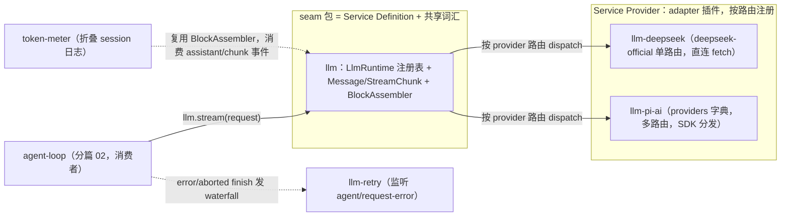
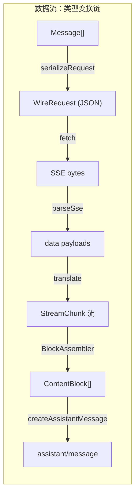
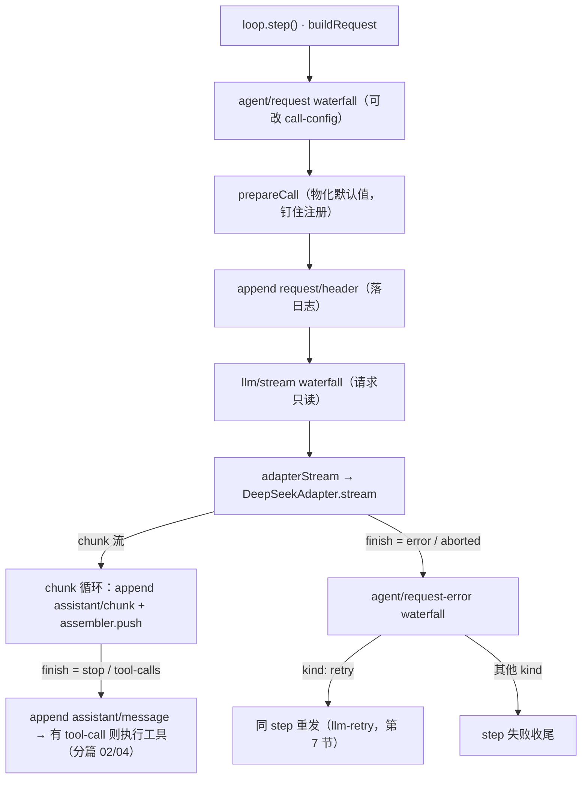

# 分篇 03 — LLM 能力层与流式管道

- 仓库：deepseek-ai/deepseek-harness / 子类型：monorepo（pnpm workspaces，ESM，strict TS）
- 版本锁定：deepseek-ai/deepseek-harness **master 分支 tarball 快照，2026-08-14 下载**；快照不含 git 元数据，**无 commit hash 可记录**（材料降级，特此声明）；替代锚点为根 `package.json` 版本 `0.1.0-rc.5`。文中全部 `file:line` 锚点以该快照的文件系统状态为准。
- 版本锁定补充锚点：快照根 `package.json` 的 SHA-1 为 `16918dcd04afbb809d896844bd04c3cb3bd3d301`（在快照根执行 `shasum package.json` 可复算）。
- 材料范围：map+采样。本篇精读 `packages/llm/` 五包（llm、llm-deepseek、llm-pi-ai、llm-retry、token-meter）全部 `src/`，关联扫读 `packages/core/agent-loop/src/agent.ts` 的模型段与 `packages/compaction/`（签名级）；文档对照 `docs/subsystems/llm-streaming.md`、`packages/llm/README.md`、`docs/cookbook/adding-an-llm-adapter.md`。
- 读者画像：已读分篇 01（Cordis 底座）与分篇 02（核心 spine 与一轮 turn）的读者；`ctx`/service/effect/waterfall/SessionEvent/turn/step 等词汇直接沿用，不再定义。
- 验证基准：`pnpm install` 后 `npx vitest run packages/llm` → 34 个测试文件、675 个测试全部通过。被这些单测覆盖的行为论断标【已验证（跑过）】；e2e（`tests/*.e2e.ts`）需要 `DEEPSEEK_API_KEY`，未跑，涉及真实 provider 行为的论断标【静态推断】；DeepSeek 官方 API 字段拼写以仓库内代码为准描述"本仓库如何映射"，外部真值【未核验】。

## 0. 阅读地图

分篇 02 讲完了一轮 turn 的骨架：inbox 唤醒 agent，loop 装配 prompt、发出模型请求、执行工具、落日志。其中有一步被一句话带过了——`agent/request → llm/stream → assistant/chunk* → assistant/message`。本篇把这一步放大成主角：loop 把一叠 `Message` 交给 `ctx.llm` 之后，它们在 seam 内部变成什么、沿哪条线流动、出错时谁来收拾。

涉及五个包：`llm`（seam 本体 + 消息词汇）、`llm-deepseek`（直连 DeepSeek 官方 API 的 adapter）、`llm-pi-ai`（包着 pi-ai 库的多 provider adapter）、`llm-retry`（失败重试）、`token-meter`（token 计量）。前三个是主线，后两个是挂在这条管道上的两个侧面。

**本篇子锚点**：你在 `examples/headless-agent` 里敲了一个任务，agent 进入第一个 step——loop 拿着派生历史走到模型边界，DeepSeek 模型流式返回一段 thinking、一段正文和一个 `bash` 工具调用。我们就盯着这一个 step：请求怎么出门、chunk 怎么回家、最后怎么变成日志里那条 `assistant/message`。这个例子的组合文件 `examples/headless-agent/cordis.yml:23-32` 配的就是 `llm-deepseek`，`thinking: enabled`、`reasoningEffort: max`，模型 `deepseek-v4-flash`（`:53`）。

## 1. 背景与前置知识：本篇词汇

第 1 节只补本篇必需的四个词，其余沿用前篇。

**provider route（路由键）**：一个不透明的字符串键，比如 `deepseek-official`。它是请求选 adapter 的唯一依据——`GenerateOptions.provider` 填什么路由，就由注册该路由的 adapter 实例服务（`packages/llm/llm/src/index.ts:816-819`，查不到就抛 `NO_ADAPTER`）。模型 id 不是路由：`provider` 选 adapter，`model` 原样透传给 adapter 当 wire 模型名。

**StreamChunk（流块）**：adapter 对外吐的原始流协议单元，一个封闭判别 union（`packages/llm/llm/src/types.ts:291-303`）。封闭的意思是：switch 完所有变体以 `assertNever` 收尾，加新变体会在每个消费点编译报错。

**LlmFailure（失败事实）**：一份可序列化的、provider 中立的失败描述——`message` + 稳定机器码 `code` + 可选 HTTP status / provider 建议延迟 / request id（`packages/llm/llm/src/types.ts:40-51`）。它的设计分工是：adapter 只负责把失败翻译成这个结构，"要不要重试"是策略的事，路由永远看 `code`，绝不解析 `message`（`packages/llm/llm/src/error.ts:14` 的注释把这写成了纪律）。

**replayState（重放状态）**：adapter 私有的、可 JSON 序列化的一小包状态，跟着成功响应存进日志，下次请求时用来重建 provider 原生响应（比如 pi-ai 的 response id 和签名）。它的暴露受严格限制：只有"历史消息的生产路由和本次目标路由当前同属一个 adapter 实例"时，`LlmRuntime` 才把它交给 adapter（`packages/llm/llm/src/index.ts:822-836` 的 `forAdapter` 会把不属于本 adapter 的 replayState 剥掉）。

## 2. 对象全景：五包一站图与两套词汇

上一节立了四个词，但还差一张全景：这条管道上到底有哪几个包、各自站在哪个位置。先看森林再进词汇。

五个包的位置关系（箭头均为代码确证的调用/依赖，见后文逐节锚点）：



`llm` 包同时扮演 Service Definition（`LlmRuntime` + `LlmAdapter` 抽象类）和词汇层（Message/StreamChunk 是全仓库共享的类型）；llm-deepseek 与 llm-pi-ai 是两个平行的 Provider；llm-retry 与 token-meter 不在请求热路径上，一个挂在 loop 的失败扩展点、一个折叠日志，是这条管道的两个侧面消费者。

词汇是理解后面一切的地基，先把请求侧和响应侧两套词汇讲清，后面整个数据流就是对这两套词汇做变换。

### 2.1 请求侧：一个 Message 只有一种形状

dsh 的消息词汇有个反直觉的设计：`UserMessage`、`AssistantMessage`、`ToolResultMessage` 不是三种消息，而是**同一个 `Message` 接口的三个特化**（`packages/llm/llm/src/message.ts:129-156`）：

```ts
export interface Message {
  readonly id: MessageId
  readonly role: 'system' | 'user' | 'assistant'
  readonly content: ContentBlock[]
  readonly source: MessageSource
}
```

内容不是字符串，是 `ContentBlock[]`——五元 union：text、reasoning（思考内容，与可见正文分开）、image、tool-call、tool-result（`packages/llm/llm/src/types.ts:99-105`）。两个细节值得记住：tool-call 的 `arguments` 是**原始 JSON 字符串**（`packages/llm/llm/src/types.ts:77-85`），不是解析过的对象；tool-result 在 dsh 词汇里住在 `role: 'user'` 的消息里，靠 `source: { kind: 'tool', callId }` 与调用关联（`packages/llm/llm/src/message.ts:151-156`）——各 provider 的"role: tool"格式是 wire 层的事，词汇层不认。

`source` 字段回答"这条消息谁生产的"，是个可扩展 sum type：`user` / `plugin` / `model` / `tool`（`packages/llm/llm/src/message.ts:100-105`）。其中 `model` 源必带 `AssistantProvenance`——provider 路由 + 模型 id + 可选 replayState（`packages/llm/llm/src/message.ts:7-19`）。这就是分篇 02 那条"model-visible ⟺ logged"不变量在词汇层的落点：每条 assistant 消息天生知道自己是谁生的，日志重建请求时不需要猜。

plugin 源还带一个可选的 `form` 轴：`kind` 说"谁生产的"，`form` 说"这是哪类信息"——instructions / catalog / snapshot / notice / relay / recall 六值（`packages/llm/llm/src/message.ts:48-60`）。注释里写明了这个词汇是**语义而非视觉**的：颜色、图标、折叠方式是消费者的自由，不许进 union。两个轴刻意独立，因为一个生产者可能在一个会话里发出多种形态（system-prompt 既发 instructions 又发 catalog）。

所有消息构造助手（`createMessage` 系列，`packages/llm/llm/src/message.ts:178-241`）都走 `deepFreeze(structuredClone(...))`：消息从诞生起就是不可变值，跨 inbox、日志、模型请求三个边界传的是同一份冻结对象。这不是洁癖——它是"请求可以从日志重建"的物理前提。

### 2.2 响应侧：StreamChunk 七变体

模型响应是流式的，而且一条响应里会交错多种块：thinking 在前、正文在后、还可能并行多个 tool-call。`StreamChunk` 的设计是**按块编号相关**（`packages/llm/llm/src/types.ts:291-303`）：

```ts
export type StreamChunk =
  | { type: 'block-start'; index: number; blockType: ContentBlockType }
  | { type: 'text-delta'; index: number; text: string }
  | { type: 'reasoning-delta'; index: number; text: string }
  | { type: 'tool-call-delta'; index: number; id: CallId; name?: string; argumentsDelta: string }
  | { type: 'block-end'; index: number; block: ContentBlock }
  | { type: 'usage'; usage: TokenUsage }
  | { type: 'finish'; reason: FinishReason; replayState?: unknown }
```

`index` 把每个 delta 钉在自己的块上，并行 tool-call 各走各的编号；`block-end` 直接携带**装配好的完整块**，消费者不必自己拼 delta。尾部纪律写进了类型注释（`packages/llm/llm/src/types.ts:283-290`）：`usage` 在 `finish` 之前，`finish` 之后什么都不许有。

`finish` 携带的 `FinishReason` 是五元 union：stop / tool-calls / max-tokens / aborted / error（`packages/llm/llm/src/types.ts:116-125`），后两者必带 `LlmFailure`。注意 `TokenUsage` 的计数约定（`packages/llm/llm/src/types.ts:128-141`）：三个输入桶**互斥**——`inputTokens` 只算未命中缓存的部分，缓存读写单独报，计费输入是三者之和。这个约定是给 adapter 出的一道题：DeepSeek 的 `prompt_tokens` 把缓存命中折进了总数，adapter 必须减回来（第 5.3 节会看到减法现场）。

### 2.3 chunk 谁聚合成 message：loop，但工具是 seam 给的

导读问题里有一个分工问题：chunk 聚合成 `assistant/message` 这件事谁干？答案是 **loop 干，但聚合器由 seam 包统一提供**。`BlockAssembler`（`packages/llm/llm/src/assembler.ts:36-164`）是"唯一权威装配算法"（模块注释原话），loop 一边把原始 chunk 逐条 append 进日志、一边喂给 assembler：

```ts
// packages/core/agent-loop/src/agent.ts:343-351
const assembler = new BlockAssembler()
const chunkSeqs: number[] = []
const stream = preparedCall?.stream(request) ?? this.loopCtx.llm.stream(request)
signal.throwIfAborted()
for await (const chunk of stream) {
  signal.throwIfAborted()
  chunkSeqs.push(this.session.append('assistant/chunk', { turn, step, chunk }).seq)
  assembler.push(chunk)
}
```

【已验证（跑过）：assembler 的聚合语义由 `packages/llm/llm/tests/assembler.spec.ts` 14 个测试锁定，包含在 675 个通过的测试里。】

raw chunk 进日志、聚合结果也进日志，两份都留——这是回放保真（replay fidelity）的代价与收益：聚合是确定性的，但原始流是证据。assembler 本身的三个语义要点（`assembler.ts`）：`block-end` 权威，迟到 delta 被忽略（`:75-82`，防捣蛋 adapter 撑爆内存）；finish 是 max-tokens 时**丢弃所有 tool-call 块**（`:134-139`——被截断的 JSON 参数不能安全执行）；流正常结束却没有 finish chunk 时按 `{kind:'stop'}` 处理（`:147-149`）。

聚合完成后，loop 造出带 provenance 的 assistant 消息落日志（`packages/core/agent-loop/src/agent.ts:373-390`），`sourceEventSeqs: chunkSeqs` 把这条 message 和它的全部原始 chunk seq 钉在一起——第 8 节 token-meter 会顺着这个钉子把 provider 输出重组回来定价。

## 3. 模块详解：seam 站——`LlmRuntime` 注册表与 `llm/stream` waterfall

词汇齐了，还差管道的"站"：请求从哪个口子进、谁能中途插手。这一节讲 seam 本体——它是全书"capability seam 三角色"范式在模型侧的实例：Service Definition / Service Provider / Consumer 三个角色，`llm` 包自己占了 Definition（`LlmRuntime` + `LlmAdapter` 抽象类），adapter 插件是 Provider，loop 和一众辅助插件是 Consumer。

### 3.1 注册表：路由全有或全无，替换是原子交换

`LlmRuntime` 是一个 Cordis Service（`packages/llm/llm/src/index.ts:284`，`super(ctx, 'llm')`），核心状态是一张 `Map<route, AdapterRegistration>`。adapter 注册走 `registerAdapter(providers, adapter)`（`packages/llm/llm/src/index.ts:338-367`），三个纪律：空路由集拒绝；任何一路由撞车整体抛 `DUPLICATE_ADAPTER`，不留半截注册；注册是 `ctx.effect`，fiber 卸载路由自动释放。

注册返回的 handle 除了 disposer 还带一个 `replace(providers)`：候选集**先整体验证**、再在一个同步段内交换（`packages/llm/llm/src/index.ts:405-413` 的 `commitRoutes`），观察者永远看不到"路由消失又出现"的中间态。这个方法不是锦上添花——它是 settings 热更新的承重墙：用户改了 `settings.yaml` 里的 provider 配置，插件靠它在不卸载 fiber 的情况下换掉路由集（第 6 节 llm-pi-ai 全靠它活）。每次 commit 都广播 `llm/adapters-updated`（`packages/llm/llm/src/types.ts:12-25`），且广播做了监听器故障隔离（`packages/llm/llm/src/index.ts:297-322`）：一个坏监听器不能否决注册表变更，只有 `INVARIANT` 码的失败会重新抛出。

### 3.2 两个 waterfall 的分工：agent/request 改，llm/stream 看

请求路上有两道 waterfall，分工被制度化了：

- `agent/request`（分篇 02 讲过）：listener 可以**返回一份新 call-config**——换 provider、换模型、换 effort、改采样。这是"改写请求"的合法位置。
- `llm/stream`（`packages/llm/llm/src/index.ts:64`）：裹住每一次流式调用，listener 调 `next()` 到达 adapter，或者**yield 自己的 chunk 短路**整条流。但 loop 构造的请求到达这里时是**深冻结**的，还带一个进程内 WeakSet 标记（`packages/llm/llm/src/call-config.ts:12-13` 的 `AGENT_LOOP_REQUESTS`；loop 侧 `packages/core/agent-loop/src/agent.ts:486-493` 的 `markAgentLoopRequest(deepFreeze({...}))`）。事件 JSDoc 把规矩写明（`packages/llm/llm/src/index.ts:56-63`）：loop 请求是日志的纯函数，listener **只读，永不改写**。

为什么这样分工？因为"model-visible ⟺ logged"。请求内容必须能从日志重建，如果 llm/stream 的某个 listener 悄悄改了 messages，日志就和模型实际所见脱钩了。所以想改请求，去 agent/request——那里改完的 config 会被 loop 重新记进 `request/header`（`packages/core/agent-loop/src/agent.ts:458-470`），改动本身就是日志事件。llm/stream 留给"不改写内容"的事：重试包装、replay、mock 短路、观测。

### 3.3 终段：adapter 失败归一化为终态 chunk

waterfall 走到底，是 `adapterStream`（`packages/llm/llm/src/index.ts:843-900`）——adapter 边界的最后一道。它的职责是把"adapter 选择、dispatch、迭代"三个阶段的任何抛出**归一化为一个终态 `error`/`aborted` finish chunk**（`packages/llm/llm/src/index.ts:931-939` 的 `adapterFailureChunk`：signal 已 abort 或错误码 ABORTED → aborted，否则 error）。这样消费者只需处理两种失败形态：throw（middleware 和自己的错）和 error finish（adapter 的错），而 adapter 的错永远以 chunk 协议到达。

所以完整的调用入口是（`packages/llm/llm/src/index.ts:913-927`）：

```ts
stream(options: GenerateOptions): AsyncIterable<StreamChunk> {
  return this.streamWithRegistration(options)
}

private streamWithRegistration(
  options: GenerateOptions,
  prepared?: { registration: AdapterRegistration; config: LlmCallConfig },
): AsyncIterable<StreamChunk> {
  return this.ctx.waterfall(
    this,
    'llm/stream',
    options,
    () => this.adapterStream(options, prepared),
  )
}
```

### 3.4 prepareCall：一次注册贯穿解析、日志、分发

还剩一个看似 bureaucratic 实则关键的机制。loop 不是直接 `ctx.llm.stream()`，而是先 `prepareCall(config)`（`packages/llm/llm/src/index.ts:779-814`）。它做三件事：

1. **exact-model 解析**：向拥有该路由的 adapter 问这个精确模型的能力（`resolveModel`），把 adapter 配置的默认值**物化**进 config——`maxTokens` 缺省补上 `defaultMaxTokens`，effort 缺省补上 `defaultEffort`（`packages/llm/llm/src/index.ts:734-769`）。显式给了不支持的 effort 直接抛 `UNSUPPORTED_REASONING_EFFORT`，不 clamp、不别名。
2. **标记来源**：返回的 `adapterDefaults` 记录哪些字段是 adapter 填的（`packages/llm/llm/src/index.ts:786-793`）——loop 把这些标记记进 `request/header`，下一轮先剥掉标记字段再重新物化，保证"当前路由的当前默认值"总是生效。
3. **钉住注册**：返回的一次性 handle 把同一份 adapter 注册从异步解析、header 落日志一直带到最终 dispatch（`packages/llm/llm/src/index.ts:800-812`），config 不匹配或二次分发抛 `INVALID_PREPARED_CALL`。没有它，HMR 热替换 adapter 时可能"用 A adapter 的能力解析结果去发 B adapter 的请求"。

对照锚点：`examples/headless-agent/cordis.yml:21-22` 的注释宣称"Exact-model resolution materializes request defaults before the request header is logged"——代码顺序正是 `packages/core/agent-loop/src/agent.ts:449`（prepareCall）先于 `packages/core/agent-loop/src/agent.ts:466`（append `request/header`）。【已验证（跑过）：物化与校验逻辑由 `packages/llm/llm/tests/service.spec.ts`、`packages/llm/llm/tests/call-config.spec.ts` 覆盖。】宣称与代码一致。

## 4. 主线叙事：一个 step 的完整数据流

机制都就位了，回到锚点。把 headless-agent 那一个 step 从头到尾走一遍，控制流和数据流双通道并列：





数据通道里每一步都是纯函数式的类型变换，控制通道里每一步都可能落日志或分支——同一趟旅程的两张地图。逐步说。loop 的 `step()`（`packages/core/agent-loop/src/agent.ts:332-401`）先 `buildRequest`：seed config（继承日志里的 header）→ `agent/request` waterfall 得出 proposedConfig → `prepareCall` 物化默认值 → 记 `request/header` → 冻结请求并打 loop 标记。然后进入 chunk 循环（第 2.3 节贴过的那段）：每个 chunk 先 append `assistant/chunk` 再喂 assembler。finish 是 error/aborted 就进 `agent/request-error` waterfall 问recovery（第 7 节）；否则聚合出 assistant message 落日志，有 tool-call 就去执行工具（分篇 02/04 的领域）。

其中"adapter 把请求变成 chunk 流"这一段——`DeepSeekAdapter.stream` 内部——是本篇的重头，下一节全文拆开。

## 5. 关键制品拆解

上一节把管道走完了，但站与站之间的三个关键制品值得逐个放到灯下：adapter 主函数（出门与回家）、请求序列化（词汇怎么变 wire）、chunk 翻译（wire 怎么变回词汇）。

### 5.1 `DeepSeekAdapter.stream`：一次 stream() 就是一次 HTTP 请求

来源：原文照录，`packages/llm/llm-deepseek/src/adapter.ts:214-269`。

```ts
async * stream(options: GenerateOptions): AsyncIterable<StreamChunk> {
    // One resolution per stream call: connection facts and the credential
    // freeze here and hold for this whole request, so an in-flight stream
    // never observes a configuration change and the next call re-resolves.
    // The key resolves *from this snapshot*, so an endpoint and the secret
    // sent to it can never come from different configuration generations.
    const connection = this.config.options()
    const apiKey = await this.config.resolveApiKey(connection)
    const userId = this.config.resolveUserId()
    const consumer = new AbortController()
    const upstream = options.signal === undefined
      ? consumer.signal
      : AbortSignal.any([options.signal, consumer.signal])
    using watchdog = idleWatchdog(upstream, connection.streamIdleTimeoutMs, STREAM_IDLE_TIMEOUT_CODE)
    const iterator = this.request(
      options,
      watchdog.signal,
      connection,
      apiKey,
      userId,
      () => { watchdog.pulse() },
    )[Symbol.asyncIterator]()
    let exhausted = false
    try {
      while (true) {
        const result = await watchdog.next(iterator)
        if (result.done) {
          exhausted = true
          return
        }
        yield result.value
      }
    } catch (error: unknown) {
      if (timeoutOf(watchdog.signal, STREAM_IDLE_TIMEOUT_CODE) !== undefined) {
        throw new LlmError(
          `DeepSeek stream idle timeout after ${connection.streamIdleTimeoutMs}ms`,
          'TIMEOUT',
          { cause: error },
        )
      }
      if (options.signal?.aborted) {
        throw new LlmError('DeepSeek request aborted by caller', 'ABORTED', { cause: error })
      }
      if (error instanceof LlmError) throw error
      throw new LlmError(`DeepSeek API stream from ${connection.baseURL} failed`, 'TRANSPORT', { cause: error })
    } finally {
      consumer.abort('DeepSeek stream consumer stopped')
      if (!exhausted && iterator.return !== undefined) {
        try {
          await iterator.return()
        } catch (_abortedTransportTeardown) {
          // The consumer controller already owns termination; a return-time abort cannot add a second outcome.
        }
      }
    }
  }
```

**回答什么问题**：把一次 harness 模型调用安全地变成一次 DeepSeek HTTP 流式请求——配置快照、取消语义、停滞超时、资源清理，四件事一个函数收口。

**逐项解释**：
- `:220-222` 三个解析钩子在函数顶部一次调完：连接事实（baseURL、目录、默认值、超时、重试策略）、API key、匿名用户 id。注意 key 是**从 connection 快照里解析的**——端点和密钥永远来自同一代配置，不会出现"新端点配旧 key"。
- `:223-226` 双信号融合：调用方的 `options.signal` 与 adapter 自己的 `consumer` 控制器合成一个 `upstream` 信号。consumer 存在的意义是 adapter 可以在消费者提前离开时主动掐断传输。
- `:227` `idleWatchdog`:给"每一次 outstanding 的流读取"上闲置看门狗（默认 300 秒，`packages/llm/llm-deepseek/src/adapter.ts:89`）。它只在 `next()` 等待期间计时,消费者处理 chunk 的时间不算;SSE 注释(心跳)通过 `onComment` 回调 `pulse()` 续命(`:234`)。
- `:228-235` 进入私有生成器 `request()` 拿迭代器——真正发 HTTP 的地方。
- `:237-245` 主循环:`watchdog.next(iterator)` 拉 chunk,原样 yield 给上层。这个函数本身**不做翻译**,翻译在 `request()` 深处（`translate(parseSse(...))`，`packages/llm/llm-deepseek/src/adapter.ts:344`）。
- `:246-258` 失败分类三路：看门狗超时 → `TIMEOUT`；调用方取消 → `ABORTED`；已是 `LlmError` 原样上抛；其余一切包成 `TRANSPORT`。每一种都是稳定码，第 7 节的重试策略靠这些码做判定。
- `:259-268` finally：无论如何 abort consumer；流未耗尽就 `iterator.return()` 通知底层清理，return 时的 abort 异常被刻意吞掉（注释说明：终止权已在 consumer 手里）。

**直觉**：这个函数的设计重心不是"发请求"，而是**边界**——配置冻结边界（快照一次拿定）、时间边界（watchdog）、生命周期边界（using + finally）。真正的 wire 知识全部被推到 `serialize.ts` / `sse.ts` / `translate.ts` 三个纯模块里，adapter 主函数薄得只剩编排。

**反事实**:如果连接事实在构造时冻结(而不是每操作解析),改 `settings.yaml` 里的 baseURL 就得重启插件;如果 key 不从 connection 快照解析,配置热更新的瞬间就可能把 A 网关的 key 发给 B 网关--README 把这叫"一代配置的端点与密钥不可分"（`packages/llm/llm-deepseek/README.md:52-55`）。

**白话翻译**：进门先拍一张配置快照（端点、密钥、超时全在里面），架上秒表，然后一格一格往外搬 chunk；出错只报三种"哪类错"，走的时候一定关灯。

【已验证（跑过）：`packages/llm/llm-deepseek/tests/adapter.spec.ts` 45 个测试覆盖该路径的错误分类与超时映射(mock fetch);真实 DeepSeek 端点行为未验证(e2e 需 API key)。】

### 5.2 `serializeRequest` / `resolveThinking`：thinking 与 effort 怎么上 wire

来源：原文照录，`packages/llm/llm-deepseek/src/serialize.ts:37-53`。

```ts
/** Resolve one legal thinking/effort pair without exposing `off` as a wire effort. */
function resolveThinking(options: GenerateOptions, defaults: RequestDefaults): ResolvedThinking {
  if (options.purpose === 'session-title') return { thinking: 'disabled' }
  const effort = options.reasoningEffort === undefined
    ? defaults.reasoningEffort
    : reasoningEffort(options.reasoningEffort)
  if (defaults.thinking === 'disabled' && effort !== undefined && effort !== 'off') {
    throw new LlmError(
      `DeepSeek deployment does not support reasoning effort "${effort}"`,
      'UNSUPPORTED_REASONING_EFFORT',
    )
  }
  if (effort === 'off') return { thinking: 'disabled' }
  if (effort === 'high' || effort === 'max') {
    return { thinking: 'enabled', reasoningEffort: effort }
  }
  return defaults.thinking === undefined ? {} : { thinking: defaults.thinking }
}
```

**回答什么问题**：harness 的三档 effort 词汇（off/high/max）和部署级 thinking 开关，怎么合成 DeepSeek wire 上合法的两个字段（`thinking: {type}` 与 `reasoning_effort`）。

**逐项解释**:`purpose: 'session-title'` 无条件关 thinking--标题生成的短输出预算要全留给可见文本（`packages/llm/llm-deepseek/src/serialize.ts:170-171` 注释）;请求级 effort 优先于部署默认;`thinking: disabled` 是部署锁,此时配 high/max 直接拒绝;`off` **永远不上 wire 当 effort**--它翻译成 `thinking: {type: 'disabled'}`(README 称之为 adapter 自有的 off,见 `packages/llm/llm-deepseek/README.md:70`）;high/max 才同时发 thinking enabled + `reasoning_effort`。

**直觉**:决策全在出门前的纯函数里做完,wire 类型 `WireRequest`（`packages/llm/llm-deepseek/src/types.ts:13-30`）把字段拼写固化在类型层——`thinking` 在顶层而不是 `extra_body` 里（`packages/llm/llm-deepseek/src/types.ts:18` 注释特意强调）。外部 API 的真实字段拼写【未核验】,此处只保证"本仓库这样映射"。

**反事实**：如果把 `off` 也发成 `reasoning_effort: 'off'`，一个不支持该取值的网关就会 400；如果 session-title 不关 thinking，标题调用会思考半天还超预算。

**白话翻译**：三档旋钮、两把锁（请求级、部署级），出门前算成一个合法组合；"关"这个档位用开关表达，绝不伪装成档位。

`serializeRequest` 其余部分（`packages/llm/llm-deepseek/src/serialize.ts:151-187`）同理性很强:system 消息置顶、`stream: true` 与 `stream_options.include_usage: true` 恒开、可选字段**省略而不是发 null**(让 provider 默认值生效)。历史序列化里有一个咬过人的坑被注释钉住（`packages/llm/llm-deepseek/src/serialize.ts:85-99`）:assistant 消息的 `content` **发空串永不发 null**--纯 tool-call turn 如此,纯 reasoning turn 也如此,因为"这条消息已经 durable 在日志里,一个 null 会把这个会话之后的每一轮都打成 400"。而 `reasoning_content` 只在带 tool-call 的 turn 回传(thinking 模式的官方 passback 规则【未核验】,仓库按此实现),无工具 turn 直接丢弃省 token。tool-result 块拆成独立的 `role: 'tool'` wire 消息,空输出补字面量 `'(no output)'`（`packages/llm/llm-deepseek/src/serialize.ts:126-138`）。【已验证（跑过）：`packages/llm/llm-deepseek/tests/serialize.spec.ts`、`packages/llm/llm-deepseek/tests/translate.spec.ts` 覆盖这些映射。】

### 5.3 `translate`：SSE payload 归一为 StreamChunk，一切等 `[DONE]`

来源：原文照录（节选首尾），`packages/llm/llm-deepseek/src/translate.ts:86-118`、`:182-185`。

```ts
export async function* translate(payloads: AsyncIterable<string>): AsyncGenerator<StreamChunk> {
  let nextIndex = 0
  let textBlock: OpenBlock | undefined
  let reasoningBlock: OpenBlock | undefined
  const toolBlocks = new Map<number, OpenBlock>()
  const order: OpenBlock[] = []
  let pendingFinish: FinishReason | undefined
  let pendingUsage: TokenUsage | undefined
  // …open() 与三个 delta 分支（reasoning/text/tool_calls）…

  for await (const payload of payloads) {
    if (payload === DONE) {
      for (const block of order) {
        yield { type: 'block-end', index: block.index, block: closeBlock(block) }
      }
      if (pendingUsage) yield { type: 'usage', usage: pendingUsage }
      const reason = pendingFinish ?? { kind: 'stop' as const }
      yield {
        type: 'finish',
        reason: reason.kind === 'stop' && order.length === 0
          ? {
            kind: 'error',
            failure: { message: 'model returned a completed response with no content', code: EMPTY_RESPONSE_CODE },
          }
          : reason,
      }
      return
    }
    // …JSON.parse 失败抛 MALFORMED_RESPONSE（:124）…
    // …delta 分支即时 yield block-start / *-delta（:127-175）…
  }

  // parseSse guarantees the [DONE] sentinel (or throws); reaching here means
  // the payload source violated that contract.
  throw new LlmError('SSE payload stream ended without [DONE]', 'STREAM_CLOSED')
}
```

**回答什么问题**：把 DeepSeek SSE 的 `data:` payload 流（`chat.completion.chunk` JSON + `[DONE]` 哨兵）翻译成 harness 的 StreamChunk 协议，并且守住协议的尾部纪律。

**逐项解释**:块状态用三个容器(单 text、单 reasoning、tool 按 wire index 一张 Map),`order` 数组记首次出现顺序。delta 即时 yield--这是流式体验的命脉;但 `block-end`、`usage`、`finish` **全部延迟到 `[DONE]`** 一次性 flush。usage 为什么这么处理:DeepSeek 的 usage 可能附在 finish chunk 上,也可能是 finish 之后单独一个 usage-only chunk（`packages/llm/llm-deepseek/src/translate.ts:177-179` 注释）,只有等到哨兵才能保证"usage 在 finish 前、finish 后无一物"。`mapUsage`（`packages/llm/llm-deepseek/src/translate.ts:53-62`）在这里做那道减法:`inputTokens = prompt_tokens - cacheRead`,因为 DeepSeek 的 `prompt_tokens` 含缓存命中。`stop` 且全程没开过任何块 → 不是成功的空消息,而是 `EMPTY_RESPONSE` 错误 finish--这个码在默认重试白名单里(第 7 节)。

**直觉**:翻译器是**状态机**而不是逐条映射--“空 reasoning 首 chunk 不开块”（`packages/llm/llm-deepseek/src/translate.ts:130-140`）这类 wire 怪癖都吸收在这里,上游看到的永远是干净的协议。错误分两路:payload 坏(JSON 解析失败)抛 `MALFORMED_RESPONSE`;流截断(没有 `[DONE]`)由 `packages/llm/llm-deepseek/src/sse.ts:39` 抛 `STREAM_CLOSED`。

**反事实**：如果 finish 随 finish_reason 那个 chunk 立刻 yield，trailing usage-only chunk 就会违反"finish 后无一物"，所有按协议假设收尾的消费者（assembler、重试、计量）全部错位。

**白话翻译**：小件随到随发（delta），大件攒到终点一次结清（block-end/usage/finish）；终点是那盏 `[DONE]` 灯，灯没来就算货没送完。

【已验证（跑过）：`translate.spec.ts`、`sse.spec.ts` 共覆盖上述分支，含 EMPTY_RESPONSE 与 STREAM_CLOSED 路径。】

## 6. 另一极：llm-pi-ai——一个 adapter 装下所有 provider

上一节的 adapter 直连一家 API。seam 的价值要在"换一家"时才兑现，这一节讲 twin adapter：同一个 `LlmAdapter` 契约，包在 pi-ai 库上的多 provider 实现。两个 adapter 刻意共存——`deepseek-official`（llm-deepseek 独占）与 pi-ai catalog 的 `deepseek` 是不同路由，一个组合里可以并排挂（`packages/llm/llm-deepseek/README.md:7`）。

差异在一个**维度**上展开：llm-deepseek 是"一条路由 + 直连 fetch"，llm-pi-ai 是"**路由字典 + 库分发**"。它的 Config 是 `providers: Record<route, profile>`（`packages/llm/llm-pi-ai/src/config.ts:171-179`），dict 键即路由——重复路由在结构上不可表示。每条路由三种出身：

1. **catalog 路由**：键名命中 pi-ai 内置 catalog（openai、anthropic、deepseek…），endpoint、协议、模型目录全部继承，profile 逐字段覆盖。实现上**复用内置 provider 对象**而不是重建（`packages/llm/llm-pi-ai/src/provider.ts:144-159` 的 `reuseCatalogProvider`）——因为内置 provider 持有这个包重建不出来的 API 实现（注释举的例子：Bedrock 的 Smithy 模块走单独入口）。
2. **catalog 改点路由**：同上，但 `api`/`baseURL` 显式覆盖（比如把官方端点换成自建网关）。
3. **手写路由**:pi-ai 没听说过的键,profile 就是整个 provider 声明,协议必须点名--协议表刻意很窄,只有 `openai-completions` / `openai-responses` / `anthropic-messages` 三个（`packages/llm/llm-pi-ai/src/provider.ts:47-51`）,因为只有这三家能"用 key + endpoint + headers 完全描述";Bedrock/Vertex/Azure/Codex 的认证形态这个配置形状表达不了,提供了也只会交出一个认证不了的 provider。

模型 catalog 的物化（`packages/llm/llm-pi-ai/src/catalog.ts:446-546` 的 `resolveRouteModels`）遵循同一条哲学：**installed catalog 打底，profile 逐字段覆盖**，合并用 spread 而不是枚举（`packages/llm/llm-pi-ai/src/catalog.ts:521-540` 注释:"Spread, never enumerate"--枚举会静默丢掉 pi-ai 升级新增的任何字段)。`models` 列表整体替换目录,`modelOverrides` 按 id 单个改("correct one model, keep the other thirty-seven",`packages/llm/llm-pi-ai/README.md:80`);放错位置的 override(catalog 不认识的 id、和 models 列表并存)一律拒绝而不是跳过--"静默没改的模型是有人要 hunting 半天的 typo"（`packages/llm/llm-pi-ai/src/catalog.ts:455-456`）。

与 llm-deepseek 平行的机制对照（都是【已验证（跑过）】，packages/llm/llm-pi-ai 的测试含 adapter/catalog/config/discovery 等 spec）：

| 机制 | llm-deepseek | llm-pi-ai |
|---|---|---|
| 传输 | 裸 fetch + eventsource-parser（`packages/llm/llm-deepseek/src/adapter.ts:301`、`packages/llm/llm-deepseek/src/sse.ts:14`） | pi-ai SDK 的 `Models.streamSimple`（`packages/llm/llm-pi-ai/src/adapter.ts:313`） |
| 库内重试 | 无(自己就不重试) | 显式 `maxRetries: 0`（`packages/llm/llm-pi-ai/src/adapter.ts:97`） |
| 失败到达方式 | throw(被 adapterStream 归一) | in-stream error event → error finish（`packages/llm/llm-pi-ai/src/stream.ts:196-201`） |
| 配置快照 | options thunk 每操作解析（`packages/llm/llm-deepseek/src/adapter.ts:220`） | 不可变 snapshot，profiles 引用变则整体新建（`packages/llm/llm-pi-ai/src/adapter.ts:199-206`） |
| 密钥 | 从连接快照解析(同代端点+密钥) | 作 `apiKey` stream option 传入,不进 Models collection（`packages/llm/llm-pi-ai/src/adapter.ts:82-99`） |
| 图像 | 词汇层拒绝(UNSUPPORTED_CONTENT) | 支持,需 attachment 服务按模型 modalities 放行（`packages/llm/llm-pi-ai/src/adapter.ts:302-309`） |
| `GenerateOptions.stop` | 映射为 wire `stop` | 拒绝 `UNSUPPORTED_OPTION`（`packages/llm/llm-pi-ai/src/adapter.ts:277-279`）--pi-ai 的公共流选项无法跨 provider 保证 stop 语义 |
| 空响应 | `EMPTY_RESPONSE`（`packages/llm/llm-deepseek/src/translate.ts:110-115`） | 同码（`packages/llm/llm-pi-ai/src/stream.ts:92-100`） |

两个机制值得单独点名。**dormant 挂载**:`providers` 为空时插件挂零路由（`packages/llm/llm-pi-ai/src/index.ts:263-269`），等 settings 文档供给 profile 再注册--"哪些 adapter 存在是组合的事,哪些 provider 运行可以完全是用户 settings 的事"（`packages/llm/llm-pi-ai/README.md:74`）。**replayState**:pi-ai 的 response id、思考签名等原生元数据被投影成版本化的 `PiAiReplayState` 存进日志（`packages/llm/llm-pi-ai/src/replay.ts:63-91`）,重建历史时校验后重组(`:160-203`);没有 replayState 的历史消息按"外来者"翻译(`foreignAssistant`,`api: 'dsh-foreign'`,`:148-156`)--绝不凭空冒充原生响应。cookbook 把这条写成了 adapter 通则:"Never infer native replay from provider/model names alone when state is absent"(`docs/cookbook/adding-an-llm-adapter.md:33`)。

还有一块不在请求热路径上但属于这个包的职责:**endpoint interrogation**(`llm-pi-ai/src/discovery.ts`)。配置界面上的"获取可用模型"按钮背后是它--catalog 命中直接读本地注册表(零网络),手写路由才发 `GET {baseURL}/models`,且只读 OpenAI 兼容的两家协议,响应体 4MB 硬上限（`packages/llm/llm-pi-ai/src/discovery.ts:38-50`）。结果只是“候选元数据”，不落库：settings.yaml 永远是唯一决定路由服务什么的东西（`packages/llm/llm-pi-ai/src/discovery.ts:11-14`）。

## 7. 失败的面：LlmFailure 与 llm-retry

前面各节都有错误码飞过，这一节把它们收拢成制度，并回答重试挂在哪一层。

### 7.1 错误码是制度，不是字符串

所有 adapter 失败最终都归一为 `LlmFailure`，路由只看 `code`。`packages/llm/llm/src/error.ts` 提供了两个共享分类器：`isContextWindowExceededError`（`packages/llm/llm/src/error.ts:80-86`，五个正则认 OpenAI 兼容系的各种"context 超限"措辞）和 `isQuotaExceededError`（`packages/llm/llm/src/error.ts:94-100`，只认终态配额/余额措辞，把 429 里"限流"和"欠费"分开）。llm-deepseek 在 HTTP 层归一（`packages/llm/llm-deepseek/src/adapter.ts:138-149`：401/403→AUTH、quota→QUOTA、429→RATE_LIMIT、400+超限措辞→CONTEXT_WINDOW_EXCEEDED、5xx→SERVER）；llm-pi-ai 在文本层做同样的事（`packages/llm/llm-pi-ai/src/stream.ts:39-62`，注释里坦白这是无奈之举——pi-ai 上游把 Error 的 cause 链拍平了，只能 pattern-match 短语）。

两个刻意设计的码：`EMPTY_RESPONSE`——"正常结束但零内容"不算成功，算可重试错误，因为空消息会让 turn 无声结束（`packages/llm/llm/src/error.ts:30-39`）；`INVALID_CREDENTIAL` 刻意**不在**默认可重试集里——格式错误的密钥每次尝试都同样失败（`packages/llm/llm/src/error.ts:41-48`）。

### 7.2 llm-retry：挂在 agent/request-error，不在 llm/stream

重试**不在** llm/stream waterfall 上，而在 loop 的失败恢复扩展点 `agent/request-error` 上（`packages/llm/llm-retry/src/index.ts:210-219`）。触发链：error/aborted finish → loop 发起 waterfall（`packages/core/agent-loop/src/agent.ts:354-365`），payload 里带着 failure、serve 该请求的注册捕获的 `retryPolicy`、turn signal → llm-retry 的 listener 判定 → 返回 `{kind:'retry'}` 则 loop `continue` 同 step 重发（`packages/core/agent-loop/src/agent.ts:367-370`）。

判定逻辑（`packages/llm/llm-retry/src/index.ts:156-208`）：策略缺省 → `next()` 放行；normal 模式且错误码不在 `retryableCodes` → 放行；同 turn/step/provider/policyKey 的历史重试次数已达 `maxRetries` → 放行；provider 要求的 `Retry-After` 超过本地 `maxDelayMs` 且 normal → 放行（等不起）。默认值：最多重试 2 次、码白名单 EMPTY_RESPONSE/RATE_LIMIT/SERVER/TIMEOUT/TRANSPORT、500ms 起步指数退避封顶 10s、±10% jitter（`packages/llm/llm/src/retry-policy.ts:14-24`）。

关键设计是 **durable before wait**（`packages/llm/llm-retry/src/index.ts:150-153`）：

```ts
agent.session.append('llm/retry', eventData)
if (!await cancellableDelay(delayMs, fusedSignal)) return
agent.session.append('llm/retry-started', { retryId, turn, step, retry })
return { kind: 'retry' }
```

先落 `llm/retry` 事件（含 retryId、次数、延迟、failure 全量），再开始可取消的等待，等待完成落 `llm/retry-started`。重试**次数**不从内存计数，而是从日志里 `findLast` 重建（`:182-192`）——所以崩溃恢复后继续同一 retryId 链。这对"model-visible ⟺ logged"不变量的含义：重试不产生任何新的 model-visible 输入（messages 没变），但它把"这次失败与这次等待"全部 durable 了——**可见的不光有模型所见，还有系统所为**。配套的 runtime invariant（`packages/llm/llm-retry/src/invariant.ts:84-123`）机械地断言：retry 事件必须在 open turn/step 内、provider 与 `request/header` 在力值一致（`packages/llm/llm-retry/src/history.ts:14-33`）、次数连续、retryId 链不串。【已验证（跑过）：`packages/llm/llm-retry/tests/retry.spec.ts` 31 个测试 + `packages/llm/llm-retry/tests/transport-recovery.spec.ts` 的 TIMEOUT-重试-成功链。】

策略的所有权也值得点一句：retry policy 是 **provider 配置的一部分**（每个路由注册时捕获，`packages/llm/llm/src/index.ts:387-393`），llm-retry 只是执行器，自己零配置（`packages/llm/llm-retry/src/index.ts:23-27`，配了 `retryPolicy` 键反而报错指路）。pi-ai 把 SDK 自带重试压到 0（第 6 节那张表），就是为这个让位——可见的每一次尝试都必须是 durable 的 agent step 级重试，而不是 SDK 内部悄悄多发一次请求。

## 8. 计量的面：token-meter 与它的下游

最后一面：上下文还剩多少，谁说了算。`token-meter` 是一个 replay 式服务（`packages/llm/token-meter/src/index.ts:74`）：不监听模型，而是**折叠会话日志**得出两个量——request pressure（下一个请求大概多大）和 surface（当前会话表面的 token 分布树）。

核心机制是**锚定**（`packages/llm/token-meter/src/index.ts:232-260`）：provider 报的真实 usage 只在两个条件下采信为基线——最近一次成功调用的 canonical header 与当前 header 一致，且其总量不低于同范围的启发式估价；否则整个 envelope 用启发式（`packages/llm/token-meter/src/estimate.ts` 的 `estimateHeader`/`estimateMessage`）重估。启发式锚的好处是保守：配置一变（header 不匹配）立刻回到"宁可估高"。provider 输出的定价更较真：顺着 `assistant/message` 事件里的 `sourceEventSeqs` 把原始 `assistant/chunk` 用 `BlockAssembler` 重组回来再估（`packages/llm/token-meter/src/index.ts:277-310`）——聚合算法复用同一个，定价对象就是 provider 真实产出，不是二手转述。

消费者是谁：自动 compaction。`compaction-basic` 注入 `tokenMeter`（`packages/compaction/compaction-basic/src/index.ts:104`），用 `measure()` 判断派生历史是否逼近 context window（`:381`），超过阈值就发起一次 `purpose: 'compaction'` 的辅助模型调用做摘要（`packages/compaction/compaction-basic/src/summarizer.ts:161-164`——回到第 5.2 节，这个 purpose 在 DeepSeek adapter 会变成请求头 `x-deepseek-harness-compact: 1`）。`compaction-tool-result-pruner` 用 `estimateMessage` 给被裁剪的 tool result 计价（`packages/compaction/compaction-tool-result-pruner/src/index.ts:165`）。另外它在可选的 projection registry 上注册三个 projection（tokenUsage/contextPressure/contextBreakdown，`packages/llm/token-meter/src/index.ts:87-91`），供 UI 类消费者读。【已验证（跑过）：token-meter 三个 spec 文件覆盖锚定与 projection 行为；compaction 端到端属分篇 05 范围，此处只到签名级。】

## 9. 局限与批判：宣称 vs 实际

本篇范围内的"文档宣称 vs 代码实际"总体高度一致——这套仓库的 doc-sync gate 不是摆设。逐条核对结果：

| 宣称 | 出处 | 代码核对 | 结论 |
|---|---|---|---|
| adapter contract 八条（usage 先于 finish、raw JSON arguments、两条错误路径、一次调用一次 attempt、idle timeout、CONTEXT_WINDOW_EXCEEDED 统一、EMPTY_RESPONSE、attribution） | `docs/subsystems/llm-streaming.md:206-216` | 第 4–7 节逐条对到代码 | 一致 |
| exact-model 在 header 落日志前物化默认值 | `examples/headless-agent/cordis.yml:21-22` | `packages/core/agent-loop/src/agent.ts:449` 先于 `packages/core/agent-loop/src/agent.ts:466` | 一致 |
| "adapter 不加任何 prompt 文本"（KV cache 前缀稳定的前提） | `packages/llm/llm-deepseek/README.md:85`、`packages/llm/llm-pi-ai/README.md:166-174` | serialize.ts / context.ts 通读：只有词汇变换，无注入文本 | 一致【静态推断（通读），单测覆盖映射】 |
| 缓存记账 disjoint | `packages/llm/llm-deepseek/README.md:73` | `packages/llm/llm-deepseek/src/translate.ts:53-62` 减法 | 一致【已验证（跑过）】 |
| reasoning passback 规则（tool-call turn 回传、其余丢弃） | `packages/llm/llm-deepseek/README.md:72` | `packages/llm/llm-deepseek/src/serialize.ts:96-100` | 仓库内实现与宣称一致；外部 API 规则本身【未核验】 |

一处值得记录的**意图与现实的张力**（不是偏差）：`packages/llm/llm/src/call-config.ts:15` 留有一条仓库自身的待办标记（代号 call-config-shape）——哪些字段真正属于 epoch 级（影响 KV cache 复用）还没想完；`docs/subsystems/llm-streaming.md:597` 的同号待办注释说得更白：model 和 effort 是明确的，temperature/maxTokens/stop 这些采样标量"出于谨慎"先放在 header 里。也就是说，header 的字段集是**保守超集**——多记不错记，代价是某些其实不影响缓存的字段变化也会触发一次 `request/header` 快照。

未覆盖/未验证清单：DeepSeek 真实端点行为（e2e 需 API key）；pi-ai 各 provider SDK 的真实 wire（库内部，本仓库只到其事件接口）；`retryPolicy.mode: 'always'` 在仓库示例配置中未见实际使用（仅 README 示例），属于【静态推断：为运营场景预留】。

## 10. 总结与自测

三句话：dsh 的模型层把"一次模型调用"拆成**词汇（Message/StreamChunk）→ seam（注册表 + waterfall + prepareCall）→ adapter（wire 翻译）**三段，每段的职责被类型和纪律钉死；两个 twin adapter 证明 seam 的替换性——直连 fetch 和库分发可以实现同一契约，连错误码都汇进同一套分类；重试和计量不碰管道本体，一个挂在 loop 的失败扩展点、一个折叠日志，但都遵守同一条总规矩：模型可见的与系统所为，皆可从日志重建。

自测（读完能答上来才算过关）：

- Q：为什么 `llm/stream` 的 listener 不许改请求，改请求去哪？A："model-visible ⟺ logged"——loop 请求是日志的纯函数，listener 只读；改请求去 `agent/request`（返回新 call-config，改完重新落 `request/header`）。
- Q：chunk 聚合成 assistant/message 谁负责？A：loop 负责，但装配算法是 seam 包提供的 `BlockAssembler`；原始 chunk 与聚合结果都 durable（`sourceEventSeqs` 钉在一起）。
- Q：想从直连 DeepSeek 换到自建网关/别家模型，不改代码怎么做到？A：组合里挂 `llm-pi-ai`，providers 字典按路由键控（catalog 路由可覆盖 endpoint）；`deepseek-official` 与 pi-ai 的 `deepseek` 是不同路由，可并存。
- Q：重试为什么不在 llm/stream waterfall 里？A：可见的每一次尝试都必须 durable——llm-retry 挂在 `agent/request-error`，先落 `llm/retry` 再等待；pi-ai 连 SDK 内重试都压到 0，避免不可见的多发。

延伸阅读：`docs/subsystems/llm-streaming.md`（adapter contract 八条，本篇已逐条对照）；`docs/cookbook/adding-an-llm-adapter.md`（写一个新 adapter 的义务清单）；`packages/llm/README.md`（组内五包导览）。

小节索引：

- §1 词汇：provider route / StreamChunk / LlmFailure / replayState
- §2 对象全景：五包一站图；Message 单一形状与 source 双轴（§2.1）、StreamChunk 七变体与 TokenUsage 互斥约定（§2.2）、BlockAssembler 聚合分工（§2.3）
- §3 seam：注册与原子替换（§3.1）、双 waterfall 分工（§3.2）、失败归一（§3.3）、prepareCall 物化（§3.4）
- §4 主线叙事：一个 step 的双通道全流程
- §5 制品拆解：DeepSeekAdapter.stream（§5.1）、resolveThinking/serializeRequest（§5.2）、translate（§5.3）
- §6 llm-pi-ai：路由字典、catalog 物化、dormant、replayState、discovery
- §7 失败面：错误码制度（§7.1）、llm-retry 判定与 durable-before-wait（§7.2）
- §8 计量面：token-meter 锚定与 compaction 下游
- §9 宣称核对：五条一致 + 一处待办标记的张力
- 关联前篇：分篇 02（turn 骨架、`agent/request`、日志不变量）；后篇接续：分篇 05（`assistant/chunk`/`assistant/message` 的持久化与派生）

## 附录：覆盖报告

导读问题 → 章节映射：Q1（seam 形态）→ §3；Q2（Message 分层与 source 双轴）→ §2.1；Q3（StreamChunk 全集与聚合分工）→ §2.2/2.3；Q4（双 waterfall 分工）→ §3.2；Q5（DeepSeek wire 翻译与 SSE 错误路径）→ §5.1–5.3；Q6（pi-ai 差异）→ §6；Q7（retry 层与不变量）→ §7；Q8（token-meter 与消费者）→ §8；Q9（exact-model 物化）→ §3.4；Q10（KV cache 宣称）→ §9 表。

图表索引（均为 Mermaid 内嵌，无外部物化文件）：图 1 五包一站图（§2 开头，包间调用/依赖均为代码确证）；图 2 一个 step 的数据流（§4，类型变换链）；图 3 一个 step 的控制流（§4，含错误/重试分支）。关键制品代码全文贴出三段：`DeepSeekAdapter.stream`（§5.1）、`resolveThinking`（§5.2）、`translate` 节选（§5.3）；另有两段短代码：chunk 循环（§2.3）、durable-before-wait（§7.2）。

覆盖矩阵（包 × 维度）：

| 包 | 词汇/类型 | 主线数据流 | 错误路径 | 测试佐证 | 文档对照 |
|---|---|---|---|---|---|
| llm | §1、§2 | §3、§4 | §3.3、§7.1 | service/assembler/call-config/retry-policy 等 spec（跑过） | llm-streaming.md 八条一致 |
| llm-deepseek | §2（消费方） | §5.1–5.3 | §5.1/5.3、§7.1 | adapter/translate/serialize/sse spec（跑过，mock fetch） | README 宣称五条一致；外部 API【未核验】 |
| llm-pi-ai | §2（消费方） | §6 | §6 表、§7.1 | adapter/catalog/config/discovery spec（跑过） | README KV cache 宣称一致 |
| llm-retry | §1（LlmFailure） | §7.2 | §7.2 | retry/invariant/persistence/transport-recovery spec（跑过） | llm-streaming.md 一致 |
| token-meter | §8 | §8（侧面） | —（不产错误码） | token-meter/usage-projection/context-breakdown spec（跑过） | 宣称与锚定行为一致 |

本篇未覆盖（已声明，非遗漏）：`packages/llm/llm/src/` 内 `api-key.ts`、`attribution.ts`、`adapter-failure.ts`、`content.ts`、`brand.ts`、`invariant.ts`（§7 只点名分类器与归一入口，未逐行拆）；`packages/llm/llm-deepseek/src/invariant.ts`、`packages/llm/llm-pi-ai/src/invariant.ts`、`packages/llm/llm-retry/src/types.ts`、`packages/llm/llm-retry/src/brand.ts`；`packages/llm/llm-pi-ai/src/context.ts` 与 `packages/llm/llm-pi-ai/src/stream.ts` 内部（只到“事件翻译与无注入文本”结论级）；`packages/compaction/` 两包只到签名级（下游消费者，任务卡指定范围）；e2e（`tests/*.e2e.ts`）未跑（需 DEEPSEEK_API_KEY）。

开放问题（`[ASK USER]`）：① DeepSeek 官方 API 的真实字段与规则（thinking/reasoning_effort 拼写、passback 规则、cache 记账字段）以仓库内注释与 2026-06 实测记录为准，本次未核验外部文档——若官方已变更，映射层是否需要同步；② `retryPolicy.mode: 'always'` 未见仓库内实际配置使用（仅 README 示例），实际部署中谁在用、什么场景；③ pi-ai 上游把 Error cause 链拍平导致 llm-pi-ai 只能 pattern-match 错误短语——是否有计划给上游提修复。
