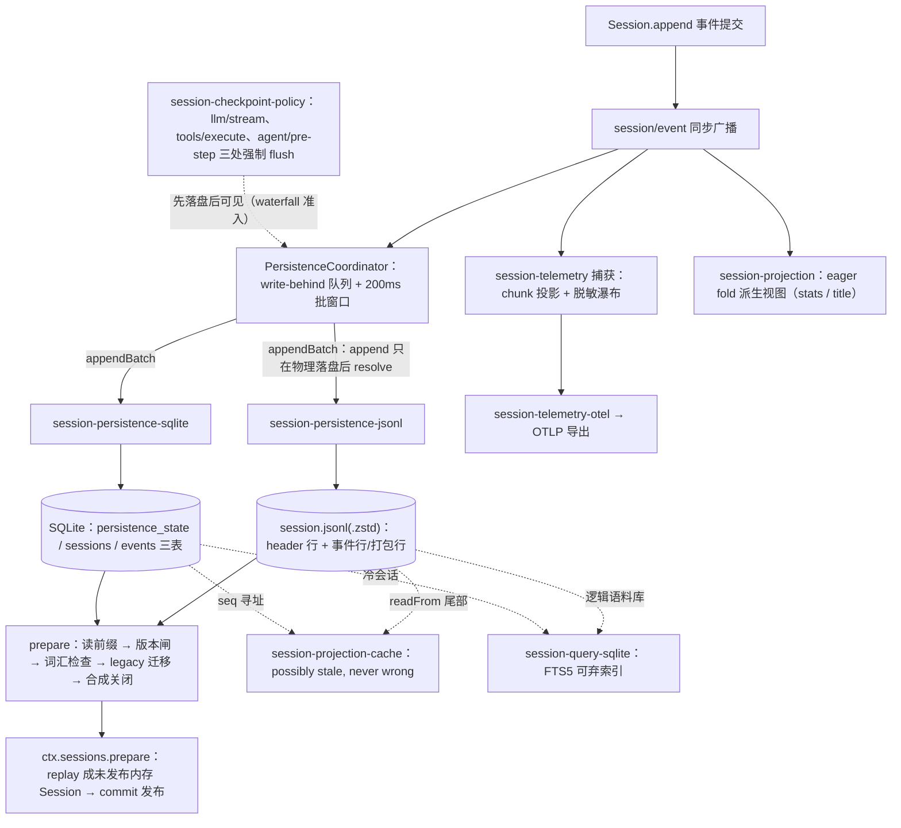

# 《DeepSeek Harness》深度解读 第 05 篇：会话数据面与持久化

- 仓库：<https://github.com/deepseek-ai/deepseek-harness> / 子类型：monorepo（pnpm workspaces，ESM，strict TS）
- 版本锁定：deepseek-ai/deepseek-harness **master 分支 tarball 快照，2026-08-14 下载**；快照不含 git 元数据，**无 commit hash 可记录**（材料降级，特此声明）；替代锚点为根 `package.json` 版本 `0.1.0-rc.5`，其 SHA-256 前 40 位 `3fec1dd1d3faf02a591c8cf792a1eeedf810491c`（复算：在仓库根跑 `shasum -a 256 package.json`，取前 40 位十六进制；本篇写作时已复算一致）。文中全部 `file:line` 锚点以该快照的文件系统状态为准。
- 材料范围：map+采样。本篇覆盖 `packages/session/` 组 13 包（persistence/projection/title/telemetry 四族）、`packages/session-query/`、`packages/storage/`、`packages/attachment/`、`packages/identity/`、`packages/settings/`、`packages/credentials/`、`packages/workspace/`、`packages/spill/`：persistence/projection/title/telemetry 四族精读，storage/settings/credentials 等到签名级加关键函数精读。行为论断三层标注（实际运行验证 / `静态推断` / `未验证`）；本篇未运行仓库的构建与测试，论断除特别说明外均为 `静态推断` 并带 `file:line` 锚点。
- 读者画像：已读完第 01 篇（Cordis 插件底座）与第 02 篇（核心 spine 与一轮 turn）的工程师。`SessionEvent`、`turn/step`、`session/event`、`waterfall listener`、`capability seam`（Service Definition / Service Provider / Consumer 三角色）、`model-visible ⟺ logged` 等词汇沿用前篇与术语表，不再定义。

## 0. 阅读地图与本篇定位

第 02 篇把一轮 turn 在内存里讲完了：inbox 唤醒 agent，step 循环驱动模型请求与工具调用，每个事件 append 进 `Session` 的内存日志。但那个故事在 `turn/end` 处故意断了一刀——内存日志只是易失的，`dsh` 进程一退，什么都不会留下。本篇接上这一刀：**turn/end 之后，事件如何落盘、重开 `dsh` 后如何回来、以及这条持久日志如何派生出标题、统计、搜索、遥测这些"第二人生"。**

本篇子锚点（挂在全书主锚点 S1 之下）：**你在 `dsh` 里聊了三轮，Ctrl+C 退出，第二天重开 `dsh` 并 resume 这个会话。** 全过程拆成四段：事件写盘（append→fsync）、崩溃或退出后的修复（torn tail→合成关闭）、resume 的重建（持久日志→内存 Session）、以及日志的派生视图（projection/标题/搜索/遥测）。每一段我们都回到这个场景问："这一步，磁盘上多了什么？"

一句话主线：事件溯源的主张（"model-visible ⟺ logged"）要兑现，靠的不是一句口号，而是一套具体到字节与事务的纪律——**日志 seam 只管 append-only 的事实，派生视图全部是可以重算的"折叠捷径"，会话之外的数据走另一条更轻的存储 seam。**

## 1. 背景与前置知识（垫层衔接）

本篇需要三个前篇没有展开的概念，排队进场。

**durable 平面（durable plane）。** 指所有"进程退出后还活着"的状态。在 dsh 里它被刻意分成三层：会话事件日志（append-only、事件溯源、每个字节都有 replay 语义）、日志的派生视图（projection 缓存、搜索索引——可以丢、可以重建，丢了只是重算慢一点）、以及非会话数据（workspace 登记簿、设置、凭据——不是日志，不进 `SessionEventMap`）。三层的可靠性承诺完全不同，混在一层里是这类系统最常见的腐烂方式。

**`DSH_HOME`。** harness 的用户级家目录（`$DSH_HOME`，默认 `~/.dsh`），设置文档、凭据文档、匿名身份、附件对象都放在这里。会话日志的位置则由各 persistence 后端的插件配置（`root`/`path`）显式给出。

**zstd 拼接帧（concatenated Zstandard frames）。** JSONL 后端默认把日志压缩存盘，但不是"整个文件压一次"，而是每批事件压成一个独立 zstd 帧顺序拼接（`packages/session/session-persistence-jsonl/src/zstd.ts:1`）。代价是压缩率略低，换来的是：追加不需要重写旧内容、崩溃时最后一帧损坏不波及前面所有帧、头部帧可以独立解出（列表时不用解压全文件）。这是本篇磁盘格式的核心物理结构。

## 2. 对象全景：durable 平面模块地图

本篇涉及的包按三层归位（对照 xray 的"会话数据面"分组）：

| 层 | 包 | 角色 |
|---|---|---|
| 日志 seam | `session-persistence`（Service Definition + coordinator）、`session-persistence-jsonl`、`session-persistence-sqlite`（两个 Service Provider） | `ctx.sessionPersistence`：append-only 日志的落盘契约 |
| 派生视图 | `session-projection` + `session-projection-cache`、`session-title` 家族（4 包）、`session-stats`、`session-query` + `session-query-sqlite` | 从日志折叠出的读模型；全部可重算 |
| 流出 | `session-telemetry` + `session-telemetry-otel`、`session-checkpoint-policy` | 日志向进程外的镜像；写路径的落盘时机策略 |
| 非会话存储 | `storage` 家族（4 包）、`workspace`、`settings` 家族、`credentials` 家族、`attachment` 家族、`identity`、`spill` | 不是事件日志的一切 durable 状态 |

缝的位置一眼可见：`ctx.sessionPersistence` 是抽象服务，两个后端可互换并通过同一份契约测试套件（`docs/subsystems/persistence.md:233`）；`ctx.sessionProjections` 是注册表，任何领域插件都能挂一个纯函数单元；`ctx.storage` 是个"集线器"（hub），自己零 IO，后端与数据形态（data form）都是插件（`packages/storage/storage/src/index.ts:47`）。三处都是前篇讲过的 capability seam 三角色范式的复用——本篇不再解释 seam 本身，只看每处的具体契约。

## 3. 主线叙事：一条 SessionEvent 的 durable 之旅

上一节立好了地图，但地图不回答"什么时候发生什么"。本节跟住子锚点：从 `turn/end` 落进内存日志的那一刻起，到第二天 resume 重建出同一个会话为止。

### 3.1 写路径：广播、缓冲、落盘

**控制流。** `Session.append` 提交一个事件后，core/session 同步广播 `session/event`。持久化后端是监听者之一——`PersistenceCoordinator` 在构造时挂好整组写路径监听（`packages/session/session-persistence/src/coordinator.ts:1086`）：

- `session/created` → 捕获 header，登记惰性创建意图（`packages/session/session-persistence/src/coordinator.ts:1118`）；
- `session/event` → 登记进本会话的 write-behind 队列（`packages/session/session-persistence/src/coordinator.ts:1123`），排空时再逐事件 `structuredClone` 出持久化层自有的副本（`packages/session/session-persistence/src/coordinator.ts:1195`）；
- `session/flush` → 取消批处理等待，立即排空到静止点（`packages/session/session-persistence/src/coordinator.ts:1129`）；
- `session/disposed` → 最后一次排空并释放状态（`packages/session/session-persistence/src/coordinator.ts:1132`）。

**数据流。** 队列里的第一个事件启动一个固定批处理窗口：默认 200ms（`DEFAULT_WRITE_BATCH_MAX_DELAY_MS`，`packages/session/session-persistence/src/coordinator.ts:30`），后续事件加入但不重置截止时间；窗口到期把当前稳定前缀作为一个批次交给后端。批次进 `appendCore`（`packages/session/session-persistence/src/coordinator.ts:682`）前先过两道关：事件必须可无损 JSON 序列化（调用点一次性快照，`packages/session/session-persistence/src/coordinator.ts:669`）；每个事件的 `seq` 必须正好接续已存日志（`packages/session/session-persistence/src/coordinator.ts:698`）——**seq 连续性就是事件溯源在磁盘上的形状**。过了关才调后端的 `appendBatch(meta, events, isMaterialized)`，而 `append` 的 Promise 只在物理落盘完成后 resolve（seam 契约原文："append resolves only after durability"，`packages/session/session-persistence/src/index.ts:81`）。

回到子锚点：你聊的三轮里，每个 `assistant/chunk`、`tool/result`、`turn/end` 都在 append 后最长 200ms 内成批写盘。Ctrl+C 杀掉进程时，最多丢掉最后一个未落盘批次——而且那是"没提交"的丢，不是"写了一半"的坏。

**write-behind 的失败纪律**也值得点名：后台写失败时，批次按原序放回队首、暂停自动重试、只向 logger 报告（`packages/session/session-persistence/src/write-behind.ts:139`）；显式 `flush()` 则立即重试并把失败抛给调用方。产生事件的 agent loop 永远不被存储故障拖住——这是"日志是硬不变量"与"loop 可用性"之间的取舍，取舍本身写在了代码注释里（`packages/session/session-persistence/src/write-behind.ts:14`）。

### 3.2 语义检查点：什么时候必须 flush

200ms 窗口是"最多等多久"，但有些事"必须已落盘才能做"。`session-checkpoint-policy` 这个只有 83 行的插件定义了三个语义检查点（`packages/session/session-checkpoint-policy/src/index.ts:63`）：

1. **`llm/stream` 瀑布**：模型请求派发前先 `ctx.sessions.flush(session)`——请求里引用的全部历史必须已在盘上，模型才能看（`packages/session/session-checkpoint-policy/src/index.ts:64`）。这是 "model-visible ⟺ logged" 的执行点：不是"最终一致"，而是"先于模型可见"。
2. **`tools/execute` 瀑布**：顶层工具调用在进工具体之前 flush（`packages/session/session-checkpoint-policy/src/index.ts:70`）——工具的副作用一旦发生，触发它的 `tool/call` 记录必须已经持久。
3. **`agent/pre-step`**：每个 step 开始前 flush（`packages/session/session-checkpoint-policy/src/index.ts:79`）——上一个 step 产出的响应/结果批次在下一请求边界前落盘。

两个检查点挂在 waterfall 上且失败即 fail-closed：flush 拒绝则下游 adapter/工具体根本不会被调用（`packages/session/session-checkpoint-policy/src/index.ts:59`）。所以"已落盘"不是统计意义上的，而是每个副作用边界的准入条件。

### 3.3 崩溃之后：torn tail 与合成关闭

现在让子锚点里的退出方式变糟：不是 Ctrl+C，而是断电。文件层面可能留下半个记录（torn tail）。两个后端用同一套语义处理，只是物理判据不同。

JSONL 端：`SessionLogScanner` 按行扫描，没有换行符结尾的最后一段直接视为撕裂尾部忽略（`packages/session/session-persistence-jsonl/src/format.ts:341`）；已提交区域（最后一个 `turn/end` 之前）出现不可解析行或 seq 缺口则报错，之后的则容忍（`packages/session/session-persistence-jsonl/src/format.ts:347`）。SQLite 端：`scanRows` 做同样的两段判定——`data` JSON 解析失败或 seq 缺口发生在最后一个 `turn/end` 之前 = 腐败报错，之后 = 撕裂尾部、记下删除起点 `tornFrom`（`packages/session/session-persistence-sqlite/src/schema.ts:232`）。

但 torn tail 只是物理层。日志层还有一个更常见的形态：**turn 没关**——进程死在 `turn/start` 与 `turn/end` 之间。dsh 的选择是**不截断**：一个长任务的单 turn 可能包含几百个已持久事件，截掉等于丢工作。`load` 改为给这个孤儿 turn 补上合成的关闭事件（`interruptedTurnClosers`，`packages/core/session/src/repair.ts:27`；协调器在 `prepareCore` 里调用，`packages/session/session-persistence/src/coordinator.ts:903`）——缺失的工具结果补错误结果、开放的 step/turn 补边界，turn 以 `reason: { kind: 'interrupted' }` 平衡收尾（`docs/subsystems/persistence.md:13`）。随后 `commitPrepared` 把修复写回磁盘：JSONL 截断撕裂尾部再追加（两个 fsync 步骤，`packages/session/session-persistence-jsonl/src/index.ts:436`）；SQLite 一个事务里 DELETE 尾部 + INSERT 关闭事件（`packages/session/session-persistence-sqlite/src/index.ts:309`）。

注意分工：**`load` 提交修复（改盘），`inspect` 只在内存里平衡（不改盘）**——看一眼历史不该有写副作用（seam 契约，`packages/session/session-persistence/src/index.ts:171` 与 `packages/session/session-persistence/src/index.ts:186`）。

### 3.4 重开 dsh：resume 的重建路径

第二天你重开 `dsh`，选昨天那个会话 resume。durable 侧的流程是 `SessionPersistence.prepare(id)`（`packages/session/session-persistence/src/coordinator.ts:720`）：

1. `prepareCore` 让后端读出存储前缀（`packages/session/session-persistence/src/coordinator.ts:892`）：header + 连续事件 + revision + 可选 tornMarker。
2. 版本与词汇检查：版本不符抛 `SessionFormatUnsupportedError`，事件类型不认识且未标 `ignorable` 同样拒读（`packages/session/session-persistence/src/coordinator.ts:1046`、`packages/session/session-persistence/src/coordinator.ts:1061`）。
3. **legacy 迁移**：这一版 harness 仍认识若干 v0 早期形状，读入时在内存里升级——旧 `steering/message` 折成 `user/message`（`packages/session/session-persistence/src/coordinator.ts:344`）、旧 `turn/start`/`turn/end` 信封改写（`packages/session/session-persistence/src/coordinator.ts:372`、`packages/session/session-persistence/src/coordinator.ts:386`）、身份制前的消息补 `legacy-message:<id>:<seq>` 形式的 id（`packages/session/session-persistence/src/coordinator.ts:462`）；而彻底退役的形状（`request/header-delta`、`mode/set`）直接拒绝（`packages/session/session-persistence/src/coordinator.ts:274`）。
4. 补合成关闭事件（3.3），拿完整事件序列调 `ctx.sessions.prepare(id, { seed, meta, seedSource: 'persistence' })` 重建出一个**未发布**的内存 `Session`（`packages/session/session-persistence/src/coordinator.ts:905`）——这就是与第 02 篇 `core/session` preparation/repair 机制的接口：持久化层只负责把"验证过、平衡好、冻结住"的事件图移交，replay 成内存 store 是 core/session 的活。
5. `commitPrepared` 若有修复先落盘，然后 reserve 这个 Session 交给调用方发布（`packages/session/session-persistence/src/coordinator.ts:934`）。

工程细节里有两处值得记住。其一，全部 per-id 操作串行在一条 promise 链上（`serialize`，`packages/session/session-persistence/src/coordinator.ts:1010`）——flush 与 load 竞争同一个会话也不会交错写。其二，冷读有缓存：coordination 为每个后端保留一个容量为 5 的"已备好未发布 Session"LRU（`DEFAULT_PREPARED_SESSION_CACHE_SIZE`，`packages/session/session-persistence/src/coordinator.ts:27`），历史页浏览与随后的 resume 共享同一次读盘、解压、校验、冻结；缓存条目用 revision 校验新鲜度——JSONL 的 revision 由 `dev:ino:size:mtimeNs:ctimeNs` 拼成（`packages/session/session-persistence-jsonl/src/index.ts:100`），SQLite 的由 store 身份 + incarnation + 单调 revision 计数拼成（`packages/session/session-persistence-sqlite/src/index.ts:47`）。

### 3.5 fork：血缘如何写进 header

子锚点最后一段：你不只 resume，还 fork 了一个分支。fork 的血缘不进事件流，而在 `SessionHeader` 的两个字段里：`parentSession`（父会话 id）与 `seedLength`（继承自父日志的前缀长度）。JSONL 把它们序列化进首行 header（`packages/session/session-persistence-jsonl/src/format.ts:33`），SQLite 存进 `sessions` 行的列（`packages/session/session-persistence-sqlite/src/schema.ts:32`）。`seedLength` 这个边界让 replay 与遥测能区分"继承来的父历史"与"这个会话自己的工作"——telemetry 的接收端正是在 `(parent_id, seed_length)` 上拼接分叉流（`packages/session/session-telemetry/src/coordinator.ts:317`）。fork 的创建走的是 3.1 的同一条写路径：seed 事件在 `session/created` 时一次性持久化（`packages/session/session-persistence/src/coordinator.ts:1236` 的 case 4），之后的增量照常 write-behind。

到这里，子锚点的四段走完了：写盘是“200ms 批处理 + 三个语义检查点”，修复是“容忍撕裂尾部、合成关闭中断 turn”，重建是“读前缀→校验→迁移→移交 core/session”，血缘是 header 里的两个字段。把这段旅程画成一张图（实线 = 同步控制流，虚线 = 读取/派生路径）：



怎么读：上半张是写路径（控制流：append → 广播 → 批窗口 → 后端事务/发布协议）与遥测分岔；下半张是读路径（数据流：盘上的字节 → prepare 重建 → 派生视图/索引/导出）。它证明的正是本篇主线：**同一条 SessionEvent 流，在物理层有 JSONL/SQLite 两种形状，在读侧有 projection/缓存/索引/遥测四种“第二人生”，而它们全部可从日志重算**。

下面把这段旅程里最硬的三份制品和一套机制摆到台面上逐行拆。

## 4. 关键制品详解

主线叙事给了"什么时候"，本节给"具体长什么样"。四份制品按拆解链五连走：JSONL 磁盘格式、POSIX 发布协议、SQLite schema、版本拒绝机制。前两份是任务要求的磁盘格式原文（来源：仓库源码，原文呈现）。

### 4.1 制品一：JSONL 磁盘格式——header 行与路径编码

**回答什么问题**：一个会话在 JSONL 后端的盘上到底是什么？答案分两半：文件放哪（路径布局），文件里是什么（行结构）。

路径布局是 `root/<项目目录>/<会话目录>/session.jsonl[.zstd]`。项目目录名给人看（分隔符换 `-`、不安全字符 `~XXXX` 转义、截断到 251 字符加双横线包裹），会话目录名给机器用（`encodeSegment` 对全部 UTF-16 字符串单射编码，`../`、绝对路径、NUL 全部被中和）。原文（`packages/session/session-persistence-jsonl/src/format.ts:121`）：

```ts
export function encodeSegment(raw: string): string {
  if (raw.length === 0) throw new Error('cannot encode an empty path segment')
  if (raw === '.') return '~002E'
  if (raw === '..') return '~002E~002E'
  let out = ''
  for (let i = 0; i < raw.length; i++) {
    const code = raw.charCodeAt(i)
    const ch = String.fromCharCode(code)
    if (ch !== '~' && /^[A-Za-z0-9._-]$/.test(ch)) {
      out += ch
    } else {
      out += '~' + code.toString(16).toUpperCase().padStart(4, '0')
    }
  }
  return out
}
```

文件内部：第一行是 header，之后每行一个事件（或一个打包行）。header 行的完整形状（`packages/session/session-persistence-jsonl/src/format.ts:33`）：

```ts
export interface HeaderLine {
  type: 'session'
  version: number
  id: SessionId
  createdAt: number
  cwd?: string
  parentSession?: SessionId
  seedLength?: number
  origin?: 'subagent'
  delegationDepth: number
  agentPreset?: string
}
```

事件行的序列化（`packages/session/session-persistence-jsonl/src/format.ts:221`）：

```ts
export function eventLines(events: readonly SessionEvent[], packChunks: boolean): string {
  const records: readonly StorageRecord[] = packChunks ? packChunkRuns(events) : events
  return records.map(record => JSON.stringify(record)).join('\n')
}
```

**逐项解释**。header 行：`type: 'session'` 是判别标签，把首行和事件行区分开；`version` 就是 `SESSION_FORMAT_VERSION`（当前为 0）；`parentSession`/`seedLength` 即 3.5 的血缘；`delegationDepth` 持久化 subagent 递归深度，使 resume 后的子代理预算不重置；`agentPreset` 持久化组合来源——字段 JSDoc 原文是 "a resume that restored a different composition would replay history the model can no longer act on"（`packages/core/session/src/types.ts:98`；文档页内嵌同一接口定义 `docs/subsystems/persistence.md:80-86`）。事件行：`packChunkRuns`（`packages/core/session/src/chunk-rows.ts:192`）把连续的 `assistant/chunk` 增量打包成 `text-chunks`/`reasoning-chunks`/`tool-call-chunks` 行（行结构见 `packages/core/session/src/chunk-rows.ts:65`），后端 README 的实测口径是「~60% smaller logical logs measured on a real coding session」（作者声明，本篇未复测，`packages/session/session-persistence-jsonl/README.md:27`），无损性由逐成员回环编解码保证；读取端 `decodeStorageRecord`（`packages/core/session/src/chunk-rows.ts:339`）对两种布局透明，所以这个开关只影响新写字节（配置项 `packChunks`，默认开，`packages/session/session-persistence-jsonl/src/index.ts:76`）。

**直觉**。整个格式的设计重心是**让 header 成为一切廉价操作的支点**：`list()` 只读首行（`parseHeaderMeta`，`packages/session/session-persistence-jsonl/src/format.ts:404`），会话选择器的开销随会话数增长而不是随日志总大小增长；zstd 模式下头部帧独立压缩、独立校验（`assertZstdHeaderFrame`，`packages/session/session-persistence-jsonl/src/index.ts:47`），廉价性在压缩下依然成立。

**反事实**。若 header 不独立成行（比如并入第一个事件批次）：list 就要全量解析每个日志；若 `encodeSegment` 不做单射转义：一个含 `../` 的 SessionId 就能把日志写到 root 之外——SessionId 是未校验的 brand 字符串，这层防御必须在落盘边界上。

**白话翻译**：一个会话 = 一个以 header 开头的追加文件，文件名和目录名全部消过毒，chunk 事件打包省空间但读起来无感。

### 4.2 制品二：POSIX 发布协议——link+unlink 为什么不是 rename

**回答什么问题**：新会话第一次写盘（header+首批事件）如何做到"要么完整出现，要么不存在"，且两个进程并发创建同 id 会话不会互相覆盖？原文（`packages/session/session-persistence-jsonl/src/index.ts:529`，注释一并保留）：

```ts
private async materializePosix(
  project: string,
  dir: string,
  finalPath: string,
  id: SessionId,
  content: Buffer | string,
): Promise<void> {
  await mkdir(this.root, { recursive: true, mode: 0o700 })
  await this.syncDirPosix(dirname(this.root))
  await mkdir(project, { recursive: true, mode: 0o700 })
  await this.syncDirPosix(this.root)
  await mkdir(dir, { recursive: true, mode: 0o700 })
  await this.syncDirPosix(project)
  await this.rejectExistingLog(finalPath, id)
  const tmp = await this.writeSyncedTempFile(finalPath, content)
  // Publish via link()+unlink(), NOT rename(): link fails with EEXIST if the
  // final path already exists, so two processes materializing the same id
  // concurrently cannot clobber each other. rename() would silently overwrite.
  let linked = false
  try {
    await link(tmp, finalPath)
    linked = true
  } finally {
    if (!linked) await rm(tmp, { force: true })
  }
  // link() succeeded — the log is published. fsync the directory so the new
  // entry survives a power loss: the new link is not crash-durable until the
  // parent directory's metadata is synced.
  await this.syncDirPosix(dir)
  try {
    await rm(tmp, { force: true })
  } catch {
    /* redundant temp link; publish already durable, rm failure is an unreachable IO edge */
  }
}
```

**逐项解释**。逐级 `mkdir(mode: 0o700)` + 对父目录 fsync：目录条目不 fsync 就不抗断电，所以每建一级就 sync 它的上级。`writeSyncedTempFile` 用 `'wx'`（排他创建、`0o600`）写临时文件并 fsync（`packages/session/session-persistence-jsonl/src/index.ts:606`）。发布用 `link(tmp, finalPath)` 而非 `rename`：注释已给出原因——目标已存在时 link 以 EEXIST 失败，rename 会静默覆盖。发布后 fsync 会话目录，让新条目本身抗断电；最后删临时硬链接（失败也只 swallow，因为发布已持久）。

**直觉**。这是把"原子性"拆成两个正交问题来解的典型：内容的原子性靠 temp+fsync（要么全有要么全无），命名的排他性靠 link 的 EEXIST 语义（先到先得）。常规写库文件用 rename 是对的（替换语义），但这里是**创建**语义，rename 给的是错的保证。

**反事实**。换成 rename：两个进程并发 materialize 同 id，后写者覆盖先写者，两个内存 Session 各自以为独占日志，之后交错 append——日志从根上腐烂。去掉目录 fsync：文件内容持久但目录条目可能在断电后丢失，表现为"写过的会话凭空消失"。

**白话翻译**：先写好并焊死一个临时文件，再用"占座"式硬链接把它安到正式名字上，最后焊死目录——任何人都不可能看到一个半成品文件，也不可能顶掉别人的文件。

**Windows 对照（`静态推断`，平台特定路径）**：Node 在 Windows 上没有目录 fsync 等价物，所以 Win32 路径改用 koffi 调 `MoveFileExW(..., MOVEFILE_WRITE_THROUGH)` 做写穿发布（`packages/session/session-persistence-jsonl/src/win32.ts:30`、`packages/session/session-persistence-jsonl/src/win32.ts:116`），目录创建同样先建随机暂存名再写穿移动（`packages/session/session-persistence-jsonl/src/win32.ts:130`）。任务卡问的"MoveFileExW write-through 宣称的代码证据"即此两处。这些路径在本快照的测试里标记为仅原生 Windows 覆盖（`packages/session/session-persistence-jsonl/src/index.ts:528` 的 `v8 ignore` 注释），本机未运行验证。

后续追加走的是更轻的路径：`appendLines` 以追加模式打开、写入、fsync；写失败则先 truncate 回写前大小再抛错——因为游标未推进会重试同批，留下半截字节会制造重复 seq（`packages/session/session-persistence-jsonl/src/index.ts:651`）。

### 4.3 制品三：SQLite schema——一个整数与三张表

**回答什么问题**：SQLite 后端如何把同一份 `SessionEvent` 映射成行，以及"schema 版本单调递增、拒绝旧格式"的宣称在哪里执行。DDL 原文（`packages/session/session-persistence-sqlite/src/schema.ts:116`）：

```sql
CREATE TABLE IF NOT EXISTS persistence_state (
  singleton INTEGER PRIMARY KEY CHECK (singleton = 1),
  store_id  TEXT NOT NULL
) STRICT;

CREATE TABLE IF NOT EXISTS sessions (
  id               TEXT PRIMARY KEY,
  version          INTEGER NOT NULL,
  created_at       INTEGER NOT NULL,
  cwd              TEXT,
  parent_session   TEXT,
  seed_length      INTEGER,
  origin           TEXT,
  delegation_depth INTEGER,
  agent_preset    TEXT,
  incarnation      TEXT NOT NULL,
  revision         INTEGER NOT NULL
) STRICT;

CREATE TABLE IF NOT EXISTS events (
  session_id        TEXT NOT NULL REFERENCES sessions(id) ON DELETE CASCADE,
  seq               INTEGER NOT NULL,
  type              TEXT NOT NULL,
  time              INTEGER NOT NULL,
  data              TEXT NOT NULL,
  source_event_seqs TEXT,
  surface_op        TEXT,
  ignorable         INTEGER,
  PRIMARY KEY (session_id, seq)
) STRICT
```

**逐项解释**。`persistence_state` 是单行表：一个随机 `store_id`，让 revision 跨库可区分。`sessions` 每行一个会话的 header；**行的存在即物化信号**——首次 append 才写入（惰性物化），与 JSONL 端"首次 append 才建文件"对齐（`packages/session/session-persistence-sqlite/src/schema.ts:31` 注释）；`incarnation` 是物化时的随机身份，`revision` 是每次变更事务单调 +1 的日志变更令牌（`packages/session/session-persistence-sqlite/src/index.ts:296`）。`events` 与 `SessionEvent` 1:1：`data` 是 JSON 文本，`source_event_seqs`/`surface_op`/`ignorable` 三个条件信封字段各一列——没有第二套持久 schema 需要同步（`docs/subsystems/persistence.md:236`）。版本闸口在打开数据库时：`SCHEMA_VERSION = 15`（`packages/session/session-persistence-sqlite/src/schema.ts:20`），非空库 `user_version` 不等于当前值直接拒绝、不原地迁移（`packages/session/session-persistence-sqlite/src/schema.ts:108`）；另有 `application_id = 0x44534850`（"DSHP"）防止把无关数据库当会话库写（`packages/session/session-persistence-sqlite/src/schema.ts:23`）。

**直觉**。SQLite 把 JSONL 端用文件协议手工实现的东西换成了数据库原语：物化+首批的原子性 = 一个事务（`packages/session/session-persistence-sqlite/src/index.ts:284` 的 `appendBatch`：BEGIN→插 sessions 行→逐事件 INSERT→revision+1→COMMIT，失败整体 ROLLBACK）；撕裂尾部删除+合成关闭 = 一个事务（`packages/session/session-persistence-sqlite/src/index.ts:309`）。它还买到了 JSONL 买不到的东西：**按 seq 寻址**——`loadStoredFrom` 直接 `SELECT ... WHERE session_id = ? AND seq >= ?`（`packages/session/session-persistence-sqlite/src/index.ts:233`），后缀读取的成本与后缀等长；JSONL 是顺序介质，只能全量解析后前跳（seam 层对此明确记账："the primitive bounds what is RETURNED and refolded, not every backend's physical read"，`packages/session/session-persistence/src/index.ts:212`）。

**反事实**。没有 `SCHEMA_VERSION` 闸口：旧二进制打开新库会按旧假设读表结构，静默读错。`events.data` 拆成结构化列：每次 envelope 演进都要迁表，而 envelope 恰是演进最频繁的地方——JSON 文本列加三个热点信封列是演进成本与查询能力的折中。

**白话翻译**：会话一行、事件一行、`data` 原样存 JSON；库门上挂着版本号，不对就拒开，永不现场改造。

### 4.4 制品四：版本拒绝机制——required-on-read 与 ignorable

**回答什么问题**：`SESSION_FORMAT_VERSION = 0`（`packages/core/session/src/types.ts:56`）的"无兼容承诺"到底怎么执行？不认识的日志会发生什么？这套机制有三层，全部 quote 原文。

第一层，**pre-release 总 stance**（根 `AGENTS.md:7`，quote-first）："Backends reject old on-disk formats. SQLite uses monotonic `SCHEMA_VERSION`; `dsh-session` keeps `SESSION_FORMAT_VERSION` at `0` with no compatibility promise."——首 release 前，正确地基优先于兼容垫片。

第二层，**版本闸口分方向**。协调器的 `assertVersion` 对任何不等于当前值的 header version 抛 `SessionFormatUnsupportedError`，文案分方向（`packages/session/session-persistence/src/coordinator.ts:77`）：

```ts
export function sessionFormatVersionRefusal(id: string, version: number): string {
  return version > SESSION_FORMAT_VERSION
    ? `session "${id}" uses log format v${version}, but this harness reads only v${SESSION_FORMAT_VERSION}: the log was written by a newer harness — upgrade the harness to open it`
    : `session "${id}" uses log format v${version}, older than the supported v${SESSION_FORMAT_VERSION}, and this build ships no upgrade path for it`
}
```

JSONL 端还在解析任何结构之前先从原始首行拒（`packages/session/session-persistence-jsonl/src/format.ts:240`）：未来格式不必满足今天的结构检查，用户必须看到"升级 harness"而不是"日志损坏"。注意这个错误与 `SessionPersistenceCorruptionError` 刻意分开——**拒绝一份完好的日志不是损坏**，错误消息附原始日志路径，文本仍可人工查看（`packages/session/session-persistence/src/coordinator.ts:55`）。

第三层，**事件词汇的 required-on-read**。版本整数只管结构，词汇增长（插件 merge 新事件类型）由 per-event 的 `ignorable` 标记覆盖。根 `AGENTS.md:104` 原文："A `SessionEventMap` member is required-on-read by default — builds that do not know its type refuse the log unless the event carries the envelope's `ignorable: true`"。执行点（`packages/session/session-persistence/src/coordinator.ts:1061`）：

```ts
private assertEventsSupported(meta: SessionHeader, events: readonly SessionEvent[]): void {
  for (const event of events) {
    if (KNOWN_SESSION_EVENT_TYPES.has(event.type) || event.ignorable === true) continue
    throw this.unsupported(meta, `session "${meta.id}" contains event type "${event.type}" (seq ${event.seq}) unknown to this harness and not marked ignorable; refusing to interpret the log — it was likely written by a newer harness`)
  }
}
```

`KNOWN_SESSION_EVENT_TYPES` 是**生成物**：`gen-persistence-catalog` 从全仓每个 `SessionEventMap` 合并点生成（`packages/core/session/src/known-event-types.ts:19`），并由 `verify-persistence-catalog` 保鲜——配套的 `docs/persistence-catalog.md:1` 逐成员列出全部可持久事件词汇，同样是生成物。设计理由在 Agent Note 里（`.agents/notes/implemented/architecture/2026-08-10-session-log-version-mechanism.md:19`）：默认 required 是因为忘了标 ignorable 的代价是"可恢复的会话被过度拒绝"（不便），而默认 ignorable 的代价是"同一错误静默 resume 出一个被掏空的会话"（安全事故）。

**直觉**。这套机制最反直觉的一笔：**未知类型检查只在读侧**（`packages/session/session-persistence/src/coordinator.ts:682` 的 appendCore 注释原文："The unknown-type guard is deliberately read-side only: an append-time refusal would stall a live session's durability mid-flight, which costs more than a loud refusal at the log's next load"）。宁可让一条带着未知事件的日志先落盘、下次加载时响亮拒绝，也不在活会话的写路径上制造停顿——durable 优先于严格。

**反事实**。没有 ignorable 机制：任何插件新增事件类型都得 bump 全局版本号，词汇演进被锁死在发布节奏上。读写两侧都查：HMR 热重载一个带新事件类型的插件时，活会话的 append 半途开始失败。

**白话翻译**：版本号是门锁（不对不开），`ignorable` 是包裹上的"此件可跳过"标签——没贴标签的陌生包裹，整批拒收；但寄出时不检查，因为拦住寄件比下次收件时拒收代价更大。

## 5. 派生视图：projection seam 与持久缓存

制品节回答了"日志是什么"，但一份 append-only 日志自己并不好用——UI 想要的是"当前标题是什么""这个会话跑了几个 step、花了多少模型时间"。这些问题都是对日志的**折叠**（fold）。projection seam 把折叠做成了标准件。

**单元契约（`静态推断`，`packages/session/session-projection/src/index.ts:42`）**：一个领域插件贡献一个 `ProjectionDefinition`——`key`（在 merge-extensible 的 `SessionProjectionMap` 类型表里的槽位）、`schema`（view 输出的 zod 校验）、`init()`（空日志的初始状态）、`apply(state, event)`（纯同步转移函数；不关心的事件必须返回**同一引用**，引用不变 = 下游零工作）、`view(state)`（状态→对外值）、`stateVersion`（持久缓存的失效版本）。约束写死两条：三函数必须同步（异步会撕裂读取方的一致性切面）、`state` 必须是纯 JSON（持久缓存的前提）。

**驱动方式（`静态推断`，`packages/session/session-projection/src/index.ts:181`）**：注册表只订阅一次 `session/event`，每个已提交事件喂给每个已注册单元的 `apply`（eager drive）；引用变化才触发 change feed，且 view 输出过 schema 才发（`packages/session/session-projection/src/index.ts:405`）。单元挂了哪个 fiber，卸载时 key 连同缓存 cell 一起消失——客户端把它读作"能力缺席"（注册即 effect，`packages/session/session-projection/src/index.ts:194`）。内置实例：`session-stats` 把 step 边界、流式 chunk、工具调用对折叠成 turn/step 计数与 llm/tool/首 token/decode 墙钟时间（`packages/session/session-stats/src/projection.ts:89`）；`session-title` 注册一个 last-wins 的 `title` 单元（`packages/session/session-title/src/index.ts:308`）。

**cache 层如何失效**。`session-projection-cache` 把每个单元的内部状态按 `(sessionId, key → {ver, seq, val})` 持久到 storage domain（`session_projcache` 域，spec 版本 3，`packages/session/session-projection-cache/src/spec.ts:66`）。它把缓存的哲学写在了 seam 注释里：**"possibly stale but never wrong"**——一行可能旧（`seq` 说它旧到哪），但绝不能错，所以每条失效路径都是"丢弃"而不是"修补"：

- 单元的 `stateVersion` 不匹配 → 行作废，全量重折（`packages/session/session-projection/src/index.ts:363`）；
- 行的 `seq` 越过所供日志末尾（崩溃修复截短了日志）→ 作废；`restoreFloor` 刻意把读取起点锚在最低水位**减一**，空尾读能把"日志变短"暴露出来而不是把陈行当新的用（`packages/session/session-projection/src/index.ts:300` 的 load-bearing 注释）；
- 记录绑定的日志身份（createdAt + cwd）与见证 header 不符（id 被删后重建、存储根被换）→ 整条记录作废（`packages/session/session-projection-cache/src/index.ts:101`）。

写侧同样保守：两个强制写点（`turn/end` 与 session disposal）加两个节流触发（计数/间隔），且写缓存行之前先 flush 会话日志——**缓存可以落后于日志，绝不超前于日志**（`packages/session/session-projection-cache/src/index.ts:150` 注释："a crash can leave the cache behind the log (longer tail replay) but never ahead of it (phantom values folded from events no stored log contains)"）。冷读走阶梯：缓存行 → persistence `readFrom` 尾部 → registry `restore` 重折 → fail-soft 写回（`packages/session/session-projection-cache/src/index.ts:166`）。任务卡问的"'Publish state only at its commit point' 的实例"在这里有两处落点：projection 只在**已提交**事件上 fold（内存态），cache 只在日志**已持久**之后写（磁盘态）；同一原则在 storage 域事件上第三次出现——`domain/changed` 在后端确认持久之后才发，"the commit point has passed at emission"（`docs/subsystems/storage.md:125`）。

## 6. 读取面：session-query 解决哪四种查询

projection 服务"当前值"，`session-query` 服务"历史本身"。它是四种查询场景一个 seam（`ctx.sessionQuery`，`packages/session-query/session-query/src/index.ts:81`）：

1. **逻辑语料库（live-preferred corpus）**：list/read 把"活会话内存态"与"已持久冷会话"合并成一个逻辑全集——同 id 时活态优先且校验 header 兼容，持久后端挂了也不影响读当前内存历史（`packages/session-query/session-query/src/corpus.ts:32`、`packages/session-query/session-query/src/corpus.ts:88`）。`readSession` 读完整日志后还会用 `Session.create` 做一次 replay 校验（`packages/session-query/session-query/src/index.ts:144`）——读路径复用重建逻辑，坏日志在读侧就暴露。
2. **有界读取**：`readEvent` 取单事件加前后窗口，窗口上限默认 50（`SESSION_QUERY_READ_WINDOW_MAX`，`packages/session-query/session-query/src/config.ts:6`）；批量标题折叠限制并发持久检查为 4（`packages/session-query/session-query/src/config.ts:9`）。给模型工具或 UI 的读永远有界，不存在"把整份日志塞进上下文"的 API。
3. **血缘**：`traceSession` 沿 `parentSession` 链追踪祖先与后代，`traceEvent` 追单事件的替换链与 `sourceEventSeqs` 引用（`packages/session-query/session-query/src/index.ts:279`、`:292`）——fork 家谱是一等查询。
4. **全文搜索（SQLite FTS5 实现）**：派生索引是**可弃的**——schema 版本不符就原地 DROP 重建（`SESSION_QUERY_SQLITE_SCHEMA_VERSION = 8`，`packages/session-query/session-query-sqlite/src/schema.ts:8`、`:96`），与持久日志的版本拒读形成鲜明对比：日志是事实，索引是缓存。FTS5 用 `unicode61` 分词（`packages/session-query/session-query-sqlite/src/schema.ts:127`），用户查询整句加引号按字面短语处理——`OR`、`*`、`NEAR` 都当数据不当语法（`quoteFtsData`，`packages/session-query/session-query-sqlite/src/query.ts:223`）。排名不用 bm25，而是按"高亮匹配 span 数降序、文档码点长度升序、时间降序"在每会话内取头名再跨会话排序（`packages/session-query/session-query-sqlite/src/index.ts:658`）。活会话进 TEMP 表、冷会话进持久表，游标绑定查询指纹与索引世代（generation），相关世代一变游标即失效（`packages/session-query/session-query-sqlite/src/index.ts:267`、`packages/session-query/session-query-sqlite/src/index.ts:351`）。（任务卡提示的"rank 0.0069"在代码中无对应字面量；实际排名逻辑如上。）

## 7. 标题家族：log-backed title 与 provider 竞争

会话列表里每个会话要有一行标题。dsh 把它做成了"日志事实 + 可选智能"的结构，三层排好序：

**底层是日志事件**。`session/title` 事件经 `SessionEventMap` 合并注册，log-only——不进模型 surface（`packages/session/session-title/src/index.ts:94`）。标题的读取是纯 fold：取最后一个 `session/title` 事件（`foldSessionTitle`，`packages/session/session-title/src/index.ts:191`）。事件负载里 `messageSeqs` 记录标题由哪几条用户消息推出、`source` 记录来源（fallback / provider / user）——标题是可审计的派生事实，不是游离的元数据。

**中层是确定性 fallback**。第一条人类消息截词截字节得到保底标题，同步可得、永远可用（`ensureFallback`，`packages/session/session-title/src/index.ts:755`）。

**上层是排他的 provider 槽**。`register()` 在已有注册时直接抛错——"sole ctx.sessionTitle provider"的强制就是这一个 if（`packages/session/session-title/src/index.ts:436`；文档同义表述见 `docs/subsystems/session-title.md:193`）。provider 声明自己的节奏（`automatic: 'first-prompt' | 'all-prompts'`）并实现 `generate()`。仓库自带两个 provider 插件：`session-title-first-prompt-llm` 只用首条人类消息、首提示节奏（`packages/session/session-title-first-prompt-llm/src/index.ts:35`）；`session-title-all-prompts-llm` 用全部人类消息、每条新提示都重生成（`packages/session/session-title-all-prompts-llm/src/index.ts:35`）。两者共享 `session-title-llm` 库：它不是 provider，而是共用的 LLM 调用政策——路由解析（显式配置或沿用主请求 route）、JSON 框架防注入、超时、输出校验（`packages/session/session-title-llm/src/index.ts:229`）。任务卡说的"三种策略（first-prompt/all-prompts/llm）"在代码里实际是"两种节奏 × 一个共享库"，外加内置 fallback——以代码为准。

三个细节值得带走。其一，**辅助 LLM 调用也要进日志**：发请求前先 append `session/title-llm-request` 事件，完整记录 system prompt、消息列表、route、maxTokens（`packages/session/session-title-llm/src/index.ts:262`）——"model-visible ⟺ logged"对标题模型这种旁路请求同样成立。其二，**并发纪律**：每会话单调 revision + supersede（新消息 abort 旧生成），provider 卸载时 abort 其全部在途调用（`packages/session/session-title/src/index.ts:444`）。其三，**用户改名是 pin**：`rename` 追加 `source: { kind: 'user' }` 的标题事件后，自动生成永久让位，显式 `refresh` 才是唯一的解锁（`packages/session/session-title/src/index.ts:363`）。

## 8. 遥测：capture seam 与 OTel provider

日志的最后一条出路是离开进程。telemetry seam 的分工一句话：**capture 侧（哪些记录、何时捕获）归 harness；`emit()` 之后的一切（批处理、重试、丢失政策）归上报 SDK**（`packages/session/session-telemetry/src/index.ts:9`）。

**记录词汇（`静态推断`，`packages/session/session-telemetry/src/index.ts:64`）**：`SessionTelemetryRecord` 两通道。`ledger` 通道把会话事件一对一镜像（body 是事件 `data` 的深拷贝，attributes 只带 `session.id`/`event.type`/`event.seq` 等最小身份）；`ops` 通道承载两个没有日志家的运行信号（`agent-error`、`shutdown`），刻意不带 seq 式身份——它是告警信号不是账本行。固定的 chunk 投影：每个 `(turn, step)` 只发第一个 `assistant/chunk`（流开始信号），其余在捕获处丢弃——接收端别把 seq 缺口当丢失（`packages/session/session-telemetry/src/coordinator.ts:184`）。交接游标按 `Session` 对象存 WeakMap（HMR 重挂后接着上次的 seq 发，不重复历史；`packages/session/session-telemetry/src/coordinator.ts:43`），语义是 at-most-once：游标记的是"已交接"不是"已送达"。

**脱敏是 waterfall 扩展点**。`session-telemetry/record` 瀑布在捕获热路径上同步执行，本包**零规则**：没挂规则就原样通过，挂了的规则逐个变换；规则抛错则该条记录被扣留（fail-closed），永远到不了 agent loop（`packages/session/session-telemetry/src/coordinator.ts:213`；瀑布契约 `packages/session/session-telemetry/src/index.ts:43`）。关键边界：脱敏只作用于导出副本，**canonical 日志永不改写**——这与"model-visible ⟺ logged"是同一枚硬币的两面：日志是事实，遥测是事实的受控投影。

**OTel provider（`静态推断`，`packages/session/session-telemetry-otel/src/index.ts:147`）**：原样组合 OTel JS SDK（`LoggerProvider` + `BatchLogRecordProcessor` + OTLP/HTTP exporter），`exporter`/`processor` 配置逐字透传。三档分享政策：`FULL` 装 live capture 全量镜像（`packages/session/session-telemetry-otel/src/index.ts:237`）；`FEEDBACK_ONLY` 平时全丢，只在 `feedback/record` 事件落进 canonical 日志后做 on-demand 回放--**同意书是已提交的记录，不是总线上的一个值**（`packages/session/session-telemetry-otel/src/index.ts:245`）；`DISABLED`（默认，`packages/session/session-telemetry-otel/src/index.ts:51`）不建任何 SDK 状态，只在收到反馈事件时 warn"此反馈留在本地"。`shutdown()` 有 harness 自有的外层时限（默认 3000ms，常量 `DEFAULT_SHUTDOWN_TIMEOUT_MILLIS` 在 `packages/session/session-telemetry-otel/src/index.ts:128`，`shutdown()` 本体在 `:283`）--SDK 的导出超时管不住它前面的 `forceFlush` 等待。`flush()` 提示刻意不实现：转发它会制造与 shutdown 内部 drain 的并发 flush，静默丢尾记录（`packages/session/session-telemetry-otel/src/index.ts:265` 注释）。

## 9. 非会话存储与周边 seams

主线到 telemetry 收口。会话日志之外还有一小群 durable 状态，它们刻意**不**走事件溯源——这一节逐个给出各自的 domain form 与一句话证据。

**storage：hub / backend / data form 三层**。`ctx.storage` 是零 IO 的集线器：后端按名字注册（json、sqlite 并存），数据形态（data form）按 key 挂载（`packages/storage/storage/src/index.ts:47`）。唯一已实装的 form 是 domain 层（`ctx.storageDomain`）：领域包用 `defineDomain` 声明一个 spec——名字、格式版本、表及其 zod record schema（`packages/storage/storage-domain/src/spec.ts:35`）；介质上版本戳不符即拒开，无迁移（pre-release stance）。写路径是 per-domain 串行链：先后端持久、再改内存、再发 `domain/changed`——读永远与介质一致（`docs/subsystems/storage.md:98`）。json 后端每单元一个人类可读文件，temp+fsync+rename 原子整文件替换（`packages/storage/storage-json/src/atomic.ts:24`）——与会话日志的 link+unlink 不同：单元文件单写者，last-write-wins 是对的语义（`packages/storage/storage-json/src/atomic.ts:6` 注释）。**这就是任务卡 Q10 的答案：storage 管"一切不是会话事件日志的东西"（`docs/subsystems/storage.md:5`），分界线是"是否需要事件溯源/replay 语义"。**

**workspace：domain form 的第一个真实用户**。`workspace` 域（spec 版本 2）登记工作区记录（realpath 规范化的 `path`、标题、有序 `sessionIds` 归属账）加一个全局单例（显示顺序、归档集、可恢复的两次写变更标记 `pendingMutation`）（`packages/workspace/workspace/src/spec.ts:21`、`:51`、`:67`）。

**settings：三层解析 + 热重载 + 密钥遮蔽**。`ctx.settings` 让插件按命名空间注册 schema，解析值按"schema 默认值 → 组合层 `base` → 用户文档 section"顺序叠加（`packages/settings/settings/src/index.ts:1`）；文件 provider 把用户文档放 `$DSH_HOME/settings.yaml`（或 json），外部编辑经 chokidar 监听热发布，自写抑制靠文本缓存比对（`packages/settings/settings-file/src/index.ts:55`、`:115`）。写纪律两个：`expectedRevision` 乐观并发——带着过期 revision 的写抛 `SettingsConflictError`（`packages/settings/settings/src/index.ts:164`）；`role('secret')` 字段在 `describe` 时默认剥离进 `secrets` 清单——**wire 表面必须传 `redactSecrets`**，原文值只留给同进程配置 UI（`packages/settings/settings/src/index.ts:95`）。

**credentials：引用进配置，值不进盘（除受管文件）**。seam 的核心分工：settings 与 cordis.yml 里只放**引用**（环境变量名，`CredentialRef`），值由 provider 持有；消费者每次操作重新 resolve——改密钥下一次请求即生效，不重启（`packages/credentials/credentials/src/index.ts:60`、`:73`）。本地 provider 的四层解析顺序（`packages/credentials/credentials-local/src/index.ts:5`）：继承的进程环境（只读，最高优先——`DEEPSEEK_API_KEY=… dsh` 是本次运行的显式意图）> `$DSH_HOME/.credentials.yaml`（provider 受管、可写）> `<cwd>/.env`（只读兜底）> `$DSH_HOME/.env`（只读兜底）。受管文件创建即 `0600`，发现 group/other 可读直接拒绝启动并提示 chmod（`packages/credentials/credentials-local/src/index.ts:103`）。seam 级规则：空值处处视为未配置，空白永不伪装成已配置密钥（`packages/credentials/credentials/src/index.ts:56`）。

**identity：匿名用户 id**。随机 UUID 存成 `$DSH_HOME/.anonymous-user-id` 的一行裸文本，不取自 hostname/MAC/git remote 等任何可识别来源；并发首启用排他创建定胜负，持久化失败也照常用（`packages/identity/anonymous-user-id/src/index.ts:68`）。OTel 遥测把它放在 Resource 的 `user.id` 上（`packages/session/session-telemetry-otel/src/index.ts:204`）。

**attachment：内容寻址的二进制**。会话事件里只放引用不放字节。本地实现把图片字节按 SHA-256 寻址存到 `<DSH_HOME>/attachments/v1/objects/<前两位>/<digest>`（“落盘先于事件 append”的规则见 `docs/subsystems/attachment.md:7`，桶布局 `packages/attachment/attachment-local/src/store.ts:37`）；保存是"暂存文件 fsync → `link()` 发布（撞名即 EEXIST，再校验已有内容 digest 防腐败）→ 目录 fsync"（`packages/attachment/attachment-local/src/store.ts:136`、`packages/attachment/attachment-local/src/store.ts:158`），读取时重算 digest 与引用逐字段核对（`packages/attachment/attachment-local/src/store.ts:204`、`packages/attachment/attachment-local/src/store.ts:220`）。`AttachmentId`（当前形如 `sha256:<digest>`）是 brand 不透明串，消费者不得解析它推路径（`docs/subsystems/attachment.md:13`）。

**spill：存储 seam 侧的一格**。`ctx.spillStore` 故意极简——只有 `saveText`：把工具超长输出全文持久化，返回不透明定位符 + 精确字节数 + 给模型的取回指引；保留政策与工具结果替换都不在这个包里（`packages/spill/spill/src/index.ts:45`）。它在 durable 平面里的位置：会话作用域的私有溢出物，引用进日志、内容在日志外——与 attachment 同构。

到这里，durable 平面的最后一块拼图放好了，也该回到第 1 节那三层承诺做总验收：**日志层**（session-persistence 三包 + checkpoint-policy）拿版本拒绝、seq 连续性、发布协议把“append-only 事实”钉死；**派生层**（projection/projection-cache/session-query/session-stats）全部可弃可重算，失效路径一律丢弃不修补；**非会话层**（storage 家族及其用户）走 domain form + 原子整文件替换，不背 replay 包袱。回到子锚点收尾：你重开 `dsh` resume 的那个会话旁边，还站着 workspace 登记簿、`settings.yaml`、`.credentials.yaml`、匿名 id、附件对象与溢出物——它们谁都没有 replay 语义，也不需要。会话日志是整个 durable 平面里唯一被当作“事实”对待的字节，其余一切都是它的派生或它的邻居。

## 10. 局限与批判（意图 vs 现实偏差）

第 1–9 节把 durable 平面的宣称逐条对到了代码，大多数成立。偏差与批判集中在三处，按「声明 / 代码实际 / 判断」列表：

| # | 声明或预期（出处） | 代码实际（锚点） | 判断 |
|---|---|---|---|
| D1 | 本篇任务卡导读问题 5 称 session-query-sqlite 有「rank 0.0069」 | 排名是 SQL 窗口函数 CTE：每会话内 `match_count DESC, document_length ASC, time DESC, seq DESC` 取头名再跨会话同序（`packages/session-query/session-query-sqlite/src/index.ts:658`）；全库检索无 `0.0069` 字面量，`docs/subsystems/session-query.md` 亦无此数 | 上游材料过期或口传数字；正文以代码为准（第 6 节已按代码描述） |
| D2 | 任务卡导读问题 6 称标题有「三种策略（first-prompt/all-prompts/llm）」 | 代码实为「两种节奏 × 一个共享库」：`first-prompt`/`all-prompts` 是 provider 的 `automatic` 节奏枚举，`session-title-llm` 是共享的 LLM 调用政策库而非第三种策略，另有内置 fallback（`packages/session/session-title/src/index.ts:755`、`packages/session/session-title-llm/src/index.ts:229`） | 任务卡把层次压平了；`docs/subsystems/session-title.md` 的 provider 词汇表述与代码一致，漂移只在任务卡转述层 |
| D3 | seam 契约「append resolves only after durability」（`packages/session/session-persistence/src/index.ts:81`） | 承诺本身无违反，但有一条窄缝：后台写失败后批次回插队首并暂停自动重试（`packages/session/session-persistence/src/write-behind.ts:139`），若进程在下次 flush 或 dispose 前异常退出，最后一批已广播事件未落盘；正常关闭有 final drain 兜底（`packages/session/session-persistence/src/coordinator.ts:1140`），三个语义检查点也保证「模型已见」的事件不在此窗口 | 「丢的是未提交批次」的纪律成立；但「广播 ⟹ 最终落盘」依赖进程生命周期内的后续 flush——语义检查点覆盖不到的旁路事件（如 `session/title`、遥测无关的杂项事件）暴露在这个窗口里 |

其他批判性观察（取舍，不一定是缺陷，读者应知道）：

- **遥测不是审计通道**。ledger 通道虽是逐事件镜像，但交接是 at-most-once（游标记「已交接」不记「已送达」，`packages/session/session-telemetry/src/coordinator.ts:43`），chunk 投影固定丢弃每 (turn, step) 的非首 chunk（`packages/session/session-telemetry/src/coordinator.ts:184`）。要审计就回读日志本体——这是设计立场不是疏漏。
- **FTS 游标在活会话上寿命短**。索引世代在每次有写入时 +1（`packages/session-query/session-query-sqlite/src/index.ts:476`），绑定世代的游标随之失效。正确性优先的取舍，代价是翻页 UI 在活跃会话上会频繁重查。
- **prepared cache 容量 5 是硬编码**（`packages/session/session-persistence/src/coordinator.ts:27`）。历史页翻多于 5 个会话后回到第 1 个，要重新读盘解压。未说明是否够用（`[ASK USER]` 候选）。
- **projection cache 的身份绑定只到 (createdAt, cwd)**（`packages/session/session-projection-cache/src/index.ts:101`）。防住了「id 被删后重建」的陈值，不防「同 id 同 cwd 两个进程并发打开」——那靠进程内单例语义兜底（`静态推断`）。

行为论断三层标注汇总（全篇口径）：

- `已验证（跑过）`：版本锚点复算——仓库根 `shasum -a 256 package.json` 结果前 40 位与元信息一致（`3fec1dd1d3faf02a591c8cf792a1eeedf810491c`）；另全篇约 150 处 `file:line` 锚点（计数口径：脚本正则匹配 `packages/**/*.ts:N` 形态、按唯一锚点去重后 149 处；含 `vendor/`/`docs/` 等全部路径形态约 190 处）经脚本逐一核对到行内容（属证据审计，不算行为验证）。
- `静态推断`：全部代码行为论断。本篇未构建、未运行仓库测试（任务约束只读）；曾尝试用 `node --experimental-strip-types` 直接导入源码对 `encodeSegment`/`packChunkRuns` 做运行验证，因 workspace 依赖指向未构建的 `lib/` 无法解析，且约束禁止在仓库内产出构建物，故止步。
- `未验证`：Windows `MoveFileExW` 写穿发布与撕裂恢复的实际行为（平台特定，本机 macOS）；OTel 导出在真实 OTLP 端点的行为；FTS5 排序在真实规模语料上的体感。

`[ASK USER]`（代码读不出，不编造）：

1. 「rank 0.0069」（D1）的出处是什么？早期实现的常数、某次基准的数字，还是转述笔误？
2. `packChunks` 的「~60% smaller」测量口径（README 自称 measured on a real coding session，`packages/session/session-persistence-jsonl/README.md:27`）——哪个负载、有无基准数据可公开复算？
3. Win32 发布路径标 `v8 ignore`、仅原生 Windows 覆盖（`packages/session/session-persistence-jsonl/src/index.ts:528`）——团队是否有 Windows CI 计划，还是认为 POSIX 同构测试足够？

## 11. 总结与自测

三句话总结：

1. 会话数据面是「一份 append-only 日志 + 三层邻居」：JSONL 与 SQLite 两个后端用完全不同的物理手段（link+unlink 发布协议 / 单事务+版本闸）兑现同一个 seam 契约——append 即持久、撕裂容忍有界、版本不符拒读，checkpoint-policy 把「model-visible ⟺ logged」钉死在三个副作用边界上。
2. 崩溃恢复不截断工作：物理层只删撕裂尾字节，语义层给孤儿 turn 补合成关闭；resume = 读前缀 → 版本/词汇检查 → legacy 迁移 → 移交 core/session replay，fork 血缘只住在 header 的 `parentSession`/`seedLength` 两个字段里。
3. 日志之外的一切——projection 缓存、FTS 索引、标题、统计、设置、凭据、附件、溢出物——都是可弃可重算的派生或走 domain form 的旁路，「日志是唯一被当作事实对待的字节」贯穿本篇全部 19 个包。

自测 Q&A（对照子锚点自问）：

- Q：Ctrl+C 杀掉 `dsh`，最多丢多少已广播事件？A：最多一个 200ms 批次（`packages/session/session-persistence/src/coordinator.ts:30`）；且三个语义检查点保证丢的绝不会是「模型已见过」的事件。
- Q：断电后日志尾部留了半个 JSON 行，resume 会怎样？A：JSONL 端无换行尾段直接忽略（`packages/session/session-persistence-jsonl/src/format.ts:341`）；只有已提交区（最后一个 `turn/end` 之前）解析失败才算腐败。孤儿 turn 补 `reason: { kind: 'interrupted' }` 关闭。
- Q：新插件 merge 了新事件类型，旧 harness 打开这份日志会怎样？A：required-on-read 拒读整份日志，除非事件带 `ignorable: true`（`packages/session/session-persistence/src/coordinator.ts:1061`）；版本号只在结构变更时 bump。
- Q：projection 缓存什么时候整条作废？A：三路全是丢弃不修补：单元 `stateVersion` 不符、行 `seq` 越过日志末尾、日志身份 (createdAt, cwd) 不符（`packages/session/session-projection/src/index.ts:363`、`packages/session/session-projection-cache/src/index.ts:101`）。
- Q：fork 出的会话怎么知道哪段历史是继承的？A：header 两个字段：`parentSession` 与 `seedLength`；telemetry 接收端正是在 `(parent_id, seed_length)` 上拼接分叉流（`packages/session/session-telemetry/src/coordinator.ts:317`）。
- Q：改了 API key 要重启吗？A：不用。消费者每次操作重新 resolve（`packages/credentials/credentials/src/index.ts:73`），继承环境变量优先于受管文件（`packages/credentials/credentials-local/src/index.ts:5`）。
- Q：想验证「崩溃后 resume 不丢已提交工作」，从哪拉线头？A：`pnpm vitest run packages/session/session-checkpoint-policy`（含 crash-recovery.e2e）；后端级损坏注入看 `pnpm vitest run packages/session/session-persistence-jsonl`（jsonl/win32/zstd.spec）与 `pnpm vitest run packages/session/session-persistence-sqlite`。

延伸阅读：`docs/subsystems/persistence.md`（本篇最完整的对照文档，含 seam 契约全文）；`docs/persistence-catalog.md`（生成物：全部可持久事件词汇）；`docs/subsystems/session-projection.md`、`session-query.md`、`session-title.md`、`session-telemetry.md`、`storage.md`、`attachment.md`、`settings.md`、`credentials.md`（各子系统参考页）；`.agents/notes/implemented/architecture/2026-08-10-session-log-version-mechanism.md`（版本机制决策记录）。全书的下一分篇（06 组合发行与多前端）把视角从数据面拉到组合面：本篇这些包如何被 profile/bundle/patch 装配成 `dsh` 终端与 `dsh web` 等产品形态。

## 附录：覆盖报告

**导读问题 → 章节映射**：Q1（写盘时机与原子性）→ 3.1、4.2、4.3；Q2（版本 0 与 required-on-read）→ 4.4；Q3（resume/fork 恢复路径）→ 3.3、3.4、3.5；Q4（projection 派生与 cache 失效）→ 5；Q5（session-query 四场景）→ 6；Q6（标题 provider 竞争）→ 7；Q7（telemetry 采集与导出）→ 8；Q8（attachment 内容寻址）→ 9；Q9（settings/credentials 解析顺序）→ 9；Q10（storage 的 domain form 与分界线）→ 9。

**图表索引**：图 1 = durable 双通道总览（Mermaid，正文 3.5 节末，承重级，唯一非文字制品）。本篇无物化位图：范围内的仓库文档页（persistence.md 等）以代码块内嵌接口定义为主、无可截取图表，故无索引物；架构/调用链按任务规则用 Mermaid 内嵌呈现，未落 `assets/` 文件。

**覆盖矩阵**（包 × 维度；测试佐证列 = 测试文件存在性核对，本篇未运行）：

| 包 | 入口/装配 | 核心契约/类型 | 主线数据流 | 测试佐证 | 文档对照 |
|---|---|---|---|---|---|
| session-persistence | 2、3.1 | seam 契约（4.4 引）、coordinator | 3.1、3.3、3.4 | persistence.spec、contract、coordinator-contract | persistence.md 一致 |
| session-persistence-jsonl | 2、4.1 | 格式（HeaderLine/事件行/encodeSegment） | 3.1、3.3、4.1、4.2 | jsonl/win32/zstd.spec | persistence.md、后端 README 一致（60% 为作者口径） |
| session-persistence-sqlite | 2、4.3 | schema 三表、SCHEMA_VERSION | 3.3、4.3 | sqlite.spec | persistence.md 一致 |
| session-checkpoint-policy | 3.2 | 三个语义检查点 | 3.2 | crash-recovery.e2e | persistence.md 一致 |
| session-projection | 5 | ProjectionDefinition 单元契约 | 5 | registry.spec | session-projection.md 一致 |
| session-projection-cache | 5 | spec 版本 3、失效三路 | 5 | cache.spec | session-projection.md 一致 |
| session-stats | 5 | stats 折叠单元 | 5 | projection.spec、loader-composition.spec | 未逐字对照 |
| session-title 家族（4 包） | 7 | 事件词汇、排他 provider、节奏枚举 | 7 | invariant/persistence/projection/provider.spec | session-title.md 一致；任务卡表述有 D2 |
| session-telemetry / -otel | 8 | capture seam、记录词汇、OTel 后端 | 8 | redact.spec、telemetry.spec | session-telemetry.md 一致 |
| session-query / -sqlite | 6 | 四场景 seam、FTS5 可弃索引 | 6 | session-query.spec、query.spec、sqlite.spec | session-query.md 一致；任务卡有 D1 |
| storage 家族（4 包） | 9 | hub/backend/domain form | 9 | domain.spec | storage.md 一致 |
| workspace | 9 | 域 spec 版本 2 | 9 | （invariant.spec 级） | 未逐字对照 |
| settings / settings-file | 9 | 三层解析、secret 遮蔽、热重载 | 9 | （包内 spec） | settings.md 一致 |
| credentials / -local | 9 | 引用制、四层解析、0600 | 9 | （包内 spec） | credentials.md 一致 |
| identity | 9 | 匿名 UUID、wx 排他 | 9 | （包内 spec） | 未逐字对照 |
| attachment / -local | 9 | 内容寻址、link 发布、digest 核对 | 9 | store.spec、image.spec | attachment.md 一致 |
| spill | 9 | saveText-only seam | 9 | （包内 spec） | 未逐字对照 |

**未覆盖清单**（讲了 seam 未进正文的，非遗漏）：`packages/session-query/session-log-export` 与 `tool-session-query`（检索家族其余两包，签名级）；`packages/storage/storage-sqlite`（json 后端讲了，sqlite 后端只点名）；`packages/spill/spill-local`、`spill-policy`（保留政策与替换策略）；`packages/session/session-title-llm` 的 JSON 框架防注入实现细节；`packages/settings/settings-file` 的 yaml/json 双格式解析细节；`packages/attachment/attachment-local` 的 validateImage 准入检查细节；OTel JS SDK 内部行为（外部依赖）；`packages/session/session-persistence-jsonl/src/zstd.ts` 的压缩参数细节（拼接帧结构已讲）。

**开放问题（`[ASK USER]`）汇总**：见第 10 节末尾三条。
