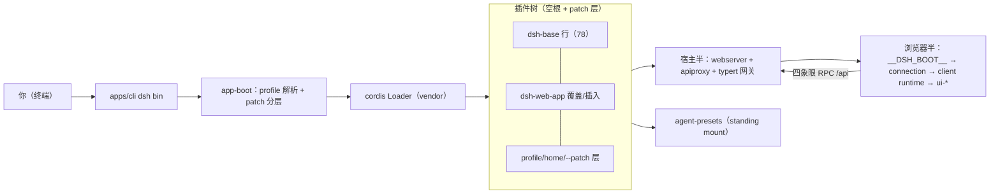
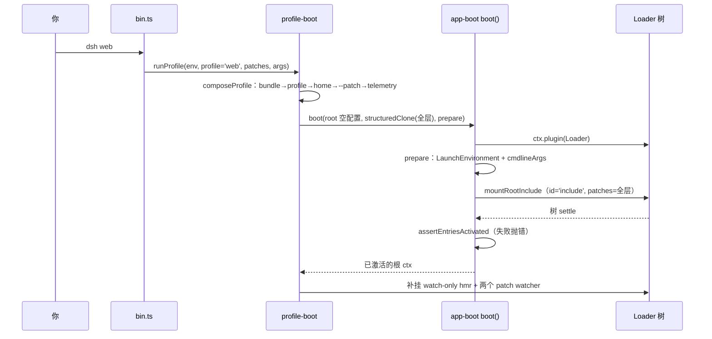

# 《DeepSeek Harness》深度解读 · 第 06 篇：组合、发行与多前端

- 仓库：deepseek-ai/deepseek-harness / 子类型：monorepo（pnpm workspaces，Node ^22.19||>=24，ESM，strict TS）
- 版本锁定：deepseek-ai/deepseek-harness **master 分支 tarball 快照，2026-08-14 下载**；快照不含 git 元数据，**无 commit hash 可记录**（材料降级，特此声明）；替代锚点为根 `package.json` 版本 `0.1.0-rc.5`。文中全部 `file:line` 锚点以该快照的文件系统状态为准。
- 版本锁定补充锚点：快照根 `package.json` 的 SHA-1 为 `16918dcd04afbb809d896844bd04c3cb3bd3d301`，SHA-256 前 40 位为 `3fec1dd1d3faf02a591c8cf792a1eeedf810491c`（在快照根执行 `shasum package.json` / `shasum -a 256 package.json` 可复算，本篇写作时实测一致）。
- 材料范围：map+采样。本篇精读 `apps/cli/src` 全部六文件、`packages/boot/app-boot/src`（index.ts + profile.ts）、三个 bundle 的 `cordis.patch.yml` 与 headless/web-app 的 `src`、`packages/preset/agent-presets/src`（index/mount/discovery/preset/session）、`packages/host/apiproxy`（index.ts + api/rpc.ts 全读，api-proxy.ts 读启动/会话域相关段）、`packages/client/runtime` 会话对象层与 `ui-conversation` 契约、`packages/examples/agent-spine-demo`、`examples/` 全部 `cordis.yml` 与 README、`docs/architecture.md`（Profiles and bundles 段）与 web-server/client-modules/api-gateway 三页。签名级扫读：`packages/typert`、`packages/api`、`packages/sdk`、`packages/acp`、`python/`、`native/`、client 其余 40+ `ui-*` 包。
- 读者画像：已读第 01 篇（Cordis/loader 垫层）与第 02 篇（core spine 与一轮 turn）的工程师；想知道「这个仓库怎么变成能装、能跑、能从浏览器用的产品」。
- 本篇子锚点：你执行 `dsh web`——从敲下回车，到浏览器里发出第一条消息、看到第一个流式字。

## 0. 阅读地图

前五篇把插件底座、turn 驱动、LLM 管道、工具执行、会话数据面逐层拆完，但它们都默认一件事：插件树已经挂好了。本篇回答最后一个问题——**这棵树是从哪里来、怎么组装、又怎么变成五种发行形态**。主线走主场景 S3：`dsh web` 从命令行到浏览器的完整启动序列，双通道推进（控制流：谁调用谁；数据流：一条 `cordis.patch.yml` 里的行怎么变成浏览器里的一次 RPC）。读完你应能对着 `dsh --profile web --dump-config` 的输出说出每一行来自哪一层、被谁改过。

## 1. 背景与前置知识

第 01 篇建立了 Cordis 心智模型（ctx / service / effect / 事件 / waterfall / Loader），第 02 篇建立了 turn 与 SessionEvent 词汇。本篇直接沿用，不再重复定义。垫层要补的是组合层与多前端的新词汇，按出场顺序排队：

- **profile（档案）**：`$DSH_HOME/profiles/<name>` 下的一个目录，存一份 `package.json`（声明它叠哪些 bundle）和一份 `cordis.patch.yml`（用户自己的覆盖层）。它是一次启动的「组合名」。
- **bundle（捆绑包）**：npm 包形式的发行单位，`package.json` 里声明 `"dsh": { "bundle": { "patch": "./cordis.patch.yml" } }`，指向它的行清单（`packages/boot/app-boot/src/profile.ts:41-45`）。`dsh-base` 是所有 profile 的第一层。
- **patch（补丁）**：对插件树的一次修改——按 id 定位一行、整行替换其 `config`，或 `insert` 新行。层序即优先级，后写的赢。
- **preset（预设）**：per-session 的 agent 组合。Web 界面里每个会话选一个 preset，preset 的行只挂一次、被所有选它的会话共享（`packages/preset/agent-presets/src/index.ts:1-21`）。
- **宿主平面（host plane）与 agent 平面（agent plane）**：进程级一次的服务（注册表、沙箱栈、持久化）属于宿主平面；单个 agent 贡献的东西（工具、prompt 段）属于 agent 平面。Web 形态把 agent 平面整体交给 preset。
- **四象限 RPC**：浏览器与宿主之间的消息模型——client-request / server-response / server-request / client-response 四种消息（`packages/host/apiproxy/src/api/rpc.ts:151-186`），物理载体（HTTP POST、SSE 流）与逻辑消息解耦。
- **Typert**：构建期类型分析器 + 运行时注册表，把宿主服务的类型化方法描述符生成给浏览器端，支撑「跨进程也有类型」的 RPC（`packages/typert/README.md:5-11`）。

三个阅读约定：

- `file:line` 锚点全部相对仓库根，例如 `apps/cli/src/bin.ts:29`。
- 行为论断三层标注：**已验证（跑过）**、**静态推断**（带锚点）、**未验证**。本篇快照无 node_modules，boot/测试未运行，**组合与运行时行为论断默认「静态推断」**；**本处「已验证（跑过）」=只读命令复算（哈希复算、逐字节比对、行数清点），非测试运行**——本篇未运行任何测试/构建命令，其命令清单在附录；npm 发布产物与单 exe 构建产物内容标「未验证」。
- 数字、模型 id、端口号、超时值一律 quote-first：写进正文的每个字面量都先回源码核对过。

锚点登场。你在终端敲 `dsh web`（仓库内等价 `pnpm dsh web`），回车。几秒后终端打出一行 `dsh web: http://…`（局域网绑定还会多一个 LAN 提示），浏览器打开、建会话、发第一条消息。本篇就把这几秒拆成七步讲完，然后回头看这套组合机制怎么支撑另外四种形态：headless、JSON-RPC、ACP、单 exe。

## 2. 对象全景：组合与发行面的模块地图

第 1 节立了词汇，本节给地图：S3 要穿过哪些包、发行面有哪些组。只到组件级，不进代码。

| 组 | 代表包/目录 | 一句话职责 | 本篇覆盖深度 |
|---|---|---|---|
| CLI 入口 | `apps/cli` | `dsh` 命令：profile 启动、插件管理、组合转储 | 精读 |
| 引导 | `packages/boot/app-boot` | profile 解析、patch 分层、Loader boot 胶水 | 精读 |
| bundle 三层 | `packages/bundle/{base,web-app,headless}` | 行清单制品：共享核 + Web 形态 + 一次性形态 | 精读 |
| preset | `packages/preset/agent-presets` | per-session agent 组合与守卫 | 精读 |
| Web 宿主半 | `packages/host/*`（webserver/apiproxy/frontend-static 等） | HTTP 载体、RPC 网关、静态前端 | apiproxy 精读，其余扫读 |
| Web 浏览器半 | `packages/client/*`（runtime/web-react/40+ ui-*） | 连接、会话对象层、表现组件 | runtime 精读，ui-* 签名级 |
| 类型化 RPC | `packages/typert/*` + `packages/api/*` | 类型图生成/注册/网关 + BFF 策略层 | 扫读（文档对照） |
| 进程外协议 | `packages/sdk/*`、`packages/acp` | JSON-RPC stdio 与 ACP 两个外部面 | 扫读 |
| 发行载体 | `python/`、`native/` | Python SDK + 单 exe；Landlock 启动器 | 扫读 |
| 组合叶 | `examples/*` | 每种接缝一个可运行示例 | cordis.yml 精读 |



这张图要带走的判断：**组合层（bundle/patch/preset）不发明任何新运行时机制，它只是把第 01 篇讲过的 Loader「配置即插件树」语义用文件分层重复利用**。所以本篇的重心不是新框架，而是「怎么把一棵树切成可发行的层」。发行形态一览（机制均为静态推断，产物内容未验证）：npm 包 `@deepseek-ai/dsh`（`apps/cli/package.json` 声明 bin 与 files）、单文件 exe（`python/sdk-runtime` 的 deploy closure）、Python wheel、vendored 包以 `@deepseek-ai` scope 重发布（`docs/rescope.md:5-21`）。

## 3. 主线叙事 S3：`dsh web` 从命令行到浏览器

回到锚点：回车之后发生了什么。按七步推进，每步先控制流后数据流。

### 3.1 第一步：bin 只做分发，launcher 只拥有自己的旗标

Node 把 `dsh` 解析到 `apps/cli/package.json` 声明的 `bin`（`dsh → lib/bin.js`）。`bin.ts` 是 53 行的薄壳：解析 argv 得到一个 invocation，然后按模式动态 import 对应模块——`profile` 模式进 `profile-boot.ts`，`plugin` 模式进 `plugin.ts`，`dump-config` 模式进 `dump-config.ts`（`apps/cli/src/bin.ts:29-48`）。动态 import 是刻意的：不相关模式的代码不进任何一条分发路径（模块 doc，`apps/cli/src/bin.ts:1-7`）。

argv 语义是本步的关键设计。launcher 只认自己拥有的旗标（`--profile`、`--patch`、`--dump-config`、`--dump-default-config`），**第一个不认识的 token 之后的全部参数原样交给被启动的树**——树内的 app 插件解析自己的旗标族、打印自己的 `--help`（`apps/cli/src/args.ts:1-15` 模块 doc）。所以 `dsh --profile web -h` 打印的是 Web app 的帮助而不是 launcher 的。`web` 子命令只是 `--profile web` 的硬编码别名（`apps/cli/src/args.ts:156`），我们的锚点命令由此进 `resolveBoot`（`apps/cli/src/args.ts:83`）。`--patch` 是可重复单值收集器，注释明说不做成 variadic——variadic 会吞掉内层参数（`apps/cli/src/args.ts:57-61`）。

数据流视角：argv 在这一步被切成三份——launcher 旗标（自己消费）、内层参数（留给树）、mode（决定 import 谁）。后面所有「app 自己的旗标」都从第二份来。

### 3.2 第二步：profile——目录即组合

`runProfile` 先把名字解析成目录。profile 是 `$DSH_HOME/profiles/<name>`（默认 `~/.dsh/profiles/web`），内含 `package.json`（`dsh.profile.bundles` 有序清单 + 普通依赖）、`cordis.patch.yml`（用户层）、`pnpm-workspace.yaml`（`packages/boot/app-boot/src/profile.ts:1-23` 模块 doc）。首次使用自动初始化：内置模板 `web = [dsh-base, dsh-web-app]`、`headless = [dsh-base, dsh-headless]`（`packages/boot/app-boot/src/profile.ts:114-117`），无名模板的 profile 默认只叠 `[dsh-base]`（`packages/boot/app-boot/src/profile.ts:125`）。

bundle 解析是双锚的：包名先从 dsh 安装自身解析，再从 profile 目录解析——安装锚优先是契约，「in-box bundle 永远来自与运行中的 dsh 同一安装」（`packages/boot/app-boot/src/profile.ts:344-355` 注释）。为了让树内插件在 profile 目录下可被 Node 解析，每次 boot 还会「治愈」`$DSH_HOME/profiles/node_modules`：对 dsh app 的依赖闭包做 BFS（含 peerDependencies——Service Definition 包只作为 peer 出现），每个包一条 symlink（`packages/boot/app-boot/src/profile.ts:223-255`）。读 manifest 时，把无 `dsh.bundle` 声明的包列为层是配置错误，直接抛错（`packages/boot/app-boot/src/profile.ts:371-403`）。

还有一个防回归细节：根配置 `cordis.yml` 每次启动都被重写为一个**永远为空的 entry list**（`apps/cli/src/profile-boot.ts:60-64`、`apps/cli/src/profile-boot.ts:101`）。为什么？vendored Loader 会在插件自卸载时把当前树写回配置文件；如果根不是空的，bundle 插进来的行会被烤进根文件，下次 boot 再插一遍、行数翻倍。整棵树都是 patch，根必须永远空着。

### 3.3 第三步：patch 分层与合并算法——本篇的算法核心

`composeProfile` 收集全部层（`apps/cli/src/profile-boot.ts:131-171`）。层序是一个精确的契约，`allPatches` 把它摊平（`apps/cli/src/profile-boot.ts:122-129`）：

1. bundle 层，按 `dsh.profile.bundles` 顺序拼接（`profile.layers.flatMap(layer => layer.patches)`）；
2. profile 自己的 `cordis.patch.yml`；
3. home 级用户层 `$DSH_HOME/cordis.patch.yml`（机器本地偏好，跨所有 profile，所以压过 profile 层；路径解析在 `apps/cli/src/profile-boot.ts:49-51`）；
4. `--patch` 覆盖层（argv 顺序）；
5. 两个程序化补丁追加在最后：launcher 给 `agent-presets` 行注入 shipped preset 根（`apps/cli/config/agent-presets/`，trust 为 system，`apps/cli/src/profile-boot.ts:35`、`apps/cli/src/profile-boot.ts:159-167`）；telemetry 开关——`DSH_TELEMETRY_DISABLED` 只要非空（哪怕值是 `'0'` 或 `'false'`）就把 telemetry 行 patch 成 disabled，注释原话「a privacy switch prefers off-by-mistake over on-by-mistake」（`apps/cli/src/profile-boot.ts:80-83`）。

合并算法本体在 vendored include 插件里，`applyEntryPatches` 是唯一被三处共用（boot、dump、composeEntries）的实现（`vendor/include/src/index.ts:58-128`；`packages/boot/app-boot/src/profile.ts:413-419` 的 `composeEntries` 就是对空根单次调用它，注释说「the same single applyEntryPatches call the boot include makes」）。算法规则（静态推断，逐行核对过源码）：

```yaml
# 规则速记（对照 vendor/include/src/index.ts:58-128）
# 1. 输入先 structuredClone —— 输出与输入无共享引用
# 2. 先建 id 索引（含 group 内子行，递归）
# 3. insert：无 id → 顶层追加；有 id → 目标必须是 group，push 进它的 config
#    并且「insert 的行立即入索引」——同层后续 patch 可以命中刚插入的行
# 4. 非 insert：必须带 id；目标缺失 → warn 跳过（fail-soft，一个共享 overlay
#    不必匹配每棵树）；name 不匹配 → warn 跳过；否则 overrides 逐键整值替换
#    ——config 是整体替换，不做深合并
```

第 4 条是全套分层语义的地基，base patch 头注释与算法注释同义互证：「A patch replaces the targeted row's whole config rather than merging into it」（`packages/bundle/base/cordis.patch.yml:6-7`；`vendor/include/src/index.ts:88-90` 附近的实现）。反事实：若改成深合并，一个模式层只想改 `tools.mode` 时会连带继承 base 的全部键，键的来源就再也说不清了——「每个值只有一个所有者」的审计性会消失。

补丁字段词汇 `PatchOptions`：`id / insert / name / config / group / disabled / inject / intercept / isolate`（`vendor/include/src/index.ts:145-156`）。`!!js` 标量方言由 include 自己的 `entryListSchema` 提供，patch 解析与 config dump 共用同一方言，「tooling 永不漂移」（`vendor/include/src/index.ts:9-23`）。

两个易被忽视的内存细节：boot 应用补丁前对补丁数组做 `structuredClone`，因为 include 对 insert 行是**按引用** push 进树的，后续 id 定向 patch 会原地改这些对象——复用同一份解析结果会把用户覆盖烤进 bundle 的 insert 行，删掉覆盖也回不去（`apps/cli/src/profile-boot.ts:240-248` 两处 clone 的注释）。同一原因，live 重载的每一代都重新读盘两个用户 patch 文件，避免两个 watcher 缝进对方的旧副本（`apps/cli/src/profile-boot.ts:268-294`）。

想知道「我这台机器到底会 boot 什么树」，用 `dsh --profile web --dump-config`：不 boot、不求值 `!!js`，按「层前缀快照差分」标注每行来源——`snapshot_k` 是前 k 层摊平后的单次应用结果，相邻快照逐行 diff 得出「谁插入了这行、谁 patch 过这行」（`packages/boot/app-boot/src/index.ts:379-441`，快照语义注释在 `packages/boot/app-boot/src/index.ts:405`；入口 `apps/cli/src/dump-config.ts:30-52`）。boot-free 是显式取舍：dump 不跑 app 的命令行 provider，所以 flag 决定的值它显示不出来（`apps/cli/src/args.ts:96-100` 注释）。

### 3.4 第四步：boot——从空根到激活审计

`boot()` 是全部 dsh 表面的共享引导（`packages/boot/app-boot/src/index.ts:757-802`）。控制流六拍：`new Context()` → 设 `baseUrl`（profile 目录）→ `provide('dshHomePath')`（供 `!!js` 表达式用）→ `await ctx.plugin(Loader)` → 跑 `prepare` 钩子 → `mountRootInclude` 挂根 Include → 等 Loader 树 settle → 激活审计。失败路径带两阶段标签：`prepare` 抛错标 `host preparation failed`（宿主装配问题），树挂载后抛错标 `plugin tree failed to load`，两者都会先 dispose 半成品 context 再把最深 cause 的原始栈接在错误后面（`packages/boot/app-boot/src/index.ts:771-802`）。

根 Include 本身是一个固定 id 的内置插件行：`{ id: 'include', name: 'cordis:include', config: { path: <根配置文件 URL>, patches: <全部层> } }`——固定 id 是为了让启动诊断跨运行稳定（「Pinned id: the bootstrap include is app glue」，`packages/boot/app-boot/src/index.ts:486-529`、id 声明在 `:510`）。`cordis:group` 同时注册为内置，因为组合要给一组行一个 `isolate` realm 时会用到它（`packages/boot/app-boot/src/index.ts:507-513` 注释）。

`prepare` 在**任何树行挂载之前**跑（`apps/cli/src/profile-boot.ts:248-259`）：提供 `LaunchEnvironment` 冻结快照（分层 `.env` 的来源记录，bootstrap 级变量如 `PATH`/`DSH_*` 拒绝从 `.env` 设置，`packages/boot/app-boot/src/index.ts:81-162`）和 `cmdlineArgs`（3.1 切出的第二份参数 + 有界的 `exit` 请求）。这就是「launcher 不认识 app 旗标」的落地：旗标以服务形式进树，任何 app 插件注入同一份不可变快照。

树的收口有三道闸：**fail-loud**——`unhandledRejection` 变成一行 stderr + `exit(1)`，终端持有者有 2 秒宽限交还终端（`FAIL_LOUD_RELEASE_TIMEOUT_MS`，`packages/boot/app-boot/src/index.ts:578`、`:609-649`）；**激活审计**——树 settle 后逐行检查，enabled 而 fiber 不 ACTIVE 的直接抛错：failed 带原始栈，pending 的列缺失服务名（`assertEntriesActivated`，`packages/boot/app-boot/src/index.ts:692-725`）；**watch 补挂**——树里没有 HMR 服务时（Web 层禁用了共享 hmr 行）补挂一个 `root: []` 的 watch-only 实例，再对 profile 与 home 两个用户 patch 文件各挂一个 watcher，用户改 `cordis.patch.yml` 立即生效（`apps/cli/src/profile-boot.ts:268-294`，注释「cordis.patch.yml edits stay live on every long-lived surface」）。信号语义：SIGTERM 退出码 0（supervisor 的常规停止）、SIGINT 130（用户中断），关停最多等 5 秒强退（`apps/cli/src/profile-boot.ts:221-222`；`PROCESS_SHUTDOWN_TIMEOUT_MS`，`apps/cli/src/process-shutdown.ts:4`）。



### 3.5 第五步：树内旗标与 Web 服务监听

到此为止进程里还没有任何 Web 专属决策——`dsh web` 与 `dsh --profile headless` 走的是完全相同的 3.1–3.4。分叉发生在树内。web-app bundle 插入的 `web-startup` 行是一个普通插件：inject `cmdlineArgs`，用 commander 解析 `--host/--port/--trusted-host`，成功后 `provide('webStartup')`（`packages/bundle/web-app/src/startup.ts:42-82`）。`webserver` 行 inject 这个服务，host/port 表达式读它、缺省回退 `127.0.0.1` 与 `3080`（`packages/bundle/web-app/cordis.patch.yml:112-120`）。「行等服务」是组合层表达启动顺序的方式：Loader 等表达式依赖的服务就绪后才解析该行配置。`dsh --profile web --help` 不 provide 该服务，于是没有 server 绑定（patch 头注释，`packages/bundle/web-app/cordis.patch.yml:7-11`）。显式拒绝 `--host 0.0.0.0`，报错原话点名理由「it would expose remote code execution to the network」（`packages/bundle/web-app/src/startup.ts:69-71`）。

服务绑定的载体是 `dsh-host-webserver`：单个 `node:http` 插件，提供 `ctx.webServer`——精确路由表 → 最长前缀 → 唯一 fallback 席位三级匹配；fallback 由 `frontend-static` 占据（非 GET/HEAD 405、越界 403、miss 回 `index.html` 200）；无 TLS、无鉴权、无 origin 策略，非回环绑定即裸奔（`docs/subsystems/web-server.md:21-47`）。`web-runtime` 行（`@deepseek-ai/dsh-web-app` 插件本体，`packages/bundle/web-app/src/index.ts:135-184`）随后做四件事：采样 LAN 信任快照并 `provide('webRuntime')`；挂 FrontendStatic（dist 位置是 bundle 的装配事实，经 `require.resolve` 解析、不是用户配置，`packages/bundle/web-app/src/index.ts:119-124`）；注册 `app:web-surface` prompt 段（order -98）与 `DSH_WEB_URL` bash 变量（`packages/bundle/web-app/src/index.ts:150-157`）；等 Loader settle 后打印 URL 行——URL 行是就绪信号，supervisor 与 keyless 冒烟都以它为观察点（`packages/bundle/web-app/src/index.ts:166-183`）。

### 3.6 第六步：浏览器半的装配与 RPC 面

浏览器怎么知道要加载哪些插件？`dsh-client-modules` 的 node 半扫描树中声明 `dsh.client` 的包，组装 `window.__DSH_BOOT__` 入口图，作为 `<head>` 里第一个 script 注入（经 `tapIndex`），每个包的浏览器 bundle 走 `/plugins/<id>/client.js` 提供；激活期发现 malformed 声明聚合成一个 `AggregateError` fail loud——「A page without a valid manifest cannot boot」（`docs/subsystems/client-modules.md:5-61`）。

RPC 面有两个。其一是 `apiproxy`：`ApiProxyService` 提供 `ctx.apiProxy`，inject 11 个服务，域覆盖 sessions/subagents/workspace/host/goals/skills/agentPresets/settings/credentials/llm/events/downloads/respond——**不注册任何路由**，物理载体（`connection` 插件把网关绑到 webserver 的 `/api`）自己包它（`packages/host/apiproxy/src/index.ts:64-126`，模块 doc `:1-8`「this package registers no routes」）。消息模型是 3.1 节定义的四象限：rpcId 由发起方铸造、应答方回显；server-request 分「可应答」（审批、提问，稳定 rpcId、重放复用）与「纯推」（session/event，每次新铸）两类，注释明说「a strict dichotomy, no third kind」（`packages/host/apiproxy/src/api/rpc.ts:148-193`）。其二是 Typert 网关：只认两段式端点（`<namespace>/<method>`），未认领的请求回落 apiproxy（`docs/api-gateway.md:119-129`；`packages/api/README.md:14-17` 称 apiproxy 为「legacy fallback」）。两网关共用 `/api` 路由与信任栏。

### 3.7 第七步：建会话、发消息——S3 与 S1 的交接

浏览器里你点「新会话」、发第一条消息。`sessions.create`（`packages/host/apiproxy/src/api-proxy.ts:2167` 起）生成或采用 sessionId，把 workspace/cwd 归一后进 `ensureSession`（`packages/host/apiproxy/src/api-proxy.ts:1618-1678`）：活 agent 直接复用；持久化里存在的会话走冷 resume——**preset 从 LOG 解析而非 header**（`resolveSessionPreset` 从事件尾向前找 `agent-preset/selected`，`packages/preset/agent-presets/src/session.ts:48-54`），且存储的 preset 压过请求指定的（历史是在那个组合下产生的）；全新的走 `agents.create`。preset 的解析发生在会话存在**之前**——header 要快照 meta，setup 里才真正 mount，失败则整个创建回滚（`composeAgent`，`packages/host/apiproxy/src/api-proxy.ts:1213-1271`，注释「a preset discovered during setup could never reach the header」）。

`session.prompt`（`packages/host/apiproxy/src/api-proxy.ts:2458-2517`）经 `turnAgentFor` 冷恢复拿 agent，构造带 rpcId 的 `UserMessage`，`followup`（或 steer）投递；带图先过 attachment 校验（数量/字节/模态），模型不支持图片输入直接拒。从这里开始就是第 02 篇的 S1：inbox claim → prompt 装配 → llm/stream → …。回程数据流：宿主把 `session/event` 作为纯推 server-request 广播给浏览器；projection 变化走 `session/projection` 推帧（`packages/host/apiproxy/src/api-proxy.ts:1275-1287`）。浏览器侧的 `Session` 对象维护事件窗口 + views 平行数组（「Kept parallel rather than merged so events stays the raw log slice」，`packages/client/runtime/src/client/sessions/session.ts:59-160`），断线期间的事件进 liveBuffer、按 seq 缝合；每个会话一个 `ConversationNodeAssembler`，把事件流折叠成视图节点（§4.3 展开）。第一个流式 assistant 字到达渲染层，S3 收口。

## 4. 模块详解：preset、多前端与远程协议

主线走完，本节补齐四个承重模块的深度，均从代码确证。

### 4.1 agent-presets：standing mount 与两道守卫

preset 的核心决定是**每 preset 全进程只挂一次**（standing mount），agent 以 scope parentage 加入——插件实例、工具注册、prompt 段只存在一份，per-session 状态键在插件内部（模块 doc，`packages/preset/agent-presets/src/index.ts:1-21`）。`mount(agentCtx)` 是唯一支持的挂载点（agent factory 的 `setup` 钩子，agent 尚未发布、失败可整体回滚）；`composeFrom` 让子 agent 加入父的同一代组合，同步、不读 roster——「It is a bind, not a mount」（`packages/preset/agent-presets/src/index.ts:316-325`）；`recompose` 只在空白会话合法（换工具会让日志里已记录的工具调用无法复现，`packages/preset/agent-presets/src/index.ts:437-472`）。组合文件的代际用文件 stamp（mtimeMs+size）识别：变了就起下一代，旧代进程存活期不回收（源码注释自陈回收待办，`packages/preset/agent-presets/src/index.ts:241-252`、`:491-534`）。

挂载走的 `PresetTree` 是 Include 的子类，两处覆写都有反事实支撑：裸包名从 harness 基址解析（用户 preset 在 home 下，node_modules 上溯到不了 harness，`packages/preset/agent-presets/src/mount.ts:57-112`）；`write()` 置空——否则 Loader 在会话结束销毁子树时会把 preset 文件截断成空清单（「truncating a shipped composition to [] the first time a session ends」，`packages/preset/agent-presets/src/mount.ts:113-133`）。挂载后两道守卫：`inactiveRows`（等不到 inject 服务的行拒绝）与 `leakedServices`（把服务发布进 root realm 的行拒绝——「a preset service must sit behind an isolate realm or move to the host composition」，`packages/preset/agent-presets/src/mount.ts:179-203`、`:332-380`）。对外部读者（浏览器 RPC）则给 `serviceForAgent`：按 agent 从 isolate realm 内读服务实例的**只读寻址**（「a request that is ABOUT a session but arrives from outside it」，`packages/preset/agent-presets/src/mount.ts:232-272`）。

发现侧：preset 目录 = `agent.cordis.yml` + 可选 `preset.yml`；id 正则 `PRESET_ID` 是**路径包含边界**而非风格规则；坏 preset 留在 roster 上（占着 id、可见可删）；重复 id 先到先得（`packages/preset/agent-presets/src/discovery.ts:25-41`、`:139-186`；`packages/preset/agent-presets/src/preset.ts:10-18`）。发行内置四个 shipped preset：`code / cordis / minimal / standard`（`apps/cli/config/agent-presets/` 实测目录），默认 `standard`（`packages/bundle/web-app/cordis.patch.yml:421-424`）。

### 4.2 apiproxy 的会话域：以「组合事实必须可重建」为轴

apiproxy 十三个域里最承重的是 sessions（§3.7 已拆）。补充一个贯穿性原则的出处：fork（`packages/host/apiproxy/src/api-proxy.ts:2400-2443` 段）给子会话继承父的组合，理由注释直说「the seeded history was produced under those tools, and composing anything else would strand the tool calls it already carries」。这与 02 篇的「model-visible ⟺ logged」是同一条不变量在组合层的投影：**日志在哪个组合下产生，就必须能在哪个组合下重建**。

### 4.3 client 三层：runtime 对象层 / web-react 胶水 / ui-* 表现层

客户端是单向分层（`packages/client/AGENTS.md:42-55`）：`runtime` 是 **React-free 的数据对象层**（ConnectionController → SessionManager → Session 拥有全部业务状态），`web-react` 只做 ctx-to-React 的壳绑定，40+ `ui-*` 包是纯 props 的表现组件（web-app patch `:171-274` 逐行插入：ui-conversation、ui-tool、ui-jobs、ui-goal、ui-model-selection……每个一行）。会话视图的折叠引擎是 `ConversationNodeDefinition` 注册制状态机：`match(event)` 只读当前事件、`start/update` 按 seq 确定性重放、`publication` 三档节奏（none / animation-frame / immediate）、`buildViewNode` 物化最终节点（`packages/client/runtime/src/client/contract/conversation.ts:171-228`；引擎实现在 `packages/client/runtime/src/client/sessions/conversation-assembler.ts:47-117`）。工具卡片树、通用回退、按键业务视图都走这条注册路，不碰 Session/SessionManager——「deterministically replayable by log seq」（`packages/client/AGENTS.md:60`）。per-session 的 UI 交互状态（选中、草稿、视图切换、inspect 交接）放 `ChatStoreState` 四字段（`packages/client/ui-conversation/src/client/contract/views.ts:15-32`）。40+ ui-* 包本篇只到 roster 级（未覆盖清单见附录）。

### 4.4 Typert：让跨进程 RPC 也有类型

问题域：apiproxy 的方法表是手写 zod 的平铺契约，浏览器侧拿到的类型靠人工同步。Typert 用**构建期类型分析**替代人工：generator 从宿主 `ts.Program` 分析 `@Remote`/`@RemoteScope` 装饰的方法签名、lookup 与 context，生成 `typert.host.js/d.ts`（宿主反射与严格描述符）与 `typert.remote-client.js/d.ts`（可挂载贡献 + 声明合并），写到各包 `lib/` 不写 `src/`（`docs/api-gateway.md:103-115`）。协议词汇是三张声明合并空表：`TypertLookupMap`（宿主对象 ↔ 线上身份）、`TypertContextMap`（scoped Context 身份）、`TypertRemoteMap`；调用结果统一 `RemoteResult`（ok/error 两支）；codec 两档——strict（生成 schema）/ src-json（源码模式 JSON 安全检查）（`packages/typert/protocol/src/types.ts:33-40`、`:54-63`、`:139-163`）。运行时三件套分工：registry 提供 `ctx.typert` 存描述符，loader 在 Loader entries 里发现生成物注册，gateway 在宿主侧按描述符精确匹配参数、解析 lookup、校验返回值；客户端 `ctx.remote.<namespace>` 是**具体函数而非 Proxy**（`docs/api-gateway.md:119-129`）。源码模式（tsx 直跑）没有生成物，走弱化的 SRC 回退——只解析参数名与 JSON 安全，不生成 schema（`docs/api-gateway.md` SRC development fallback 节）。

### 4.5 两个进程外协议：sdk（JSON-RPC）与 acp

`packages/sdk` 三件套面向「从另一个进程驱动 harness」：protocol 定义 ndjson JSON-RPC 2.0 传输与线上类型——客户端→服务端仅 `initialize` / `session/prompt` / `shutdown` 三个方法，服务端→客户端四种通知（`session.event` 全量不过滤、`session.status`、`subagent.started/finished`）；**没有 cancel/close**——放弃一轮 turn 的方式是关掉运行时进程（`packages/sdk/protocol/README.md:7-25`、`:35-39`）。acp 则是互操作面：基于 `@agentclientprotocol/sdk` 的 `AgentSideConnection` over stdio ndjson，自建自有 agent（`inject = ['agents']`），只携带 prompt 文本、已提交的助手文本、取消与一次性权限决定——「Automation-only」，演示与人类交互的功能留给 UI 层（`packages/acp/acp/src/index.ts:1-10`、`:42-44`）。

### 4.6 发行载体速览

npm 面：`@deepseek-ai/dsh` 的 bin 是 `lib/bin.js`，files 只带 `lib/*.js` 与 `config`（shipped presets），dependencies 含 `dsh-base`/`dsh-web-app`/`dsh-headless` 全闭包（`apps/cli/package.json`）——**依赖闭包即插件全集**是 npm 形态的发行语义（产物内容未验证）。exe 面：`python/sdk-runtime` 两种载体——生产用单文件 Node 可执行（wheel 只发它）、开发用 `runtime/node/` deploy closure；`sdk-runtime/package.json` 是单 exe 管线的 deploy 根，「dependency closure IS both the plugin set compiled into the exe」（`python/sdk-runtime/README.md:7-29`）；签入的 `runtime/cordis.yml` 含 JSON-RPC serving 行，且运行时**无显式配置拒绝启动**（零配置是 Python 客户端显式注入 `DSH_CORDIS_CONFIG`，不是运行时隐藏回退）。native 面：`landlock-run` 是约 300 行 C11/musl 静态链接的 Landlock「自我限制后 exec」启动器，三包 npm 家族（入口 + 平台 optionalDeps），fail-closed——内核不能强制就退出不执行（`native/landlock-run/README.md:1-24`）。它是 04 篇沙箱执行链在 Linux 上的内核级底座，本篇只记其在发行族谱中的位置。

## 5. 关键制品拆解链

### 5.1 `packages/bundle/base/cordis.patch.yml`——「最小完整 agent」的行清单

**回答什么问题**：每个 dsh 形态共享的核里到底有什么。**逐项**：文件 451 行，唯一的 patch 是一个大 `insert`（`packages/bundle/base/cordis.patch.yml:15`），插入 78 个插件行——78 这个数以 `grep -c` 对 `apps/cli/composition.md` 表格实测（已验证（跑过））；全表（id ↔ 包名）物化为 [assets/p06-composition-map.md](../assets/p06-composition-map.md)，其正文体与仓库 `apps/cli/composition.md` 逐字节一致（仅前置一行来源注释，diff 实测）。头注释全文：

```yaml
# The dsh-base bundle patch: the shared core of every dsh profile, applied as
# ONE insert over the empty profile root. Later bundle patches and the user's
# profile cordis.patch.yml address these rows by id, with the last write
# winning per row.
#
# A patch replaces the targeted row's whole `config` rather than merging into
# it, so a row whose value differs by mode does NOT live here: it belongs to
# each mode bundle, keeping any single row down to one bundle layer plus the
# user's. Mode-specific rows appear below only with shared plugin identity and
# neutral defaults; each mode bundle restates its complete configuration.
#
# Row order carries no load semantics (activation is service-availability
# driven); the grouping is for readers.
```

**直觉**：三条纪律各治一个病——「一个值一个所有者」治深合并的来源混乱；「模式相关行留给模式层」治 base 臃肿；「行序无语义」把激活顺序交给服务可用性（01 篇的 Loader 语义），分组只是给人读的。**反事实**：若行序有语义，任何上层 reorder 都是破坏性变更，preset 与 `--patch` 的自由度会塌掉。**白话翻译**：base 是一张 78 项的菜单，谁都可以划掉某项或整份换掉某项的口味，但没人需要关心菜单的排序。分组脉络（对照文件分组注释）：框架（timer/hmr）→ 词汇（llm/session/typert 三件套）→ 会话数据面（title/persistence/attachment/query/projection/telemetry）→ 模型面（settings/credentials/llm-pi-ai 休眠挂载）→ 执行（subprocess/sandbox/policy/双 shell 门控）→ 审批权限（三档预设，`:193-205`）→ 工具族（tool-*）→ loop 卫生（compaction/spill/pruner/meter）→ 协作（subagent/workflow/goal/plan 与 todo_write/ralph）→ web 能力 → 尾部「每个模式都挂、值由上层声明」区（`:420-451`：tools/system-prompt/agent-loop(空 agents)/fs-sandbox/llm-deepseek）。平台门控示例：`bash-sandbox` 在 win32 禁用、`pwsh-sandbox` 反之（`:178-186`）。

### 5.2 `packages/bundle/web-app/cordis.patch.yml` 的 agent 平面让位段

**回答什么问题**：Web 形态为什么「删」工具。424 行 patch 分三段：改 base 行的值（persona、禁 hmr、`tools.mode` 环境接缝）、insert 宿主与浏览器 roster（§3.5–3.6）、以及 `:276` 起的整段 disable。段首注释给出所有权判定准则：

```yaml
# Every row below composes what ONE agent contributes to the host registries:
# its tools, its prompt sections, its delegation backends. The base keeps them
# for the TUI, which is single-session and composes its agent process-wide; the
# Web surface disables them here and lets each session mount a preset instead.
#
# Disabling rather than deleting is deliberate: the base is shared, and a row
# absent from a surface overlay would silently reappear the day someone reorders
# the composition.
```

**直觉**：disable 而非不写——不写意味着「继承 base」，组合重排时会静默复活；显式 disable 是可审计的否决。**逐项**：24 个工具/协作行被禁（tool-bash/pwsh/fs/editor/skill/jobs/goal/plan/subagent 族/workflow/ralph/todo_write/web/compaction 族等），但**注册表类行刻意留下**——jobs/goals/skill/subagents/token-meter 的注册表与 `shell-env` 留宿主平面，注释逐个给出理由（如 goal 服务被 Remote 描述符在宿主解析、per-session realm 会让浏览器调用 service-unavailable）。**白话翻译**：Web 把「这个 agent 有哪些本事」从进程问题改成了每会话问题，但「本事登记处」仍是全进程一处。

### 5.3 `apps/cli/config/agent-presets/standard/agent.cordis.yml`——isolate realm 的教科书

**回答什么问题**：一个 preset 怎么既共享注册表又私有服务。头注释立规矩：「A service row here MUST sit inside a group carrying an isolate realm」——无 realm 的服务行进 root realm，第二个挂同款 preset 的会话即碰撞，mount 守卫直接拒。**逐项**：文件分 identity / shell / filesystem / jobs / skills / goals 段（这些行注册进宿主注册表，无需 realm），加三个 `cordis:group` + `isolate` 组——`planning`（planMode）、`compaction`（compaction + toolResultPruner 同 realm，因前者 `ctx.get` 读后者）、`delegation`（workflowEngine）；token-meter 刻意**不**进 realm（上下文计量是进程级事实）。**直觉**：realm 边界 = 数据所有权边界。**反事实**：compaction 行若在 realm 外，两个会话共享一个压缩器，A 会话的阈值改动会即时影响 B。**白话翻译**：登记簿放客厅，私人物品各锁各屋。

### 5.4 `packages/bundle/headless/src/index.ts` 的 `run()`——一次性驱动的全部

headless 形态证明组合层的表达能力：同一 base，无宿主、无 HTTP、无浏览器。bundle 只 insert 三行（code-runtime、headless-startup、headless-runner，后者 `inject: [headlessStartup]` 从服务读 task，`packages/bundle/headless/cordis.patch.yml:26-35`）。驱动核心：

```ts
const { agent } = await ctx.agents.create({
  sessionId: SessionId(`session-${randomUUID()}`),
  meta: { cwd: process.cwd() },
  agentOptions: { provider: selection.provider, model: selection.model },
  setup: (agentCtx) => { installModelSelection(agentCtx, selected) },
})
await agent.whenIdle()
const firstSeq = agent.session.seq
agent.followup(createUserMessage({ content: [{ type: 'text', text: task }], source: { kind: 'user' } }))
await agent.whenIdle()
await sessions.flush(agent.session)
const outcome = summarize(agent.session.events, firstSeq)
io.stdout.write(outcome.text + '\n')
io.exit(outcome.reason?.kind === 'completed' ? 0 : 1)
```

（摘自 `packages/bundle/headless/src/index.ts:96-134`；`summarize` 从 firstSeq 起聚最后一个非空 assistant 文本与 turn 结局。）**直觉**：create → followup → whenIdle → flush → 打印 → exit，六拍就是一个完整 agent 产品。它不挂 preset roster，模型面行读全局层（源码注释自陈配了 roster 的部署须先 join）。**白话翻译**：headless 是把 S1 场景整段跑完、只交最后一句答案的极简壳。

### 5.5 `examples/headless-agent/cordis.yml`——组合叶与 format-pure stdout

examples 是「每种接缝一个可运行叶」：165 行手写 entry list（不是 patch，是直接的树），无 logger-console 行——stdout 只归最终答案，这就是「format-pure stdout」的实现（文件头注释「One-shot coding agent with format-pure stdout」，`examples/headless-agent/cordis.yml:1-2`）。它显式挂 `agent-spine-demo` 预建 main agent（flash 模型，注释解释为什么不换 pro：goal/ralph 回放语料录在 flash 上），持久化默认 zstd 压缩、快照模式切 none（`DSH_SNAPSHOT` 接缝）。测试侧两条腿：`tests/fixtures/headless-driver.ts` 把一轮 fixture turn 逐事件输出为 JSONL（`examples/headless-agent/tests/fixtures/headless-driver.ts:1-33`）；keyless 冒烟不碰模型 API——真 Loader 树 + 真 bash 往返 + 断言落盘文件以 zstd magic `28b52ffd` 开头（`examples/headless-agent/tests/keyless-smoke.e2e.ts:15-48`）。同族对照：`acp-agent` 与 `jsonrpc-agent` 的 yml 都声明 stdout 归协议（「This tree has no stdout logger or HMR because stdout carries ACP JSON-RPC」，`examples/acp-agent/cordis.yml:1-5`；`examples/jsonrpc-agent/cordis.yml:1-7`）；`web-cordis`/`web-schedule` 则演示 `--patch` 覆盖层（改端口 3081 + insert 行，文件头注释自述「This file is a PATCH OVERLAY over the web profile」）。官方运行方式：`pnpm dsh --profile headless "fix the failing test in this workspace"`（`examples/headless-agent/README.md:13-16`）。

## 6. 价值与取舍

这套组合层在三个维度做了明确选择，均有代码证据：

1. **文件即组合，而非代码即组合**。行清单是 YAML、层序是清单顺序、合并是单函数纯算法（`applyEntryPatches`）。代价：表达力受限于 PatchOptions 九字段；收益：`--dump-config` 能完整打印任何机器将 boot 的树并标注来源（快照差分，§3.3），可审计性是同类「配置驱动」系统里少见的。
2. **「一个值一个所有者」**。patch 整行替换而非深合并，模式相关的值不进 base。代价：上层必须整段重述 config；收益：任何键的取值都能指向唯一一层，争论「这个值哪来的」有机械答案。
3. **宿主/agent 双平面 + preset standing mount**。Web 形态把 agent 平面整体下放 per-session，但用两道 mount 守卫与「注册表留宿主」的判定准则把边界守住（§4.1、§5.2）。代价：每个新行都要回答「属于哪个平面」（web-app patch 与 preset 的大段注释就是这份判定记录）；收益：多会话不碰撞、浏览器 RPC 可从外部寻址会话内服务。

## 7. 局限与偏差（意图 vs 现实）

四层分离：以下第 1–4 条为**文档/注释声明与代码实际的对照差**，第 5 条为标注汇总。

| # | 意图（注释/文档声称） | 现实（代码证据） | 判定 |
|---|---|---|---|
| 1 | `packages/bundle/web-app/cordis.patch.yml:287-288` 与三个 shipped preset 注释（如 `apps/cli/config/agent-presets/standard/agent.cordis.yml:37-38`）称 `apps/cli/src/web.ts` 注入 `DSH_WEB_URL`/`DSH_WEB_MODE` | 该文件在快照中不存在（`ls` 实测）；`DSH_WEB_MODE` 已被 2026-08-11 cmdline-seam-trim 笔记删除（`.agents/notes/implemented/architecture/2026-08-11-cmdline-seam-trim.md:15`）；`DSH_WEB_URL` 实际由 `packages/bundle/web-app/src/index.ts:150-157` 注册 | 四处注释过时，行为以代码为准 |
| 2 | webserver schema 声明支持 `0.0.0.0`「deliberate network exposure」（`docs/subsystems/web-server.md:35-38`），`resolveLanTrust` 也有全接口分支（`packages/bundle/web-app/src/index.ts:85-92`） | CLI 面显式拒绝 `--host 0.0.0.0`（`packages/bundle/web-app/src/startup.ts:69-71`） | CLI 封死、config 面留口；config 直改 yml 可绕过 CLI 保护（静态推断） |
| 3 | composition.md 自述「hybrid 维护模式：叶插件清单从 cordis.yml 解析」（`apps/cli/composition.md:251-252`） | 78 行表与 base patch 行集逐项一致（本篇实测计数与抽样比对） | 生成文档与制品一致；未逐行核对每行 config 值 |
| 4 | preset 代际注释自陈「旧代不回收」为已知待办（`packages/preset/agent-presets/src/index.ts:491-500` 注释内含待办标记） | 长寿命进程频繁改 preset 文件会积累子树（skill-filesystem 还在 watch 根目录） | 已声明的已知取舍，非缺陷隐瞒 |

行为论断三层标注汇总：本篇全部 boot/RPC/浏览器行为论断为**静态推断**（快照无 node_modules，未运行任何 dsh 命令）；「已验证（跑过）」仅限哈希复算、文件比对、行数清点、锚点存在性（附录列命令）；**未验证**：npm 发布 tarball 实际内容、单 exe 构建管线（`scripts/build-exe-for-python-sdk.ts` 未精读）、Python wheel 实际产物。

## 8. 怎么用

上手路径（仓库内）：`pnpm dsh web` 起 Web 形态；`dsh --profile web --dump-config` 看本机将 boot 的树（每行带来源注释）——这是理解任何组合问题的第一工具；`dsh --profile web --dump-default-config` 排查坏掉的用户层。第一次改动：写一个 `--patch` 覆盖层改 webserver 端口（照抄 `examples/web-schedule/cordis.yml` 的形态，`dsh web --patch examples/web-schedule/cordis.yml` 即可跑）。第二个改动：在 `$DSH_HOME/.agent-presets/` 复制一份 shipped preset 改行。拉线头入口：想验证 patch 合并语义 → `vendor/include/src/index.ts:58-128` 单函数 + `packages/boot/app-boot/src/profile.ts:413-419`；想验证启动序列 → `apps/cli/src/profile-boot.ts:207-300`；想验证会话创建与 preset 回滚 → `packages/host/apiproxy/src/api-proxy.ts:1213-1271`、`:1618-1678`、`:2167`。坑清单：①根 `cordis.yml` 是每次重写的空文件，别手改（改了也会被覆盖，`apps/cli/src/profile-boot.ts:59-64`）；②dump 不显示 flag 决定的值（boot-free 是取舍不是缺陷）；③preset 服务行忘加 isolate realm 会在 mount 时被拒，错误信息会列出泄漏的服务名；④`--patch` 路径相对调用目录解析（`apps/cli/src/plugin.ts:120-157` 的 spec 重写规则）。

## 9. 总结与自测

三句话总结：**dsh 的产品形态是一摞 YAML 行清单**——base 的 78 行 insert、模式层的覆盖与插入、用户层与 `--patch`，全部经同一个 `applyEntryPatches` 纯函数在空根上合并成树；**Web 的浏览器/宿主分半靠 preset 补完**——宿主保留注册表与传输，agent 平面按会话挂 standing mount，两道守卫守住 realm 边界；**五种发行形态共享同一组合语义**——npm 依赖闭包、单 exe deploy closure、Python wheel、examples 叶、vendored 包，差别只在「谁把行清单带到用户机器上」。

自测 Q&A（答不上就回上文找）：

- Q1：`dsh web` 与 `dsh --profile web` 有区别吗？哪行代码说的？——无区别，`apps/cli/src/args.ts:156` 的硬编码别名。
- Q2：四层 patch 的顺序？telemetry 开关插在哪、什么值触发？——bundle→profile→home→`--patch`→程序化补丁；`DSH_TELEMETRY_DISABLED` 任何非空值（含 `'0'`）即硬关（`apps/cli/src/profile-boot.ts:80-83`）。
- Q3：为什么根配置永远是空表？——防 Loader 写回把 bundle 行烤进根文件导致重复插入（`apps/cli/src/profile-boot.ts:59-64`）。
- Q4：Web 形态为什么禁用 base 的工具行而不是删掉？三个注册表为什么留下？——disable 防组合重排时静默复活（§5.2）；注册表被宿主侧 Remote/跨会话面读取，per-session realm 会饿死宿主行。
- Q5：浏览器怎么获得类型化 RPC？——Typert 构建期生成描述符与客户端贡献，网关只认两段端点、未认领回落 apiproxy（§4.4）。

延伸阅读：`docs/architecture.md`（Profiles and bundles 段）、`docs/api-gateway.md`、`.agents/notes/implemented/architecture/2026-08-10-host-plane-ownership-after-presets.md`（宿主平面判定准则的原始论证）、第 05 篇（会话数据面——preset 选择事件的持久化侧）。

## 附录：覆盖报告

**图表索引**：正文内嵌 Mermaid 两幅——§2 产品形态全景（flowchart）、§3.4 boot 时序（sequenceDiagram）；§3.3 另有一幅以 YAML 规则块呈现的合并算法速记；物化文件一件：`assets/p06-composition-map.md`（dsh-base 78 行组合全表，承重物，正文体与 `apps/cli/composition.md` 逐字节一致，仅前置一行来源注释；diff 实测，已验证（跑过））。快照仓库输出目录中另有既有资产 `assets/dsh-base-composition.md`（此前阶段物化的同一文件副本，与源文件 diff -q 逐字节一致，未被任何分篇引用，本篇未动它）。

**覆盖矩阵**（元素轴：入口/核心模块/数据流/测试/构建）：

| 元素 | 覆盖情况 |
|---|---|
| 入口 | `apps/cli/src` 六文件全覆盖（bin/args/profile-boot/plugin/dump-config/process-shutdown） |
| 核心模块 | bundle 三层、app-boot 两文件、agent-presets 五文件精读；apiproxy 读 index/rpc 全量 + api-proxy 会话域；client runtime 会话层 + ui-conversation 契约 |
| 数据流 | S3 七步双通道覆盖：行清单→patch 合并→树→HTTP/RPC→浏览器视图 |
| 测试 | keyless-smoke、headless-driver 精读；app-boot/agent-presets/apiproxy 的测试文件未读（行为佐证靠源码与注释，标注静态推断） |
| 构建 | tsdown 双面、Typert 生成管线仅文档级（`docs/api-gateway.md` 转述）；`scripts/build-exe-for-python-sdk.ts` 未读 |

**未覆盖清单**（讲了什么但未深入）：client 侧 40+ `ui-*` 包只到 roster 级（repo map 中 `ui-message-feedback` controller 的 PageRank 第一名属引用图假象，非叙事重点，recon 笔记已记录）；`packages/host` 其余包（directory-picker 三包、plugin-inventory、session-log-export、cordis-host-runner）；`packages/api/remotes` 的 BFF 策略实现细节；`apps/web` 前端壳与 `website/`；`packages/examples/agent-spine-demo` 只读了 apply 装配段；mcp-memory 与 e2b 示例 overlay；python SDK 的 Python 侧代码。

**只读验证命令**（「已验证（跑过）」的全部依据）：

```sh
cd <快照根>
shasum package.json      # 16918dcd04afbb809d896844bd04c3cb3bd3d301
shasum -a 256 package.json  # 3fec1dd1…（前 40 位见元信息）
node -e "console.log(require('./package.json').version)"  # 0.1.0-rc.5
grep -c '^| `' apps/cli/composition.md   # 78
# 物化资产正文体与源一致（去掉首行来源注释后比对）：
tail -n +2 <输出目录>/assets/p06-composition-map.md | diff -q - apps/cli/composition.md
diff -q apps/cli/composition.md <输出目录>/assets/dsh-base-composition.md  # 既有副本逐字节一致
ls apps/cli/src/web.ts   # 不存在（偏差 #1 证据）
```

（lint 本身校验了全部 `file:line` 锚点存在性，亦属只读验证。）

**开放问题（[ASK USER]）**：

1. npm 发布产物：`@deepseek-ai/dsh` 的实际 tarball 内容与 publish 流程（仓库内只见 package.json 声明，CI 发布脚本未读，产物内容未验证）。
2. 单 exe 构建管线 `scripts/build-exe-for-python-sdk.ts` 的内部机制（本篇只采信了 `python/sdk-runtime/README.md` 的声明面）。
3. 为什么选 pnpm 作为 profile 插件管理器（`dsh plugin` 转发器的设计决策史，代码读不出动机）。

**与前后篇的接续**：本篇消费 01（Loader/Include 语义）、02（agent 创建与 turn 驱动）；第 05 篇承接 preset 选择事件的持久化与 projection 推帧的 durable 侧；总览篇的 C4 全景与本篇 §2 的模块地图互为缩放。
